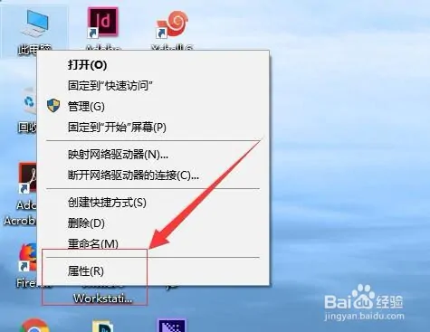
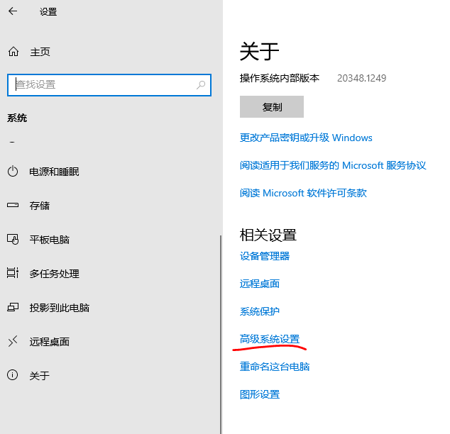
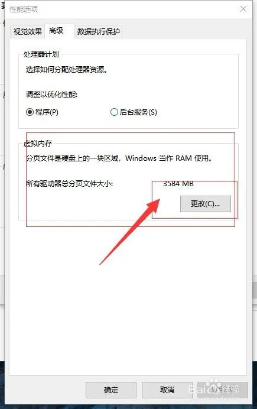
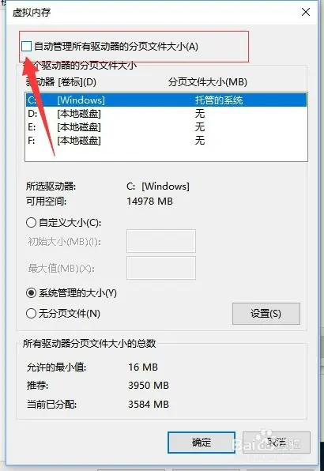

1. 首先，在电脑桌面找到“此电脑”。如图：
    

2. 接着，右键单击，在弹出的下拉菜单中选择“属性”。如图：
   

3. 在”关于“里，选择”高级系统设置“：
   

4. 在弹出的“系统属性”界面中，选择“高级”。如图：
   

5. 接着，在高级选项下找到“性能”，点击下方的“设置”。如图：
   

6. 接着，在弹出的性能选项中，选择“高级”。如图：
   

7. 在高级选项中，在下方的“虚拟内存”下，选择“更改”。如图：
   

8. 把“自动管理所有驱动器的分页文件大小”前的勾取消，即可自定义虚拟内存的大小。如图：
   

9. 自定义大小
   记得要按”设置“按钮，否则不生效
   

10. 重启后生效

# 参考
[1] windows 10如何设置虚拟内存 win10虚拟内存设置, https://jingyan.baidu.com/article/7082dc1c8a53cca40b89bd35.html