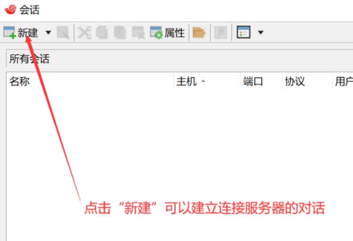
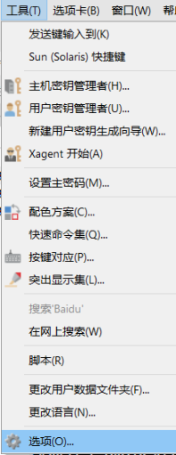
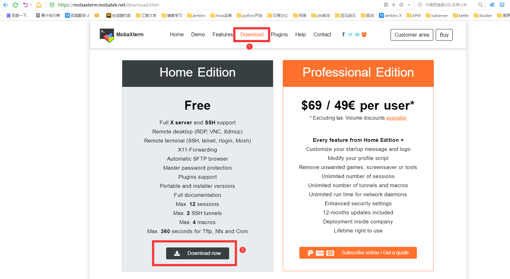
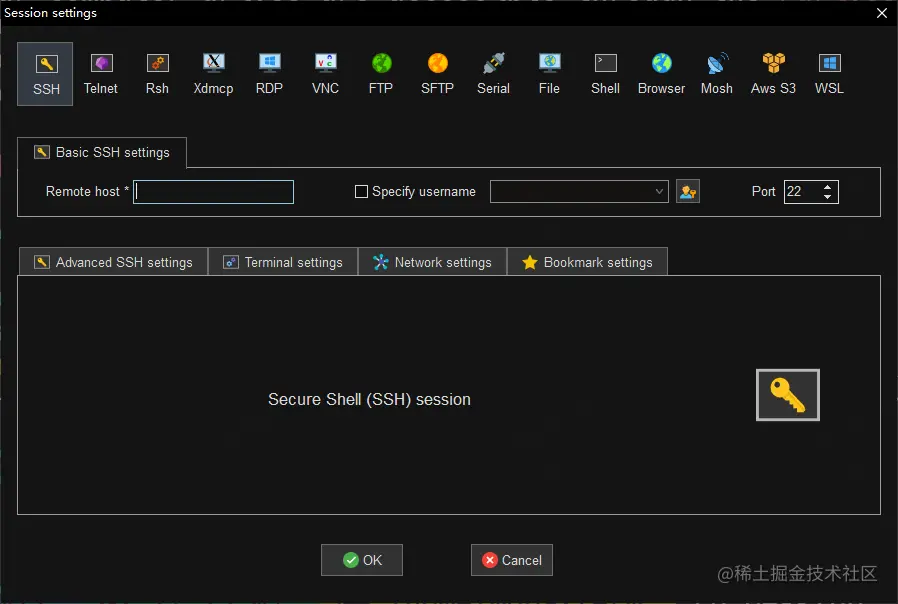
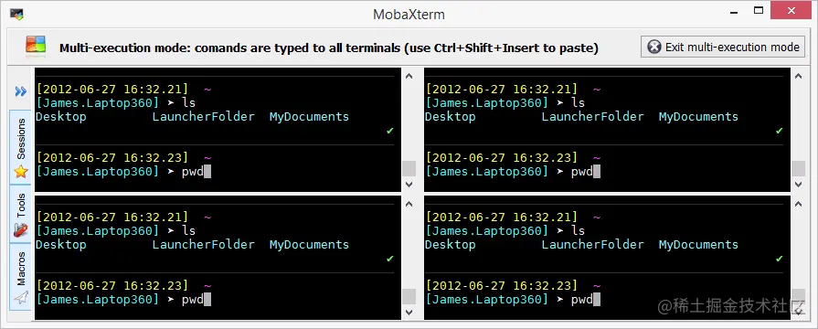
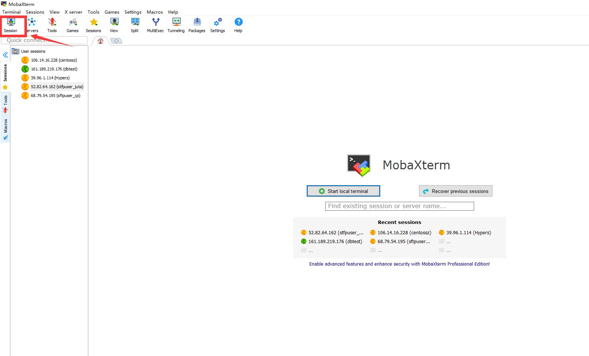
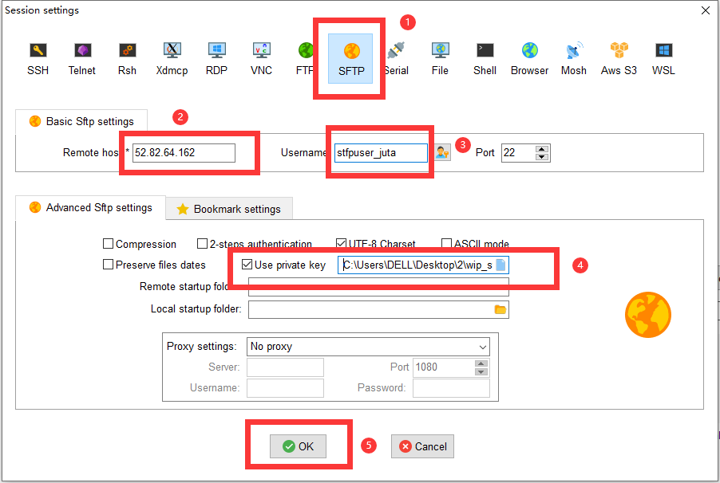
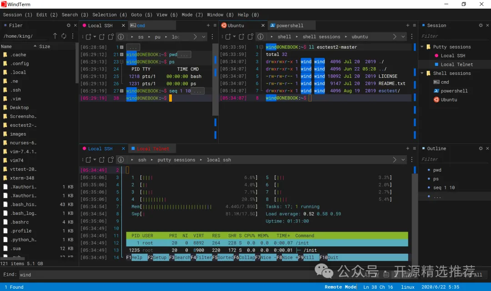

# 1. Xshell

1. 介绍

    最好用的SSH远程连接工具。
    
    免费版(**不可商用**)：https://www.xshell.com/zh/free-for-home-school/

    如官网打不开，可以从网盘下载  
    - 链接：https://pan.baidu.com/s/1NJGWZHkByakOkQpKfkc7Yg?
    - 提取码：r0ds

2. 会话连接配置
    
    （1） 开启Xshell
    
        
    
    （2） 新建会话
    
    
    
    (3) 填写主机IP并编写会话名称
    
    
    
    (4) 填写用户名和密码
    
    
    
    (5) 选中会话进行连接
    
    
    
    (6) 连接服务器
    
    
    
3. 属性设置

    
    
    
    
    - 可以选择按下鼠标的按钮快速粘贴
    - 选定即可自动复制到剪贴板 

# 2. MobaXterm

- 优点：免费可商用，相对来说，是免费中最好的
- 缺点：rzsz使用不方便；分屏功能不如xshell

下载路径： https://mobaxterm.mobatek.net/

## 2.1 SSH使用

点击任意session类型，即可弹出详细的配置选项，下图为SSH的配置项

配置Remote host、username等，SSH的私钥需要在【Advanced SSH Settings】选项卡中配置。
可以在【Bookmark settings】中配置终端自定义名称，默认使用的Remote host作为名称

通过SSH登录远端机器后，界面如下图。特别提出一点，点击【Remote monitoring】在主页下面会弹出登录机器的CPU、
内存、网络上传下载速率、磁盘空间、用户名等信息。

## 2.2 多终端SSH

一次编写，到处执行：此工具允许您同时在许多不同的服务器上执行相同的命令

## 2.3 SFTP使用

1. 打开MobaXterm，选择新建session。

   

2. 选择SFTP，填写主机IP：52.82.64.162，用户名：stfpuser_juta（举例）端口：22 ，
   选择Advanced Sftp settings，使用私钥prd-databridge001-stfpuser_juta.pem，或者使用密码，点击OK即可。

   

3. 发现可以正常登陆即可。
   
   

## 2.4 操控设置

1. 选中复制，右键粘贴

选中复制，右键粘贴在SecureCRT有一个十分有用的功能，MobaXterm也有，但是默认处于关闭状态，需要设置一下。

菜单栏点击 Settings --> Configuration --> Terminal , 然后打勾选中。

# 3. 其它
## 3.1 FinalShell

个人感觉不好用，页面字体显示不佳，但仍可作为一个选择。

- 免费
- http://www.hostbuf.com/t/988.html

## 3.2 PuTTY

- 下载路径：https://www.chiark.greenend.org.uk/~sgtatham/putty/latest.html

## 3.3 WindTerm

项目地址：https://github.com/kingToolbox/WindTerm

在github中提供了mac、linux、windows不同环境的终端包，可以直接去releases中下载

功能：一个是账户密码自动填充，一个是彩虹括号

1. SSH、Telnet、Tcp、Shell、串行

   实现了 SSH v2、Telnet、Raw Tcp、Serial、Shell 协议，支持在会话身份验证时 SSH 自动执行

   如果你用的是jump server之类的堡垒机，也可以直接配置，支持二次验证

   当然也支持代理跳板机登录。

2. 自动填充

   这个点或许是开发最喜欢的，它可以自动完成历史命令填充

3. 常用命令快速触发
   
   这个也是日常用到比较多的，有些工具虽然有这个功能，但是很多有限制

   这款就很随意了，可以选择一组服务器，可以配置大量的预制命令

4. 搜索
   如果你打开了多个终端，可以快速搜索跳转

5. 关于性能

   性能测试其实作者提供了很多的数据，包括文件的传输、随机数据的生成、延迟、终端性能等，确实很强，尤其是与一些其它常用工具相比。

   具体数据，这里不在罗列，更多可以到github上去看。

# 参考

[1] XShell免费版的安装配置教程以及使用教程（超级详细、保姆级），
    https://blog.csdn.net/m0_67400972/article/details/125346023
[2] MobaXterm连接SFTP教程，https://www.cnblogs.com/jhno1/p/15556916.html
[3] 再见了putty、Xshell、FinalShell、Mobaxterm、iTerm2，这款开源的终端工具真香，https://mp.weixin.qq.com/s/3RQZhK6QH4OPTHj760W0Ew
