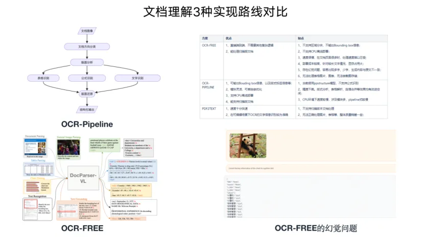
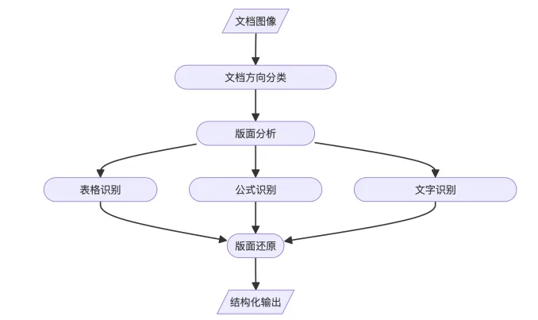

# 1. 资源

- Github: https://github.com/360AILAB-NLP
- 模型权重-huggingface地址：https://huggingface.co/qihoo360/360LayoutAnalysis

主要特点：
- 1)涵盖中文论文、英文论文、中文研报三个垂直领域及1个通用场景模型；
- 2)轻量化推理快速【基于yolov8训练，单模型6.23MB】；
- 3)中文论文场景包含段落信息【CLDA不具备段落信息，我们开源独有】；
- 4)中文研报场景/通用场景【基于数万级别高质量数据训练，我们开源独有】

# 2. 背景

在数字化以及文档处理场景下，总会涉及到技术设计的方案，一般可以总结成如下三种路线：

1. PDF及其他文档类型解析路线

    当前，针对不同的文档类型有不同的解析方案，如word类文档，可以通过解析内部xml文件；对于PDF可编辑文档，可以使用pdfminer,pdfplumber等工具进行解析。
    这种方式的优点在于实现简单，速度很快，但这类处理方案无法处理扫描版本的文档类型。此外，对PDF这些文档进行硬解析，会丢失很多结构化信息，例如表格、图片等。

2. OCR-pipeline路线

    为了解决上一种方案中存在的扫描版本文档无法解析以及结构化信息丢失等问题，目前另一种解析方案是OCR-pipeline，将文档解析任务转换成一个OCR的序列任务，包括版式分析(将文档分割成多个不同的语义区域)、图表解析、公式识别、图表解析、阅读顺序识别、文档还原等多个步骤。
    这种方式的优势在于，能够处理扫描版文档，并且能够对文档的各个元素进行精细处理，能够最大化地利用文档信息，并且速度尚可（主要受限于OCR的处理），在文档理解场景下目前是通用方案。但劣势在于，其作为一个串行的解决方案，存在整体误差传播，并且每个模块都需要单独做优化，工作量很大。

3. OCR-FREE路线

    OCR-FREE路线是一套端到端的方案，其利用当前的前沿多模态大模型进行处理，将文档OCR，表格解析以及图表理解建模为一个微调任务。其优点在于，路线端到端，技术前沿。
    劣势也很明显，例如多模态大模型与身俱来的幻觉问题，例如上图所示，给一个大熊猫的图，让其解析成一个json_dict(让其做一个图表解析任务)，其结果就表现出了很大的幻觉性。此外，这套方案需要大量的训练数据集，并且在落地侧需要较大的显卡占用资源，在密集型文本场景下，处理速度很慢。

# 3. 方案

面向3大特定场景及1个通用场景的版式分析模型

在实际的文档理解落地场景里，我们需要综合考虑模型性能(性能尚可，且可以预见性地迭代优化)、模型计算资源消耗(支持cpu部署)、模型推理速度(可并发、快速推理)几个方面的因素。
因此，我们搭建了一套以版式分析为核心的文档处理组件360structure，围绕差异化场景，研发出了多套版式分析模型360LayoutAnalysis，并对外开源其中的3大特定场景及1个通用场景的版式分析模型，模型采用yolov8。
 
1. 中文研报场景

   对于研报场景而言，目前并没有相关版式分析模型出现，而研报作为金融场景的一个重要文档类型，其中包含了大量的图片、表格等富文本类型，在行文结构上错综复杂，并且富含很多决策信息。

   因此，为了填补这个空白，我们通过人工标注的方式，形成了数万级别的研报标注数据集，涵盖9类标签。进行训练，并开源中文论文场景版式分析模型。

2. 中文论文场景

   当前，中文论文场景的数据并不多，据我们了解，在论文场景中，以往的开源数据集如：CDLA（A Chinese document layout analysis，https://github.com/buptlihang/CDLA），面向中文文献类（论文）场景，包含10类：Text、Title、Figure、Figure caption、Table、Table caption、Header、Footer、Reference、Equation，共包含5000张训练集和1000张验证集。

   不过，该数据集数量并不多，且缺乏段落信息。因此，我们重新进行数据标注，并扩充数据量，进行yolov8训练，并开源中文论文场景版式分析模型。

3. 英文论文场景

   在英文论文场景，当前流传最广的为Publaynet数据集(https://github.com/ibm-aur-nlp/PubLayNet),其包含Text、Title、Table、Figure、List，共5个类别，数据集中包含335,703张训练集、11,245张验证集和11,405张测试集，但该数据集不包含段落信息。
   我们基于PubLayNet数据集进行训练，并开源英文论文场景版式分析模型。

4. 通用文档场景

   从技术角度而言，版式分析模型与文档类型高度相关，因此，利用A领域文档训练好的版式分析模型应用到B领域文档，总会取得不太好的效果，这个就是我们经常说的迁移性(泛化性)问题。
   而为了缓解这个问题，在开源若干个特定领域文档版式分析模型之外，我们通过混合多种通用文档，确定Text、Title、Figure、Table、Caption、Equation共6类标签，进行训练，并开源通用文档场景版式分析模型。

# 4. 使用

开源的轻量化版式分析模型可以怎么用？

版式分析模型是当前文档理解的重要步骤。

对于当前RAG应用，我需要提前知道给定一个文档中，区分出来哪些是表格、哪些是页眉页脚，哪些是图表，哪些是公式，这个可以通过后接不同的单独小模块进行处理（如下图所示），其属于一个龙头的定位，因此，其准确性十分重要。

也就是说，基于开源的版式分析模型，可以进行前接和后接两者中操作。

对于前接，考虑到不同的文档类型，为了缓解因为其泛化性带来的问题，可以在这4个模型之前，前接一个文档类型路由分类，针对不同的文档，做针对性的处理；

对后接处理，在已经识别文档区域结果之后，获取每个标签区域的boudingBox，然后自行地接入不同的处理模型。例如：

针对文本区域，接入OCR组件处理，得到对应的text结果；

对于表格区域，可以送入到表格解析模型进行表格解析；

对于图片区域，可以接入多模态模型进行图文理解，生成摘要；

对于识别出的title以及figure cation信息等，可以通过OCR后，形成目录。

此外，基于这些信息，可以作为RAG中文档的切分边界进行切分。

# 参考

[1] 360开源多场景文档轻量化版式分析模型360LayoutAnalysis，https://mp.weixin.qq.com/s/DglU4ES4ndtIS2_sqp1IHw
