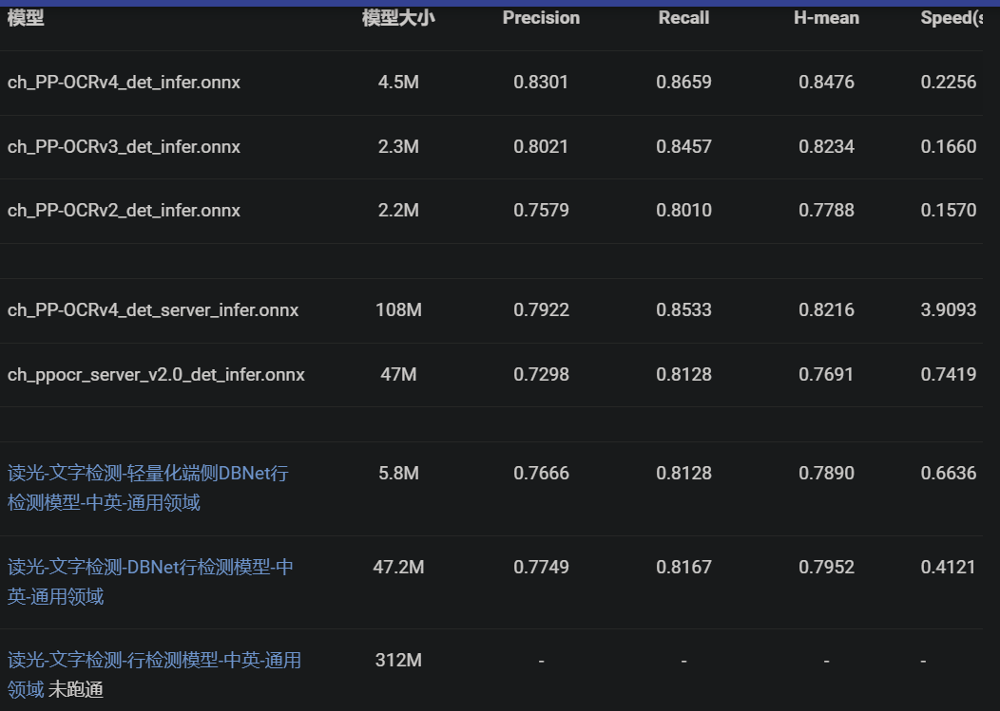

# OCR对比

Comparison of Paddle OCR, EasyOCR, KerasOCR, and Tesseract OCR

一句话总结：PaddleOCR在性能和速度最好，EasyOCR支持语种最多。

We compare four OCR systems, namely Paddle OCR, EasyOCR, KerasOCR, and Tesseract OCR. OCR, or Optical Character Recognition, is a technology that allows machines to recognize and interpret human-readable text from an image or document. We discuss the advantages and limitations of each OCR system based on factors such as accuracy, speed, language support, customization options, and community support.

OCR or Optical Character Recognition is a technology that enables machines to recognize and interpret human-readable text from an image or document. OCR offers a wide range of applications, including document scanning and data extraction from photos, receipts, and ID cards. Several OCR systems have arisen over the years, each with its own set of advantages and drawbacks. In this article, we will compare various OCR methods such as Paddle OCR, EasyOCR, and KerasOCR.

Paddle OCR
Paddle OCR is a deep learning-based OCR system created by PaddlePaddle, a Chinese AI firm. Paddle OCR is built on the PaddlePaddle framework, which is well-known for its quick and efficient deep learning algorithms. Paddle OCR supports numerous languages, including Chinese, English, Japanese, and Korean, and can properly detect different text styles and fonts.

Advantages
High accuracy: Paddle OCR has achieved state-of-the-art performance on various OCR benchmarks, including the ICDAR 2015 and ICDAR 2017 competitions.Fast and efficient: Paddle OCR is optimized for speed and can process large volumes of images in real-time, making it suitable for applications that require high throughput.Easy to use: Paddle OCR has a user-friendly interface that allows users to quickly train and deploy OCR models.

Limitations
Limited language support: Although Paddle OCR supports multiple languages, it does not support as many languages as some of its competitors.Limited community support: Paddle OCR is a relatively new OCR system, and its community is not as large as some of its competitors, making it harder to find resources and support.

EasyOCR
EasyOCR is a Python-based OCR library that supports over 70 languages and can recognize various text styles and fonts. EasyOCR is known for its ease of use and fast processing speed.

Advantages
Fast and efficient: EasyOCR is optimized for speed and can process large volumes of images in real-time.Easy to use: EasyOCR has a simple interface and can be easily integrated into Python applications.Good accuracy: EasyOCR has achieved high accuracy on various OCR benchmarks.

Limitations
Limited customization: EasyOCR does not provide as many customization options as some of its competitors, making it harder to fine-tune models.Limited language support: EasyOCR supports over 70 languages, but it is not as comprehensive as some of its competitors.

KerasOCR
KerasOCR is a Python-based OCR library that uses the Keras deep learning framework.

Advantages
High accuracy: KerasOCR has achieved state-of-the-art performance on various OCR benchmarks.Easy to use: KerasOCR has a user-friendly interface that allows users to quickly train and deploy OCR models.Customizable: KerasOCR provides a wide range of customization options, including different neural network architectures and training parameters.

Limitations
Limited language support: KerasOCR currently supports only a few languages, including English, French, and German.Limited community support: KerasOCR is a relatively new OCR system, and its community is not as large as some of its competitors, making it harder to find resources and support.

Tesseract OCR
Tesseract OCR is an open-source OCR engine developed by Google. Tesseract OCR is well-known for its high accuracy and wide language support.

Advantages
Wide language support: Tesseract OCR supports over 100 languages, making it suitable for applications that require multilingual support.

Accurate: Tesseract OCR has achieved state-of-the-art performance on various OCR benchmarks, making it a reliable OCR system.

Easy to use: Tesseract OCR has a simple interface and can be easily integrated into applications.

Limitations
Limited image preprocessing: Tesseract OCR relies heavily on image preprocessing techniques to improve accuracy, which can be time-consuming and resource-intensive.

ComparisonTo compare these OCR methods, we evaluated their accuracy, speed, language support, customization options, and community support.

Accuracy: All three OCR systems achieved high accuracy on various OCR benchmarks. Paddle OCR and KerasOCR have both achieved state-of-the-art performance on different benchmarks, while EasyOCR has also achieved high accuracy.

Speed: Paddle OCR, EasyOCR, and KerasOCR are optimized for speed and can process large volumes of images in real-time, making them suitable for applications that require high throughput.

Language support: Paddle OCR supports numerous languages, including Chinese, English, Japanese, and Korean, while EasyOCR supports over 70 languages and KerasOCR currently supports only

# 详细对比

https://rapidai.github.io/RapidOCRDocs/blog/2022/04/16/%E5%BC%80%E6%BA%90ocr%E6%A8%A1%E5%9E%8B%E5%AF%B9%E6%AF%94/

# 参考

[1] Comparison of Paddle OCR, EasyOCR, KerasOCR, and Tesseract OCR，https://www.plugger.ai/blog/comparison-of-paddle-ocr-easyocr-kerasocr-and-tesseract-ocr