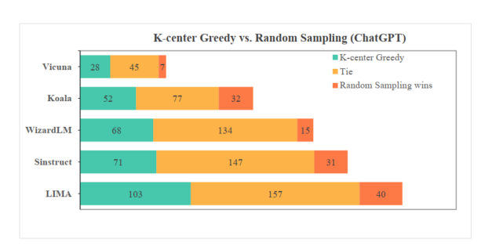

## 1.1 MoDS

### 1.1.1 方法介绍

1. 概要

   - 要点：核心是从数据质量、覆盖范围、必要性三个角度来对原始数据集进行数据过滤，
     最终获取对于不同模型的高质量数据集。并且相较于自动识别方法，在使用更少数据的情况下，就可以获取更好的效果。
   - 论文：MoDS: Model-oriented Data Selection for Instruction Tuning
   - paper: https://arxiv.org/pdf/2311.15653.pdf
   - github: https://github.com/CASIA-LM/MoDS

2. MoDS方法

    MoDS方法主要通过质量、覆盖范围、必要性三个指标来进行数据的筛选，其中数据质量是为了保证所选的指令数据的问题和答案都足够好；
    数据覆盖范围是为了让所选择的数据中指令足够多样、涉及知识范围更广；数据必要性是选择对于大模型较复杂、
    较难或不擅长的数据以填补大模型能力的空白。整体流程如下图所示，
    
    

3. 质量筛选

   对于数据进行质量过滤时，采用OpenAssistant的reward-model-debertav3-large-v2模型（一个基于DeBERTa架构设计的奖励模型）
   对数据进行质量打分。讲原始数据的Instruction、Input、Output的三个部分进行拼接，送入到奖励模型中，得到一个评分，
   当评分超过α时，则认为数据质量达标，构建一份高质量数据集-Data1。 

4. 多样性筛选

   为了避免所选质量数据高度相似，通过K-Center-Greedy算法进行数据筛选，在最大化多样性的情况下，使指令数据集最小。
   获取种子指令数据集（Seed Instruction Data）-SID。 

    

    在该步骤中，采用BERT模型为指令数据生成句向量来计算不同数据之间的距离。

5. 必要性筛选
   
   不同的大型语言模型在预训练过程中所学到的知识和具有的能力不同，因此在对不同的大型语言模型进行指令微调时，所需的指令数据也需要不同。

   对于一条指令，如果给定的大型语言模型本身能够生成较好的回答，则说明给定的大型语言模型具有处理该指令或者这类指令的能力，
   反之亦然，并且哪些不能处理的指令对于模型微调来说更为重要。
    
   - 使用SID数据集对模型进行一个初始训练
   - 用训练好的初始模型对整个高质数据集-Data1中的指令进行结果预测
   - 利用奖励模型对结果进行评分，当分值小于β时，说明初始模型不能对这些指令生成优质的回复，不具有处理这些类型指令的能力，获取必要性数据集-Data2
   - 对Data2进行多样性筛选，获取增强指令数据集（Augmented Instruction Data）-AID。

6. 模型训练

   最终利用种子指令数据集和增强指令数据集一起对模型进行指令微调，获得最终模型。

### 1.1.2 实验结果

1. 训练数据
   
   训练数据有两种，一种是单独的Alpaca数据集（52k），一种时混合数据集（214k），包含HC3数据集、
   Alpaca数据集、Alpaca-evol-instruct数据集、Dolly-v2数据集、InstructWild数据集和LIMA数据集。

   测试数据主要包含5个测试集，分别为Koala数据集（180）、WizardLM数据集（218）、Self-instruct数据集（252）、
   Vicuna数据集（80）和LIMA数据集（300）。

2. 训练超参

   模型基座采用LLaMA2-7B模型，训练过程中学习率为2e-5，warmup的比率为0.03，权重衰减为0.0，批大小为128，
   训练轮数为3。在质量评价和必要性评价过程中，Alpaca数据集的α和β均设置为0.0，混合数据集的α和β分别设置为1.0和-1.0。

   在模型测试过程中，采用ChatGPT和GPT4作为裁判，对模型生成结果从相关性和准确性两个角度进行打分，
   每个角度的评分从1到10。在评价两个模型胜、平、负时，当两个角度评分都高时为胜；当两个角度评分一高一低时为平；
   当两个角度评分都低时为负。

3. 结果分析

   在Alpaca数据集中通过MoDS方法获取1k数据的效果要优于全量数据训练的结果，如下图所示。
   
   

   在Alpaca数据集中MoDS方法在选择2k数据时，训练效果优于基于IFD的自动选择方法，如下表所示。
    
   

   在混合数据及中MoDS方法获取4k数据的效果全面优于全量数据训练的结果，如下图所示。
   
   

   验证指令多样性选择的重要性，与随机选择进行对比，如下图所示。
  
   

   验证必要性筛选的重要性，与仅用种子数据训练的模型进行对比，如下图所示。

  

# 参考

[1] 大模型微调技巧 | 高质量指令数据筛选方法-MoDS, https://mp.weixin.qq.com/s/Y9YWov-DskFOVs5lECPJcA