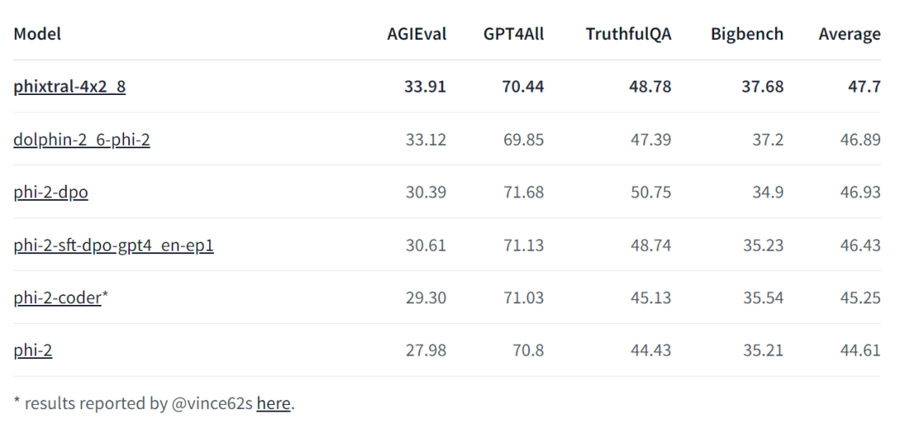
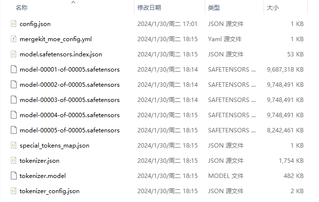

# 1. 简介

在 Hugging Face Hub 上，我们可以轻松找到一系列定制的 MoE，比如mlabonne/phixtral-4x2_8。

mergekit（遵循 LGPL-3.0 许可），这个工具让制作这些混合大模型变得轻而易举。以 Phixtral LLMs 
为例，就是通过 mergekit 合并了多种 Phi-2 模型，制作出了一个效果还可以的 AI 混合大模型。

Phixtral的架构

```python
from transformers import AutoModelForCausalLM
model = AutoModelForCausalLM.from_pretrained(
    "mlabonne/phixtral-4x2_8", 
    torch_dtype="auto", 
    load_in_4bit=True, 
    trust_remote_code=True
)
print(model)
```

```text
# 输出
PhiForCausalLM(
  (transformer): PhiModel(
    (embd): Embedding(
      (wte): Embedding(51200, 2560)
      (drop): Dropout(p=0.0, inplace=False)
    )
    (h): ModuleList(
      (0-31): 32 x ParallelBlock(
        (ln): LayerNorm((2560,), eps=1e-05, elementwise_affine=True)
        (resid_dropout): Dropout(p=0.1, inplace=False)
        (mixer): MHA(
          (rotary_emb): RotaryEmbedding()
          (Wqkv): Linear4bit(in_features=2560, out_features=7680, bias=True)
          (out_proj): Linear4bit(in_features=2560, out_features=2560, bias=True)
          (inner_attn): SelfAttention(
            (drop): Dropout(p=0.0, inplace=False)
          )
          (inner_cross_attn): CrossAttention(
            (drop): Dropout(p=0.0, inplace=False)
          )
        )
        (moe): MoE(
          (mlp): ModuleList(
            (0-3): 4 x MLP(
              (fc1): Linear4bit(in_features=2560, out_features=10240, bias=True)
              (fc2): Linear4bit(in_features=10240, out_features=2560, bias=True)
              (act): NewGELUActivation()
            )
          )
          (gate): Linear4bit(in_features=2560, out_features=4, bias=False)
        )
      )
    )
  )
  (lm_head): CausalLMHead(
    (ln): LayerNorm((2560,), eps=1e-05, elementwise_affine=True)
    (linear): Linear(in_features=2560, out_features=51200, bias=True)
  )
  (loss): CausalLMLoss(
    (loss_fct): CrossEntropyLoss()
  )
)
```

它是一个具有四个 MLP 的 MoE，即使用四个专家子网络。Phi-2 是一个 2.7B 参数模型，
但 phixtral-4x2_8 总共只有 7.8B 参数，因为四位专家共享相同的自注意力模块。
只有 MLP 模块权重参数是针对每位专家的。

mergekit_moe_config这个文件：

```yaml
base_model: cognitivecomputations/dolphin-2_6-phi-2
gate_mode: cheap_embed
experts:
  - source_model: cognitivecomputations/dolphin-2_6-phi-2
    positive_prompts: [""]
  - source_model: lxuechen/phi-2-dpo
    positive_prompts: [""]
  - source_model: Yhyu13/phi-2-sft-dpo-gpt4_en-ep1
    positive_prompts: [""]
  - source_model: mrm8488/phi-2-coder
    positive_prompts: [""]
```

这是提供给 mergekit（自定义版本）用于创建 MoE 的配置文件。

我们可以看到基本模型是cognitivecomputations/dolphin-2_6-phi-2。
模型的共享模块，例如令牌嵌入和自注意力，是使用这些模型的权重进行初始化的。
其 MLP 权重用于初始化其中一个专家。剩下的三名专家是使用各种技术（例如 DPO）
和数据集进行微调的其他 Phi-2 模型。一言以蔽之（思无邪），mergekit 使用 
Cognitivecomputations/dolphin-2_6-phi-2 作为基本模型，并使用其他三个 
LLM 的 MLP 模块作为专家。

通过这种简单合并获得的模型的性能令人惊讶。Phixtral 从未进行过微调。
路由器网络具有随机初始化的权重。然而，Phixtral 的表现优于每位专家，如下结果所示：



由于我们没有对路由器网络进行微调，因此一种廉价的替代方案是在推理过程中选择
专家在出现提示时激活。例如，在 Phixtral 中，我们有 phi-2-coder，
这是一个针对代码生成进行微调的模型。如果提示包含生成代码的指令，
我们可以编写一种机制，选择 Phixtral 中对应于 phi-2-coder 的权重参数集推理。
我们可以定义有助于激活正确专家的提示。

例如，对于专家 mrm8488/phi-2-coder，我们可以在上述文件中编写如下内容：

```yaml
positive_prompts: ["你是有用的编码助手。", "完成以下函数的代码："]
```

在推理时，当用户输入语义上接近 Positive_prompts 的提示时，
模型的路由器网络将激活“mrm8488/phi-2-coder”。在 Phixtral 中，
这是通过使用每层的原始令牌嵌入来完成的。在配置中，这是由“gate_mode：
cheap_embed”指定的。由于我们只需要从每个专家那里检索令牌嵌入，
这非常简单但也非常幼稚。更好的选择是计算提示的隐藏状态以获得更准确的表示，
但这需要将模型加载到内存中。如果我们手头的 GPU 有足够的 VRAM，可以通过指定“gate_mode:
hidden”来选择这个更好的替代方案。“gate_mode:random”设置成随机也可以。

# 2. 使用 Mergekit 创建我们自己的 MoE

Phi-2 是创建 MoE 的良好候选模型。由于其模型非常小，
我们可以轻松合并 8 个 Phi-2 模型，并且生成的模型仍然可以在有 
24 GB VRAM 的消费级GPU上（3090，4090等）运行、量化。
我们还可以选择Mistral 7B 、Llama 2等大模型。

我们希望生成的模型在量化为 4 位时能够在消费类硬件（最大 24 GB VRAM）上运行。
这意味着我们最多可以让模型有 46B 个参数。为了用消费类显卡进行推断，
我选择仅组合 6 个 Mistral 7B。Hugging Face Hub 上有许多在不同
数据集上微调的 Mistral 7B版本，因此我们可以发挥创意。

```yaml

base_model:  Mistralai/Mistral-7B-Instruct-v0.2 
dtype:  float16 
gateway_mode:  cheap_embed
experts: 
  - source_model:  HuggingFaceH4/zephyr-7b-beta 
    positive_prompts: [ "你是一个有用的通用助理。" ] 
  - source_model: mistralai/Mistral-7B-Instruct-v0.2 
    positive_prompts: [ "你是有用的助手" ] 
  - source_model:  teknium/OpenHermes-2.5-Mistral-7B 
    positive_prompts: [ "你是一个很有帮助的编码助手。" ] 
  - source_model:  meta-math/MetaMath-Mistral-7B
    positive_prompts: [ "你是一个很擅长数学的助手。" ] 
```

我们使用 Mistralai/Mistral-7B-Instruct-v0.2 作为基本模型，
因为它在一般用途上表现良好。将此配置保存到名为“config.yaml”的文件中。

现在我们已经定义了合并配置，让我们安装 mergekit 及其依赖项。请注意，
我们需要使用 mergekit 的“mixtral”分支来创建 MoE。

```yaml
git clone -b mixtral https://github.com/cg123/mergekit.git
cd mergekit && pip install -e .
pip install --upgrade transformers
```

然后，只需使用上面的配置文件运行 mergekit：

```shell
mergekit-moe config.yaml merge --copy-tokenizer  --allow-crimes \
   --out-shard-size  5B --lazy-unpickle  --trust-remote-code
```

合并本身非常快（几秒钟），但下载所有模型将需要一些时间。此外，
这将产生 50 GB 的模型，因此请确保硬盘驱动器上有足够的可用空间。

我们生成的模型文件如下：



测试模型，我使用了以下代码：

```python
from transformers import AutoTokenizer
import transformers
import torch
model = "merge"
tokenizer = AutoTokenizer.from_pretrained(model)
pipeline = transformers.pipeline(
    "text-generation",
    model=model,
    model_kwargs={"torch_dtype": torch.float16, "load_in_4bit": True},
)
messages = [{"role": "user", "content": "你知道多模态深度学习是什么吗?"}]
prompt = pipeline.tokenizer.apply_chat_template(messages, tokenize=False, add_generation_prompt=True)
outputs = pipeline(prompt, max_new_tokens=2048, do_sample=True, temperature=0.7, top_k=50, top_p=0.95)
print(outputs[0]["generated_text"])
```


# 参考

[1] GPT4的专家混合模型架构实践：使用Mergekit打造私有的MoE，https://mp.weixin.qq.com/s/tHOMaTG_O_Kfc-vFGROw8Q