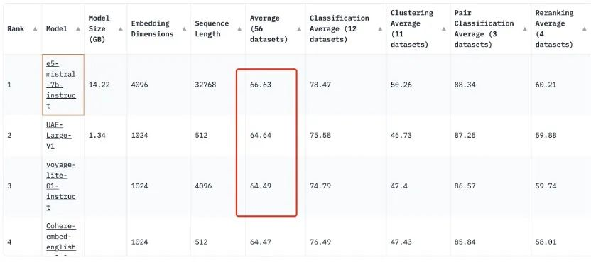
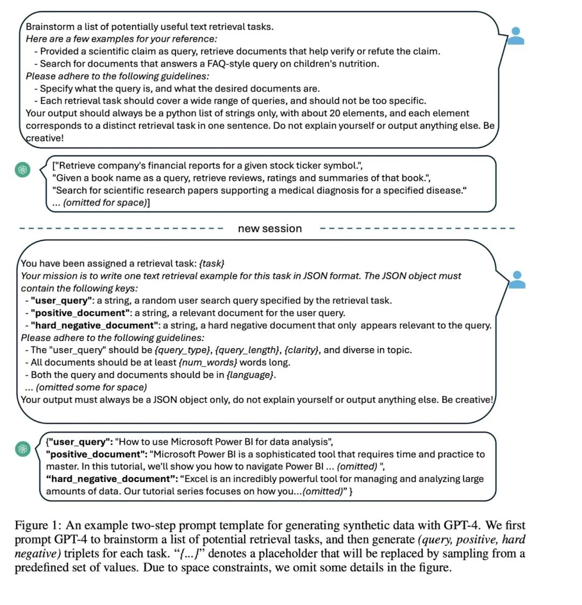
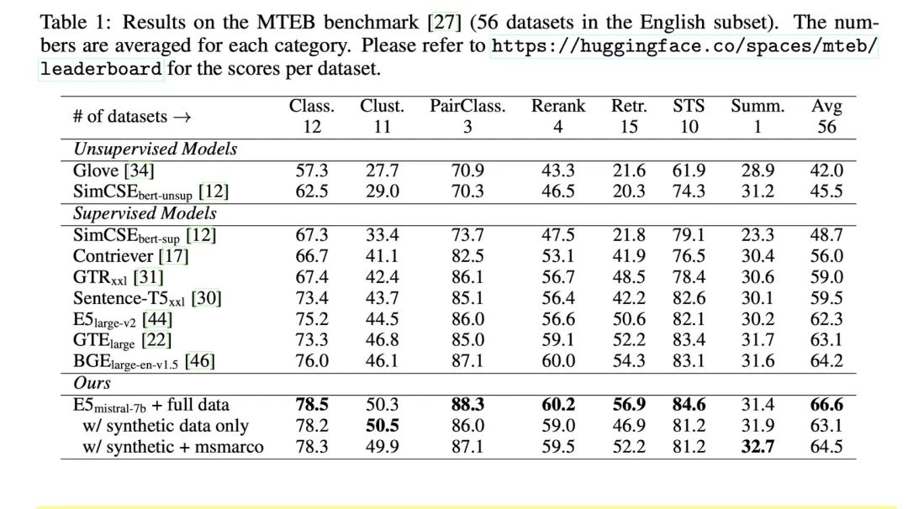
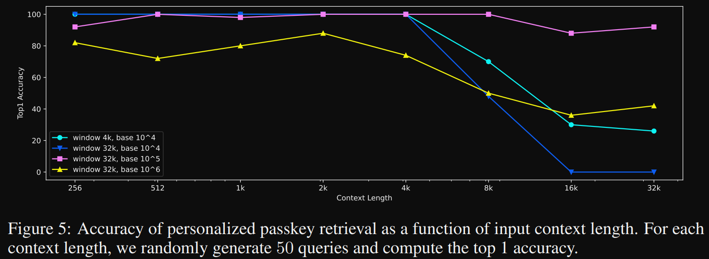
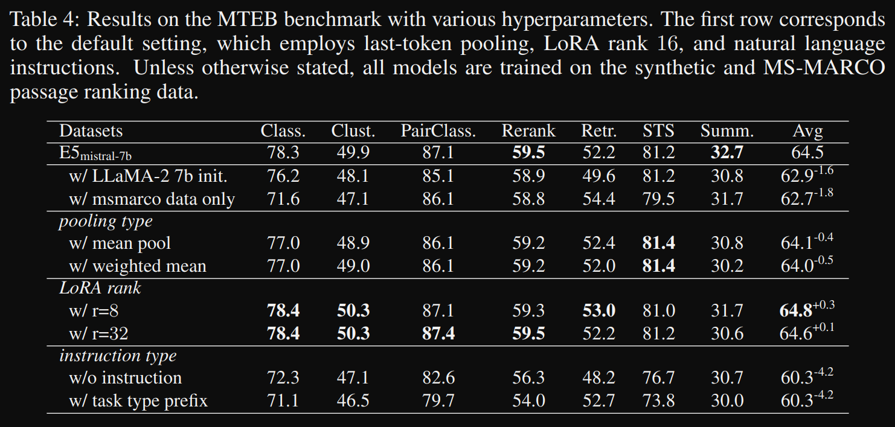

# 1. 简介

- 模型下载：https://huggingface.co/intfloat/e5-mistral-7b-instruct
- 论文：Improving Text Embeddings with Large Language Models，https://arxiv.org/pdf/2401.00368.pdf
- 论文：Text Embeddings by Weakly-Supervised Contrastive Pre-training
- Github代码（非官方，26k Stars）：https://github.com/kamalkraj/e5-mistral-7b-instruct
- （基线E5模型）官放相关代码和数据：https://github.com/microsoft/unilm/tree/master/e5

E5-mistral-7b-instruct利用LLM产生了接近100种语言的高质量且多样化的训练数据，利用纯decoder的LLM在合成数据上进一步finetune。
仅依靠合成数据训练得到的text embedding可以媲美目前主流的sota模型，而混合合成数据跟真实标注数据训练完成的text embedding
模型在BEIR跟MTEB上都达到新的sota效果。



## 1.1 快速使用

```python
import torch
import torch.nn.functional as F

from torch import Tensor
from transformers import AutoTokenizer, AutoModel


def last_token_pool(last_hidden_states: Tensor,
                 attention_mask: Tensor) -> Tensor:
    left_padding = (attention_mask[:, -1].sum() == attention_mask.shape[0])
    if left_padding:
        return last_hidden_states[:, -1]
    else:
        sequence_lengths = attention_mask.sum(dim=1) - 1
        batch_size = last_hidden_states.shape[0]
        return last_hidden_states[torch.arange(batch_size, device=last_hidden_states.device), sequence_lengths]


def get_detailed_instruct(task_description: str, query: str) -> str:
    return f'Instruct: {task_description}\nQuery: {query}'


# Each query must come with a one-sentence instruction that describes the task
task = 'Given a web search query, retrieve relevant passages that answer the query'
queries = [
    get_detailed_instruct(task, 'how much protein should a female eat'),
    get_detailed_instruct(task, 'summit define')
]
# No need to add instruction for retrieval documents
documents = [
    "As a general guideline, the CDC's average requirement of protein for women ages 19 to 70 is 46 grams per day. But, as you can see from this chart, you'll need to increase that if you're expecting or training for a marathon. Check out the chart below to see how much protein you should be eating each day.",
    "Definition of summit for English Language Learners. : 1  the highest point of a mountain : the top of a mountain. : 2  the highest level. : 3  a meeting or series of meetings between the leaders of two or more governments."
]
input_texts = queries + documents

tokenizer = AutoTokenizer.from_pretrained('intfloat/e5-mistral-7b-instruct')
model = AutoModel.from_pretrained('intfloat/e5-mistral-7b-instruct')

max_length = 4096
# Tokenize the input texts
batch_dict = tokenizer(input_texts, max_length=max_length - 1, return_attention_mask=False, padding=False, truncation=True)
# append eos_token_id to every input_ids
batch_dict['input_ids'] = [input_ids + [tokenizer.eos_token_id] for input_ids in batch_dict['input_ids']]
batch_dict = tokenizer.pad(batch_dict, padding=True, return_attention_mask=True, return_tensors='pt')

outputs = model(**batch_dict)
embeddings = last_token_pool(outputs.last_hidden_state, batch_dict['attention_mask'])

# normalize embeddings
embeddings = F.normalize(embeddings, p=2, dim=1)
scores = (embeddings[:2] @ embeddings[2:].T) * 100
print(scores.tolist())
```

# 2. 数据
## 2.1 生成合成数据

借助于目前火热的GPT3.5-Turbo，GPT4去生成训练数据，构建多种语言跟任务类型的数据来增强训练数据的多样性。
从大类来看可以将合成数据分为两大类，即非对称任务跟对称任务，最终构建得到超过15万个task definition的包括93种语言的50万个训练样本，
每个样本的格式为（task definition, user query, positive document, hard negative document）。

## 2.2 任务

非对称类任务

Query跟document在语义上存在关联，但彼此不互为变体的任务，例如常见的文本检索任务。文中将非对称任务划分4个子类，
短文本-长文本匹配，长文本-短文本匹配，短文本-短文本匹配以及长文本-长文本匹配。对于每个子类的数据生成，
都需要设计两阶段的LLM prompt，第一阶段的prompt让LLM通过头脑风暴生成一系列符合要求的任务，
然后第二阶段再根据前面生成的任务描述生成训练数据，在第二阶段可以通过配置诸多参数来控制生成数据的类型，
长度，语种等信息，从而进一步提升多样性，详情可参照示例。之所以采用两阶段prompt的方式，在于只用一个prompt同时生成任务
信息跟数据的方式发现数据的多样性比较差。



图1: 非对称类任务两阶段prompt示例

对称类任务

Query跟document语义相关，只是具有不同的表现形式，例如常见的STS任务。文中将对称类任务划分为2个子类，
即STS（textual similarity）跟bitext retrieval(两个语言的文本匹配)。
为这两个子类设计了不同的prompt，让LLM直接生成相应的场景数据。

## 2.3 数据集

除了利用LLM生成数据外，研究人员还收集13个公共数据集，包括ELI5, HotpotQA, SQuAD, T2Ranking等。
跟合成数据混合后进行采样，最终保留了180万左右的训练数据。


prompt样例：

```text
Prompt template for the long-short matching subgroup. For placeholders, “{num_words}”
∈ {"less than 10", "at least 10", "at least 50", "at least 100", "at least 200"}, “{difficulty}” ∈ {high
school, college, PhD}, “{clarity}” ∈ {clear, understandable with some effort, ambiguous}
```

```text
Brainstorm a list of potentially useful text classification tasks.
Please adhere to the following guidelines:
- Tasks should cover a diverse range of domains and task types.
Your output must always be a python list of strings only, with about 20 elements, and each element corresponds
to a distinct text classification task in one sentence. Do not explain yourself or output anything else. Be
creative!
```

```text
You have been assigned a text classification task: {task}
Your mission is to write one text classification example for this task in JSON format. The JSON object must
contain the following keys:
- "input_text": a string, the input text specified by the classification task.
- "label": a string, the correct label of the input text.
- "misleading_label": a string, an incorrect label that is related to the task.
Please adhere to the following guidelines:
- The "input_text" should be {num_words} words and diverse in expression.
- The "misleading_label" must be a valid label for the given task, but not as appropriate as the "label" for the
"input_text".
- The values for all fields should be in {language}.
- Avoid including the values of the "label" and "misleading_label" fields in the "input_text", that would make
the task too easy.
- The "input_text" is {clarity} and requires {difficulty} level education to comprehend.
Your output must always be a JSON object only, do not explain yourself or output anything else. Be creative!
```

# 3. 模型训练

## 3.1 训练方法

mistral-7b-instruct的训练方式跟之前介绍的instructor相似，在query侧将task definition跟user query
拼接到一起作为一个整体去生成query的向量表征，而document侧则不添加任何前缀。由于采用的纯decoder的语言模型Mistral-7b，
会在query或者document后插入一个[EOS]，然后一同输入到语言模型中，将[EOS]位置上最后一层的隐层表示作为句向量。
训练损失采用的是常规的对比损失，希望task definition+user query跟positive document足够靠近，
同时跟hard negative document或者其他batch的负样本足够疏远。


使用 temperature-scaled cosine similarity


## 3.2 训练配置

使用预训练的Mistral-7b微调1 epoch，采用RankLLaMA方案，并使用Lora，Rank设为16，使用gradient checkpointing, mixed precision
training, and DeepSpeed ZeRO-3

评估在8卡v100 GPUs花费3天

# 4. 实验结论

a) 从MTEB上看，仅用LLM生成数据训练得到的text embedding效果就很不错了，
混合了合成数据跟真实监督数据训练得到的text embedding更是取得了新的sota效果。在多语言能力上，
也有不俗的表现，文中认为在低资源语言上的表现稍差一筹在于基底模型Mistral-7b预训练语料主要是英语。



图2: MTEB上实验结果


图3: 多语言能力表现

b) 弱监督对比学习预训练是主流text embedding模型成功的一个关键因素，
研究人员对比弱监督对比学习预训练对于纯encoder的XLM跟纯decoder的Mistral-7b的影响，
发现不做预训练对于Mistral-7b几乎没有影响，这可能是因为自回归预训练任务已经让纯decoder的Mistral-7b
具备获取高质量文本表征的能力，所以只要经过finetune就可以称为强大的text embedding模型了。


图4: 弱监督对比学习的影响

c) 超长片段性能对比




调整sliding window size 和 RoPE rotation base，
4k长度是100%，32k后性能急剧下降，RoPE rotation base设到10^5，性能达到90%。



- Mistral-7B比LLaMA-2 7B更好
- Lora ranks对性能影响不大
- 使用insturction产生embedding比不使用instruction好，让模型更好理解任务

# 5. 讨论

微软提出的E5-mistral-7b-instruct有三点值得注意，其一利用GPT4跟GPT3.5-Turbo生成了高质量的训练数据，
hard negative对于text embedding的训练很是关键，之前也想过利用GPT4去生成多样化的（query，positive document），
但是没想到hard negative也能一起生成。看起来只要利用得当，大部分任务的训练数据都可以通过GPT4生成了，
再也不用担心缺乏高质量数据了。其二是无监督对比学习预训练对于纯decoder的模型没有影响，这虽然跟主流的text 
embedding训练思路所不同，但考虑到目前主流的text embedding采用的都是纯encoder的模型架构也就能理解了，
这大概率是语言模型本身预训练任务的差异所带来的。其三是多语言，目前主流的text embedding基本都是单语言的，
E5-mistral-7b-instruct的成功说明这个text embedding的训练过程是可以建立多语言能力的，
真正通用化的text embedding一定是要具备这种能力的。


# 参考

[1] 微软E5-mistral-7b-instruct: 站在LLM肩膀上的text embedding，https://mp.weixin.qq.com/s/sXgRy26pTgzik_OXUo6ipg
[2] Improving Text Embeddings with Large Language Models，https://arxiv.org/pdf/2401.00368.pdf
