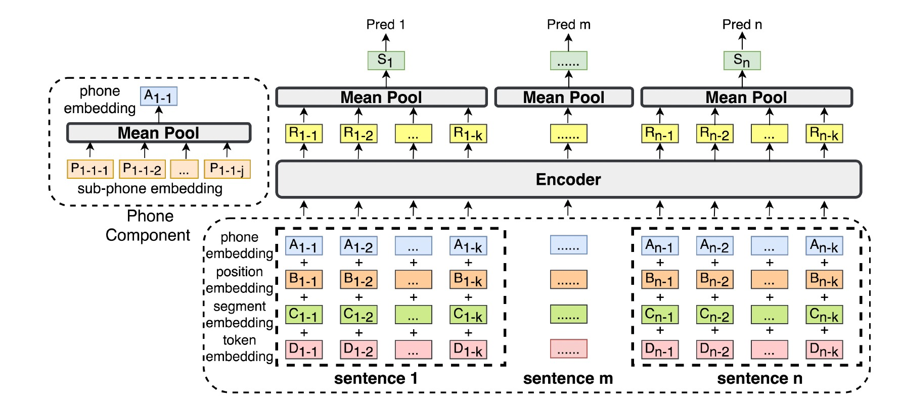
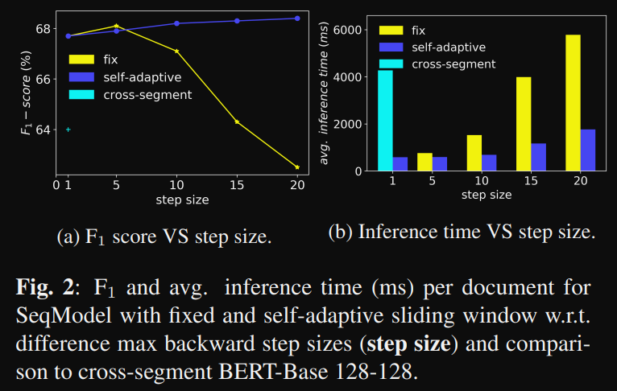

# 1. 介绍

Modelscope模型下载：https://modelscope.cn/models/iic/nlp_bert_document-segmentation_chinese-base/summary
使用公开的中英文wiki数据: https://linguatools.org/tools/corpora/wikipedia-monolingual-corpora/
论文：Sequence Model with Self-Adaptive Sliding Window for Efficient Spoken Document Segmentation

核心贡献：
- 达到SOTA，英文提升4.2，中文提升4.3-10.1
- 推理速度为当前SOTA的1/6
- 口语文档分割F1提升2.1-2.8

# 2. 原理

文档分割被定义为自动预测文档的段（段落或章节）边界。近年来，诸多研究者提出了许多基于神经网络的文本分割算法。
比如， 当前文本分割的 state of the art (SOTA) 是 Lukasik等提出的基于BERT的cross-segment模型，将文本分割定义为逐句的文本分类任务。

然而，文档分割是一个强依赖长文本篇章信息的任务，逐句分类模型并不能很好的利用长文本的语义信息，导致模型性能有着明显的瓶颈。
而层次模型面临计算量大，推理速度慢等问题。我们工作的目标是探索如何有效利用足够的上下文信息以进行准确分割以及在高效推理效率之间找到良好的平衡。



训练
- softmax cross-entropy loss
- phone embedding用于修正ASR错误
- 基于RoBERTa and ELECTRA


推理
- 概率0.5作为分割点

# 3. 效果

- 选择positive precision、positive recall、 positive F1作为客观评价指标。
- 在同源WIKI测试集上，positive-P、positive-R、positive-F1 = 78.4，69.5， 73.7；




# 4. 使用

```python
from modelscope.outputs import OutputKeys
from modelscope.pipelines import pipeline
from modelscope.utils.constant import Tasks

p = pipeline(
    task=Tasks.document_segmentation,
    model='damo/nlp_bert_document-segmentation_chinese-base')

result = p(documents='移动端语音唤醒模型，检测关键词为“小云小云”。模型主体为4层FSMN结构，使用CTC训练准则，参数量750K，适用于移动端设备运行。模型输入为Fbank特征，输出为基于char建模的中文全集token预测，测试工具根据每一帧的预测数据进行后处理得到输入音频的实时检测结果。模型训练采用“basetrain + finetune”的模式，basetrain过程使用大量内部移动端数据，在此基础上，使用1万条设备端录制安静场景“小云小云”数据进行微调，得到最终面向业务的模型。后续用户可在basetrain模型基础上，使用其他关键词数据进行微调，得到新的语音唤醒模型，但暂时未开放模型finetune功能。')

print(result[OutputKeys.TEXT])
```
