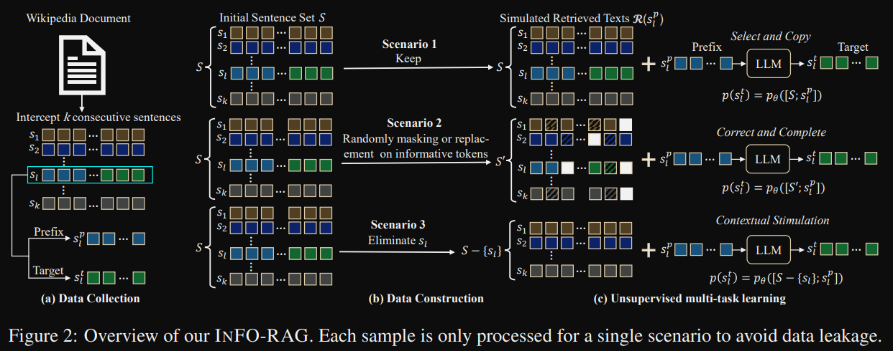
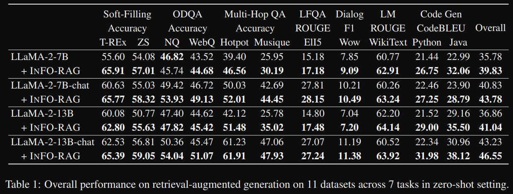

# 1. 简介

- 论文：Unsupervised Information Refinement Training of Large Language Models for Retrieval-Augmented Generation
  - https://arxiv.org/abs/2402.18150
- Github: 论文发表后即将开源

# 2. 问题

大模型本身的训练中并没有学习如何利用不同质量的输入文本。从而导致模型容易被误导或者忽略的情况，因此，论文提出了一个新颖的观点，将LLMs在RAG中的角色视为“信息精炼器”，意味着不管检索文本的正确性、完整性或有用性如何，LLMs都能够一致地整合检索文本和模型参数中的知识，生成比检索文本更简洁、准确和完整的文本。

论文提出了INFO-RAG，并将检索到的文本分为三类：

抽取。模型需要从检索到的文本中选择相关信息，并直接复制这些信息以生成正确的输出。

纠正。检索到的信息可能是不完整或包含错误。那么就要求模型纠正这些错误并补全缺失的信息，以生成更准确、完整的回答。在实际项目中这种场景就是，多路召回信息源不完美，需要被清理和完善的情况。

推理。检索到的信息是相关的，但没有直接答案。模型需要根据上下文和本身的知识来进行推理生成。

# 3. 原理

针对以上三类情况，论文提出了三个训练方式：

1. 选择与复制（Select and Copy）

  - 流程：模型接收一组句子集合S和一个前缀spl。它的任务是从S中选择与spl最相关的句子，并复制相关信息以生成目标stl。这个任务模拟了当模型面对大量信息时，需要准确挑选和复制正确信息的场景。
  - 实现：这要求模型具备强大的信息检索能力和文本匹配能力，以便准确选择与前缀相关的句子。

2.纠正与完成（Correct and Complete）
  - 流程：首先识别信息丰富的令牌，然后对这些令牌进行随机掩码和替换，以模拟不完整和错误的知识情景。模型需要基于剩余的正确信息来纠正错误和补全缺失的知识，以生成完整和准确的输出。
  - 实现：通过计算Jensen-Shannon Divergence（JSD）来识别信息丰富的令牌，然后执行掩码和替换操作。这个过程训练模型在面对有误导性或不完整信息时，如何利用其内部知识进行正确的生成。

3.情境刺激（Contextual Stimulation）
  - 流程：在这个任务中，部分与前缀直接相关的句子被从检索文本中移除，留下的信息虽然与前缀有关联，但并不直接提供生成目标所需的明确信息。模型需要利用这些间接信息，激发其内部知识，以生成与前缀相关但内容新颖的输出。
  - 实现：这要求模型具有较高的抽象和推理能力，能够在不直接依赖于特定检索信息的情况下，结合自身的知识和上下文提示生成相关内容。

在所有这些任务中，重点是训练模型以更灵活、准确地使用检索到的信息，无论这些信息的质量如何。通过这种训练，模型能够在实际应用中更好地处理来自外部来源的信息，提高检索增强生成任务的性能。这些任务通过模拟不同的信息使用场景，帮助模型学习如何在各种情境下有效地整合和利用检索到的信息。

# 参考

[1] INFO-RAG 一种提高问答准确的新尝试方案，https://mp.weixin.qq.com/s/LFiglki2I1skgPsd0vH77w