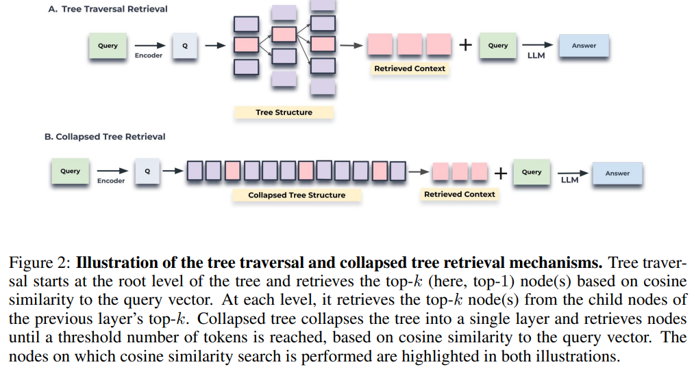
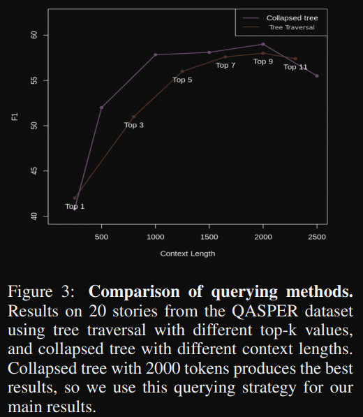
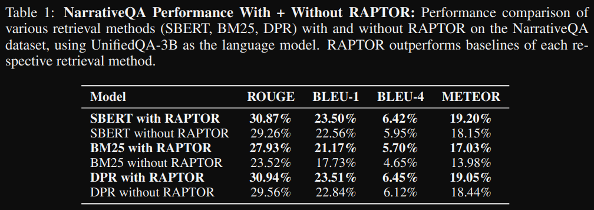

# 1. 简介

- 论文：RAPTOR: RECURSIVE ABSTRACTIVE PROCESSING FOR TREE-ORGANIZED RETRIEVAL
  - https://arxiv.org/pdf/2401.18059.pdf
  - 2024-01-31，作者：Stanford University
- Github (265 stars): https://github.com/parthsarthi03/raptor

论文引入了一种新颖的方法——RAPTOR，即递归嵌入、聚类和汇总文本块，自下而上构建具有不同摘要级别的树。在推理时，RAPTOR 模型从此树中检索，在不同抽象级别上集成冗长文档中的信息。对照实验表明，与传统的检索增强LM相比，使用递归摘要进行检索在多项任务上提供了显着的改进。在涉及复杂、多步骤推理的问答任务中，我们展示了最先进的结果; 例如，通过将 RAPTOR 检索与 GPT-4 的使用相结合，可以将QuALITY基准测试的最佳性能提高 20% 的绝对精度。

# 2. 原理

## 2.1 架构

RAPTOR 树的构建首先将检索语料库分割成长度为 100 的短而连续的文本（类似于传统的检索增强技术）。如果一个句子超过100个token的限制，我们会将整个句子移动到下一个块，而不是在句子中间剪切它。这保留了每个块中文本的上下文和语义一致性。然后使用SBERT嵌入这些文本，SBERT是一种基于BERT的编码器（multi-qa-mpnet-base-cos-v1）。块及其相应的 SBERT Embeddings构成了树结构的叶节点。

为了对相似的文本块进行分组，我们采用了聚类算法。聚类后，将使用语言模型来汇总分组的文本。然后，这些摘要文本被重新嵌入，嵌入（embedding）、聚类（clustering）和摘要（summarization）的循环继续进行，直到进一步的聚类变得不可行，从而产生原始文档的结构化、多层树表示形式。RAPTOR的一个重要方面是它的计算效率。该系统在构建时间和令牌支出方面都呈线性扩展，使其适用于处理大型和复杂的语料库。

对于此树中的查询，论文引入了两种不同的策略：树遍历和折叠树。树遍历方法逐层遍历树，修剪并选择每个级别最相关的节点。折叠树方法对所有层中的节点进行集体评估，以找到最相关的节点。

## 2.2 聚类算法

聚类在构建 RAPTOR 树、将文本片段组织成有凝聚力的组中起着关键作用。此步骤将相关内容组合在一起，这有助于后续的检索过程。该聚类方法的一个独特方面是使用软聚类，其中节点可以属于多个聚类，而不需要固定数量的聚类。这种灵活性至关重要，因为单个文本片段通常包含与各种主题相关的信息，因此可以保证将它们包含在多个摘要中。该聚类算法基于高斯混合模型（GMM），这种方法既具有灵活性，又具有概率框架。GMM 假设数据点是由多个高斯分布的混合生成的。

向量嵌入的高维性对传统的GMM提出了挑战，因为距离度量在用于测量高维空间中的相似性时可能表现不佳。为了缓解这种情况，论文采用了均匀流形近似和投影（UMAP），这是一种用于降维的流形学习技术。UMAP 中最近邻参数 n 个邻居的数量决定了局部结构和全局结构保留之间的平衡。我们的算法改变 n 个邻居以创建一个分层聚类结构：它首先识别全局聚类，然后在这些全局聚类中执行局部聚类。这个两步聚类过程捕获了文本数据之间的广泛关系，从广泛的主题到特定的细节。

如果本地集群的组合上下文超过汇总模型的令牌阈值，我们的算法会在集群内递归应用聚类，确保上下文保持在令牌阈值内。

为了确定聚类的最佳数量，我们采用贝叶斯信息准则 （BIC） 进行模型选择。BIC不仅惩罚了模型的复杂性，还奖励了拟合的优度。给定 GMM 的 BIC 为 BIC = ln（N）k − 2 ln（Lˆ），其中 N 是文本段（或数据点）的数量，k 是模型参数的数量，Lˆ 是模型似然函数的最大值。在 GMM 的上下文中，参数 k 的数量是输入向量的维数和聚类数量的函数。利用BIC确定的最优聚类数，然后使用期望最大化算法估计GMM参数，即均值、协方差和混合权重。

基于模型的总结：使用高斯混合模型对节点进行聚类后，每个聚类中的节点将发送到语言模型进行汇总。此步骤允许模型将大块文本转换为所选节点的简明、连贯的摘要。论文使用 gpt-3.5-turbo 来生成摘要。摘要步骤将检索到的大量信息压缩为可管理的大小。虽然摘要模型通常会产生可靠的摘要，但一项重点注释研究表明，大约 4% 的摘要包含轻微的幻觉。这些不会传播到父节点，并且对问答任务没有明显的影响。

## 2.3 查询

论文详细阐述了 RAPTOR 采用的两种查询机制：树遍历和折叠树。这些方法提供了遍历多层 RAPTOR 树以检索相关信息的独特方法，每种方法都有自己的优点和权衡。

树遍历方法首先根据其与查询嵌入的余弦相似度选择前 k 个最相关的根节点。这些选定节点的子节点在下一层被考虑，并且根据其与查询向量的余弦相似性再次从此池中选择前 k 个节点。重复此过程，直到我们到达叶节点。最后，将所有选定节点的文本连接起来，形成检索到的上下文。该算法的步骤概述如下：

1. 从 RAPTOR 树的根层开始。计算查询嵌入与此初始层上存在的所有节点的嵌入之间的余弦相似度。

2. 根据最高的余弦相似度分数选择前 k 个节点，形成集合 S1。

3. 继续处理集合 S1 中元素的子节点。计算查询向量与这些子节点的向量嵌入之间的余弦相似度。

4. 选择与查询余弦相似度分数最高的前 k 个子节点，形成集合 S2。

5. 对 d 层递归地继续此过程，生成集合 S1， S2， . . . ， Sd.

6.Concatenate 将 S1 设置为 Sd，以将相关上下文组合到查询中

通过调整深度 d 和每层选择的节点数 k，树遍历方法可以控制检索信息的特异性和广度。该算法从广阔的前景开始，考虑树的顶层，并在树的下层下降时逐渐关注更精细的细节。

折叠树方法提供了一种更简单的方法来搜索相关信息，方法是同时考虑树中的所有节点，如下图所示。这种方法不是逐层进行，而是将多层树展平为一层，实质上是将所有节点带到同一级别进行比较。

此方法的步骤概述如下：

1. 首先，将整个 RAPTOR 树折叠成一个图层。这组新的节点（表示为 C）包含来自原始树的每一层的节点。

2. 接下来，计算查询嵌入与折叠集合 C 中存在的所有节点的嵌入之间的余弦相似性。

最后，选择与查询具有最高余弦相似度分数的前 k 个节点。继续向结果集添加节点，直到达到预定义的最大令牌数，确保不超过模型的输入限制。

在 QASPER 数据集中的 20 个故事中测试了这两种方法。下图显示了具有不同顶部大小的树遍历和具有不同最大令牌数的折叠树的性能。折叠树方法始终表现更好。

# 3. 总结

论文认为，折叠树检索比树遍历具有更大的灵活性，因此更好; 即，通过同时搜索所有节点，它可以检索给定问题的正确粒度级别的信息。相比之下，当使用具有相同 d 和 k 值的树遍历时，树的每个级别的节点比率将是恒定的。因此，无论问题如何，高阶主题信息与细粒度细节的比例都将保持不变。

然而，折叠树方法的一个缺点是它需要对树中的所有节点执行余弦相似性搜索，当然这可以通过快速的 k 最近邻库（如 FAISS）提高效率。

总的来说，鉴于折叠树方法具有更大的灵活性，并且在 QASPER 数据集的子集上具有卓越的性能，这就是继续使用的查询方法。

定性研究

论文进行了定性分析，以了解 RAPTOR 的检索过程与密集通道检索 （DPR） 方法相比的优势。云纹的研究重点是使用 1500 字的灰姑娘童话故事的主题、多跳问题。如下图，RAPTOR 基于树的检索允许它从不同的树层中选择节点，从而匹配问题的详细程度。与 DPR 相比，这种方法通常为下游任务提供更相关、更全面的信息。

# 4. 实验

在三个问答数据集中衡量 RAPTOR 的表现：NarrativeQA、QASPER 和 QuALITY。

NarrativeQA 是一个由基于书籍和电影转录全文的问答对组成的数据集，共计 1,572 份文档。NarrativeQA-Story任务需要对整个叙事有全面的理解，才能准确回答其问题，从而测试模型在文学领域理解较长文本的能力。论文使用标准的 BLEU （B-1， B-4）、ROUGE （R-L） 和 METEOR （M） 指标来衡量此数据集的性能。

QASPER 数据集包括 1,585 篇 NLP 论文中的 5,049 个问题，每个问题都探索全文中嵌入的信息。QASPER 中的答案类型分为可回答/不可回答、是/否、抽象和提取。精度使用标准 F1 测量。

QuALITY 数据集由多项选择题组成，每个题都附有平均长度约为 5,000 个token的上下文段落。该数据集要求对整个文档进行推理以执行 QA 任务，使我们能够衡量检索系统在中等长度文档上的性能。该数据集包括一个具有挑战性的子集 QuALITYHARD，其中包含大多数人类注释者在速度设置中回答错误的问题。论文出具了整个测试集和 HARD 子集准确性的报告。

结果

结果表明，当与任何Retriever结合使用时，RAPTOR 在所有数据集上的表现始终优于相应的Retriever。

RAPTOR 在 QASPER 数据集上的所有三个语言模型中始终优于 BM25 和 DPR。

使用 GPT-3、GPT-4 和 UnifiedQA 时，RAPTOR 的 F-1 Match 分数分别为 53.1%、55.7% 和 36.6%。这些分数比 DPR 高出 1.8、2.7 和 4.5 分，并在各自的 LLM 中比 BM25 高出 6.5、5.5 和 10.2 分

与最先进系统的比较

基于受控比较，如下 所示，带有 GPT-4 的 RAPTOR 以 55.7% 的 F-1 得分为 QASPER 树立了新的基准，超过了 CoLT5 XL 的 53.9%

# 参考

[1] RAPTOR:递归树让大模型RAG的性能提升20%，https://zhuanlan.zhihu.com/p/681574401