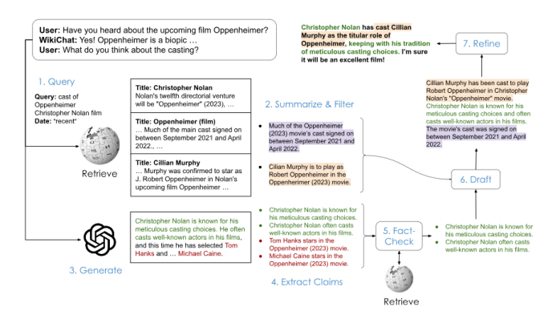
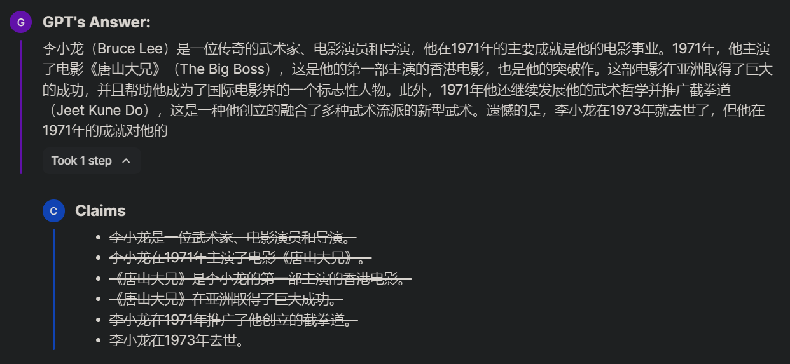
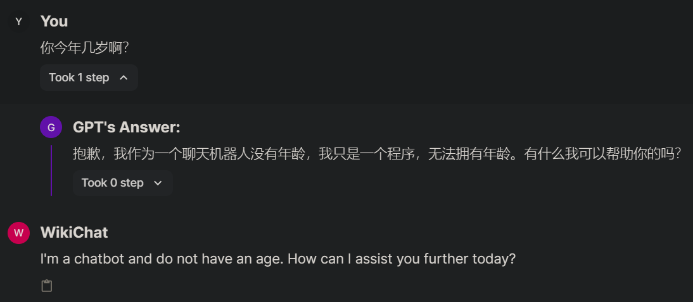
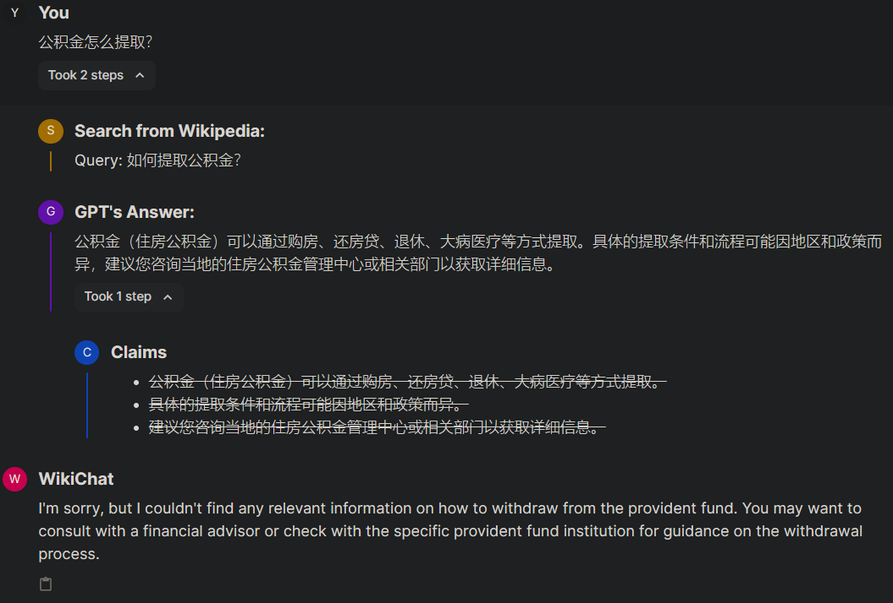

# WikiChat：几乎不会产生幻觉的模型

- 项目地址：https://github.com/stanford-oval/WikiChat
- 在线体验：https://wikichat.genie.stanford.edu

## 1.1 简介

像ChatGPT和GPT-4这样的大型语言模型（LLM）聊天机器人经常会出现错误，特别是当你要求的信息是最新的
（“告诉我关于2024年超级碗的事情。”）或者涉及较不流行的主题时（“推荐一些你喜欢的外国导演的好电影。”）。

WikiChat使用维基百科和以下的7阶段流程来确保其回答是基于事实的。

WikiChat基于英文维基百科信息。当它需要回答问题时，会先在维基百科上找到相关的、准确的信息，
然后再给出回答，保证给出的回答既有用又可靠。
在混合人类和LLM的评估中，WikiChat达到了97.3%的事实准确性，同时也普遍高于其他模型。
它几乎不会产生幻觉，并且具有高对话性和低延迟。

## 1.2 工作原理

WikiChat利用模型蒸馏技术，将基于GPT-4的模型转化为更小、更高效的LLaMA模型（70亿参数），以提高响应速度和降低成本。

WikiChat的工作流程涉及多个阶段，包括检索、摘要、生成、事实核查等，每个阶段都经过精心设计以保证整体对话的准确性和流畅性。

1. 检索信息: 当与用户进行对话时，WikiChat首先判断是否需要访问外部信息。
   例如，当用户提出具体问题或需要更全面的回答时。WikiChat生成一个搜索查询，
   以捕捉用户的兴趣，并根据这个查询从知识库（如维基百科）中检索相关信息。
2. 摘要和过滤: 检索到的信息可能包含相关和不相关的部分。
   WikiChat会提取相关部分，并将其摘要成要点，同时过滤掉无关内容。
3. 生成LLM响应: 接下来，使用大型语言模型（如GPT-4）生成对话历史的回应。
   这一步骤生成的内容通常既有趣又相关，但它本质上是不可靠的，因为它可能包含未经验证的或错误的信息。
4. 事实核查: WikiChat将LLM的回应分解为多个声明，并对每个声明进行事实核查。
   它使用检索系统从知识库中获取每个声明的证据，并基于这些证据对声明进行验证。只有那些被证据支持的声明才会被保留。
5. 形成回应: 最后，WikiChat使用经过筛选和验证的信息来形成一个吸引人的回应。
   这个过程分为两个步骤：首先生成草稿回应，然后根据相关性、自然性、非重复性和时间正确性对其进行优化和改进。

## 1.3 评估

1. 高事实准确性：在模拟对话中，WikiChat的最佳系统达到了97.3%的事实准确性。
   这意味着它在回答问题或提供信息时，几乎所有的回应都是基于事实和真实数据的。
2. 与GPT-4的比较：当涉及到头部知识（即常见或流行的主题）、尾部知识（即不常见或较少被讨论的主题）
   和最近的知识（即最新发生的事件或信息）时，WikiChat相比于GPT-4在事实准确性上分别提高了3.9%，
   38.6%和51.0%。这表明WikiChat在处理不同类型的信息时都有显著的改进，特别是在处理较少讨论的主题和最新信息方面。
3. 与基于检索的聊天机器人的比较：与之前最先进的基于检索的聊天机器人相比，
   WikiChat不仅在事实准确性上表现更好，而且在提供信息量和吸引用户参与方面也表现得更加出色。
   这意味着WikiChat能够提供更丰富、更有趣的对话体验。

在线页面体验如下 （该方案不支持流式推理）：

1. 正常分析回答步骤 (需要2步)
   
   
   
   
   
   
   

2. 判断不需要参考 （0步）

   

3. 搜索不到参考 （2步）

   

# 参考

[1] 斯坦福开发WikiChat：几乎不会产生幻觉的模型，https://mp.weixin.qq.com/s/c1Ft_Fx-Zegq-4Ny9dl-lA
