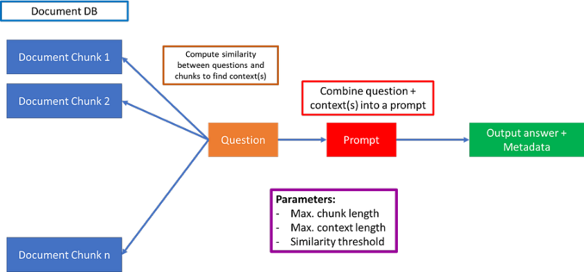
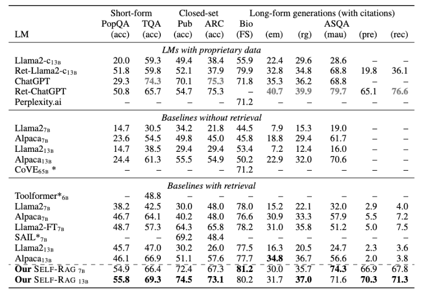

# 1. 资源

- 论文地址：https://arxiv.org/pdf/2310.11511.pdf
- Github地址：https://github.com/AkariAsai/self-rag
- 作者: IBM AI, 美国华盛顿大学

# 2. 问题分析

尽管LLM（大型语言模型）的模型和数据规模不断增加，但它们仍然面临事实错误的问题。
现有的Retrieval-Augmented Generation (RAG)方法可以通过增强LLM的输入来
减少知识密集任务中的事实错误，但可能会影响模型的通用性或引入无关的、低质量的内容。

***



在如下图所示的标准检索增强生成（RAG）架构中，通常检索前k个文档，或者选择固定上下文长度内的文档。

- 一个问题是，前k个文件并不包含所有答案——例如，可能只对应于过去5年或10年。
- 另一个问题是，计算文档块和提示之间的相似性并不总是产生相关的上下文。
  在这种情况下，可能会得到一个错误的答案。

# 3. 方法介绍

self-RAG使用了一种巧妙的方法，通过按需检索和自我反思来改进LLM的生成质量。 
self-RAG会训练一个任意的LM（比如Llama2–7B和13B），使其能够反思自己的生成过程，
并生成任务输出和中间的特殊tokens（reflection tokens）
（比如[Retrieval], [No Retrieval], [Relevant], [Irrelevant], 
[No support / Contradictory], [Partially supported], [Utility]等）。
这些reflection(反思) tokens被分类为检索tokens和批评tokens，分别表示需要检索的需求和其生成质量。


 Table-1 展示了一个名为 "SELF-RAG" 的系统中使用的四种反思tokens的类型：

① Retrieve：这是一个决策过程，它决定了是否从某个资源 R 中检索信息。

② IsREL：这是一个相关性检查，目的是确定给定的数据 d 是否包含解决问题 x 所需的相关信息。

③ IsSUP：这是一个验证过程，用于检查提供的响应 y 中的声明是否得到了数据 d 的支持。

④ IsUSE：这是一个评估过程，旨在评估给定的响应 y 对于问题 x 有多么有用。输出是一个从1到5的评分，5分代表最有用。

***


根据上图，可以分为两部分：RAG 和 Self-RAG，我们分别来看一下：

## 3.1 常规方法 RAG

Retrieval-Augmented Generation (RAG)

Step 1: 基于一个特定的提示（例如：“How did US states get their names?”）从数据源中检索K个文档。

Step 2: 使用这K个检索到的文档来引导语言模型(LM)生成答案。

## 3.2 SELF-RAG

Self-reflective Retrieval-Augmented Generation (Self-RAG)

- Step 1: 基于同样的提示，按需进行检索。这意味着可能不是一次性检索所有文档，而是根据需要逐个检索。

- Step 2: 并行生成各个段落，每个提示后都跟着一个检索到的文档。例如，Prompt + 1
  会生成与第一个文档相关的内容，同理，Prompt + 2和Prompt + 3也是如此。

- Step 3: 对输出进行评价，并选择最佳的段落。这一步骤是Self-RAG的核心，它使模型能够评判自己的输出，
   选择最准确和相关的段落，并对其进行迭代或改进。

图中还展示了Self-RAG模型在处理不同类型的问题时可能的行为。例如，在请求写一篇关于“最佳夏日假期”的文章时，
模型可能会选择不进行检索，直接生成答案。

# 4. 训练
## 4.1 训练概述 

(1) SELF-RAG 的目标

    SELF-RAG 的设计使得任意的语言模型（LM）可以生成包含“反思tokens”(reflection tokens) 的文本。
    这些token来自于扩展的模型词汇（即，原始词汇加上反思tokens）。

(2) 训练细节

    生成模型M是在一个经过筛选的语料库上进行训练的，该语料库包含由检索器R检索到的段落和由评判模型C预测的反思tokens。

(3) 评判模型C

    它被训练用于生成反思tokens，这些tokens用于评估检索到的段落和给定任务的输出质量。

(4) 使用评判模型的目的

    在离线情况下，使用评判模型可以将反思tokens插入到任务输出中, 更新训练语料。

(5) 最终训练的目标

    使用传统的LM目标，训练最终的生成模型 ，使其能够自己生成反思tokens，而不需要在推理时依赖评判模型。


## 4.2 Self-RAG 训练

### 4.2.1 训练评判模型(critic model)

（1）数据收集

    利用GPT-4生成reflection tokens，然后将其知识提炼到一个内部评判模型C（in-house C）

（2）评判学习(critic learning)

    - 训练数据集 D_critic；
    - 使用预训练的LM（语言模型）对C进行初始化，训练评判模型的目标：
      最大化似然。希望最大化关于D_critic的期望值，其中期望值基于某些"reflection tokens"的条件概率的对数；
      
   
    
    - 初始模型可以是任何预训练的LM，这里选择了与生成器LM相同的模型，即 Llama 2-7B；
    - 评判模型在大多数"reflection token"类别上达到了超过90%的与GPT-4基于的预测的一致性。

### 4.2.2 训练生成模型(generator model)

（1）数据收集

    - 对于输出 y 中的每个片段 yt，模型会使用 C（评判模型）来评估是否需要进一步的检索；
    - 如果需要检索，会添加一个特殊的检索token:  Retrieve=Yes，接着，R（检索算法）会检索最相关的 K 个文章或段落，记为 D；
    - 对于每一个检索到的文章或段落，C（评判模型）会进一步评估这个段落是否与当前的任务相关，并给出一个 IsREL（是否相关）的预测；
    - 如果该段落被认为是相关的，C 会进一步评估这个段落是否支持模型的生成，并给出一个 IsSUP（是否支持）的预测；
    - IsUSE 可能代表着模型对检索到的内容的整体效用或有用性的评估；

    最后，与反思tokens一起增强的输出和原始的输入对被添加到 Dgen，作为一个训练数据集。
    
(2) 生成学习(generator learning)

    - 使用反思tokens的经过修改过的语料库Dgen来训练生成器模型；
    - 目标函数描述了最大化 M 在给定输入 x 的情况下，对输出 y 和相关的信息 r 的概率的对数似然；
    
   
   
    - 与C（评判模型）训练不同，生成器M学习预测目标输出以及反思tokens。训练期间，
    将检索到的文本块（由<p>和</p>围绕）进行遮挡以进行损失计算。这意味着模型在计算
    损失时不考虑这些检索到的文本块。原始词汇V通过一组反思tokens（如<Critique>
    和<Retrieve>）进行扩展。这表示这些tokens被加入到词汇中，
    使模型能够使用这些特定的tokens来生成输出。

# 5. 评估

作者针对公共卫生事实验证、多项选择推理、问答等三种类型任务进行了一系列评估。
像事实验证和多项选择推理等闭集任务，使用准确性作为评估指标。对于开放域问答这样简短的生成任务，
作者使用groundtruth答案是否包含在模型生成中来进行评估，而不是严格要求精确匹配。

对于传记生成和长格式QA等长文本生成任务，作者使用FactScore（https://github.com/shmsw25/FActScore）
来评估传记——基本上是对生成的各种信息及其事实正确性的衡量。对于长格式QA，使用了引用精度和召回率。

对于长文本生成任务，安装factscore==v0.1.5，并设置FactScore环境



Self-RAG在非专利模型中表现最好，在大多数情况下，较大的13B参数优于7B模型。在某些情况下，它甚至优于ChatGPT。

# 6. 推理

推理算法的伪代码，其中涉及三个主要组件：生成器语言模型（LM）、检索器（R）、以及大型文本段落集合（D）。如图所示:


论文介绍了 SELF-RAG 模型如何在推理阶段生成反思tokens，这使得它能够自我评估其输出。
这一功能使 SELF-RAG 能够在推理阶段进行控制，从而根据不同的任务需求调整其行为。

***

基于阈值的自适应检索（Adaptive retrieval with threshold）

（1）SELF-RAG 可以动态决定何时检索文本段落，这是通过预测 Retrieve 来完成的。此外，框架还允许设定一个阈值。

（2）如果生成的token是 Retrieve=Yes， 且在所有输出tokens中的标准化值超过了指定的阈值，则触发检索。

***

基于评判tokens的树解码（Tree-decoding with critique tokens）

（1）基本框架

    第1步：当每一步进行到t时，依据是否需要检索，可以基于硬或软条件进行。
    
    第2步：R会检索出K个段落，而生成器M会处理这些段落，从中产生K个不同的续写候选。
    
    第3步：之后进行一个段落级别的束搜索（使用beam size=B），从而在时间戳t获得最优的续写序列。
    
    第4步：每一段的得分将根据与段落d的关系进行更新。

（2）评判得分（critic score）的计算

    每个片段yt关于段落d的得分与每个critique token类型的标准化概率的线性加权和相关。
    
    对于每一个critic token组（例如 IsREL），其在时间戳t的得分会被记作s^G_t。
    
    计算一个段的得分（compute a segment score），计算公式如下图：
    
    
    
    公式中参数说明: 
    
    ① p(yt | x, d, y<t) 是一个条件概率，表示给定输入x、段落d和之前的输出y<t时，产生输出yt的概率。而S(Critique)是critic token的得分。
    
    ② S(Critique)的计算是一个求和操作，涉及到所有的G组的critic token的加权得分。具体的组可以是IsREL, IsSUP, IsUSE等。
    
    ③ s^G_t: 这是最想要的reflection token的生成概率
    
    ④ G的不同可能值: critique token类型G可以有多个不同的值，例如: IsREL, IsSUP, IsUSE
    
    ⑤ 权重w^G: 这些权重是可以调整的超参数，以自定义模型在推理期间的行为。通过调整这些权重，可以强调某些期望的行为并降低其他行为。


（3）在解码过程中使用 Critique

      在解码阶段强制执行硬约束(hard constraints)，这意味着模型可以被设置为基于这些critic token完全避免产生某些输出。

（4）在多个偏好之间进行权衡

    在模型训练中平衡多个目标，模型需要在不同的输出偏好之间取得平衡。
    

***

```python
from vllm import LLM, SamplingParams
model = LLM("selfrag/selfrag_llama2_7b", download_dir="/gscratch/h2lab/akari/model_cache", dtype="half")
sampling_params = SamplingParams(temperature=0.0, top_p=1.0, max_tokens=100, skip_special_tokens=False)
def format_prompt(input, paragraph=None):
prompt = "### Instruction:\n{0}\n\n### Response:\n".format(input)
if paragraph is not None:
prompt += "[Retrieval]<paragraph>{0}</paragraph>".format(paragraph)
return prompt
query_1 = "Leave odd one out: twitter, instagram, whatsapp."
query_2 = "Can you tell me the difference between llamas and alpacas?"
queries = [query_1, query_2]
# for a query that doesn't require retrieval
preds = model.generate([format_prompt(query) for query in queries], sampling_params)
for pred in preds:
print("Model prediction: {0}".format(pred.outputs[0].text))
```

对于需要检索的查询，可以在下面的示例中以字符串的形式提供必要的信息。

```python
paragraph="""Llamas range from 200 to 350 lbs., while alpacas weigh in at 100 to 175 lbs."""

def format_prompt_p(input, paragraph=paragraph):
  prompt = "### Instruction:\n{0}\n\n### Response:\n".format(input)
  if paragraph is not None:
    prompt += "[Retrieval]<paragraph>{0}</paragraph>".format(paragraph)
  return prompt

query_1 = "Leave odd one out: twitter, instagram, whatsapp."
query_2 = "Can you tell me the differences between llamas and alpacas?"
queries = [query_1, query_2]

# for a query that doesn't require retrieval
preds = model.generate([format_prompt_p(query) for query in queries], sampling_params)
for pred in preds:
  print("Model prediction: {0}".format(pred.outputs[0].text))
```

```text

# 输出
[Irrelevant]Whatsapp is the odd one out.
[No Retrieval]Twitter and Instagram are both social media platforms, 
while Whatsapp is a messaging app.[Utility:5]

[Relevant]Llamas are larger than alpacas, with males weighing up to 350 pounds.
[Partially supported][Utility:5]
```

# 7. 总结

- 自适应段落检索：通过这种方式，LLM可以继续检索上下文，直到找到所有相关的上下文（当然是在上下文窗口内）；
- 更相关的检索：很多时候，embedding模型并不擅长检索相关上下文。Self-RAG可能通过relevant/irrelevant的特殊token来解决这一问题；
- 击败其他类似模型：Self-RAG超过了其他类似模型，在许多任务中也出人意料地击败了ChatGPT。
- 不会改变基本的LM：我们知道微调和RLHF很容易导致模型产生偏差。Self-RAG似乎通过添加特殊的token来解决这个问题，并在其他方面保持文本生成不变。


不过，在处理固定的上下文长度方面还有一些改进的空间。这可以通过在Self-RAG中添加摘要组件来实现。
事实上，之前已经有一些关于这方面的工作（请参阅：用压缩和选择性增强改进检索增强LMs
（https://arxiv.org/abs/2310.04408））。另一个令人兴奋的方向是OpenAI刚刚发布的上下文长度窗口
的增加——GPT-4 128k上下文窗口更新。然而，正如论坛中所提到的，这个上下文窗口表示输入长度，而输出限制仍然是4k个令牌。

RAG代表了行业将LLM纳入其数据以产生实际业务影响的最令人兴奋的方式之一。然而，还没有太多针对RAG的语言模型调整。
我对这个领域未来的改进感到兴奋。

# 参考

[1] LLM之RAG实战（四）：Self-RAG如何革命工业LLM, https://mp.weixin.qq.com/s/a3tzatoHdHde9-IqCIwWHQ