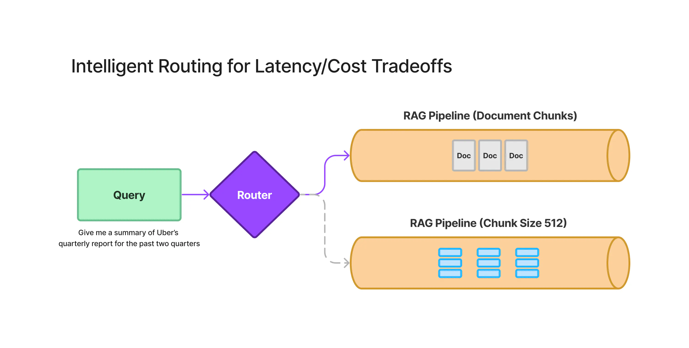
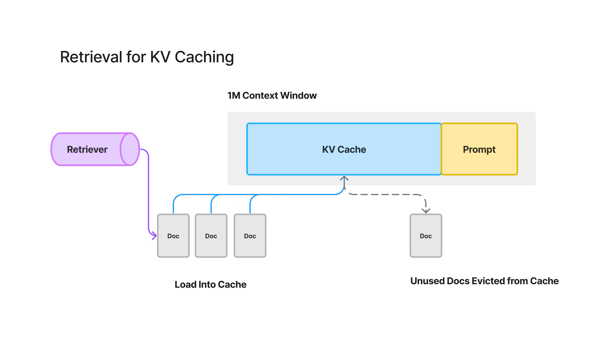

# 1. 简介

Google Gemini 1.5 Pro 1M 上下文，在“Needle in a Haystack” 实验中达到99.7%的召回率。
是否还需要RAG，或者和RAG如何结合

# 2. 问题

- Gemini无法正确读取所有的表格和图
- Gemini花费时间很长且成本高
  - Uber 10K Filing (~160k) takes ~20 seconds
  - LHS Schematic Design Binder (~890k) takes ~60+ seconds
- Genimi在页码上会存在幻觉：如给出总结以及引用的页码
- 10M在超大文档任然不够：任然需要构建检索和存储器
- embedding模型在长度上落后：最长的是together ai的32k（无attention和mlp的bert模型）
- 另一个方法，是将文档缓存在kv cache，但缓存1M需要100G显存

# 3. 优势

长上下文带来如下优势：

1. chunk大小调试不再受限
2. 不用花大量时间调试检索器和COT
3. 总结会容易（传统方案采取层级总结或者顺序优化）
4. 存储设计更加简单（不需要再用压缩方案，如果向量搜索等）

# 4. 方案

1. 文档上的从小到大检索

   

    对应方法 (llama index已实现)：
    - sentence window retriever：https://docs.llamaindex.ai/en/stable/examples/node_postprocessor/MetadataReplacementDemo.html 
    - recursive retrieval over chunk sizes：https://docs.llamaindex.ai/en/stable/examples/retrievers/recursive_retriever_nodes.html

    使用短文本检索原因：
    - 向量模型长度不够
    - 多向量比文档级的单向量效果好（向量不能很好的存储全文信息）

2. 智能路由以实现延迟/成本权衡
   
   

    - 使用长上下文LLM需要在成本和时延之间权衡，不是所有问题和例子都需要长上下文。
    - 复杂的问题可能需要介个多个文档的片段，不确定如何平衡时延和成本
      - 总结全文
      - 使用COT，关联和推理检索片段，把所有相关的片段组合成一个长上下文，能更好解决问题
   
    通过路由选择合适的pipeline。

3. 检索增强的键值对（KV）缓存

    

    通过kv cache，可以对模型计算进行缓存，避免重复推理，但是，kv cache需要大量显存。

    kv cache介绍：https://medium.com/@plienhar/llm-inference-series-3-kv-caching-unveiled-048152e461c8

    问题：
    - 如何很好的利用缓存，例如文档超长
    - 如果不是在同一个文档一直提问，利用率也不高
    - 无法提取cache里的片段
    - 使用缓存的api接口几乎不可能设计出来

# 参考

[1] Mar 1, 2024, Towards Long Context RAG, https://www.llamaindex.ai/blog/towards-long-context-rag
