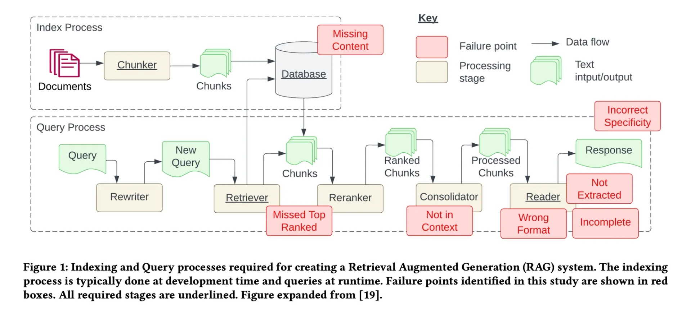
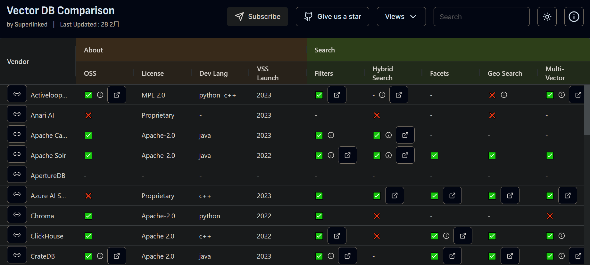
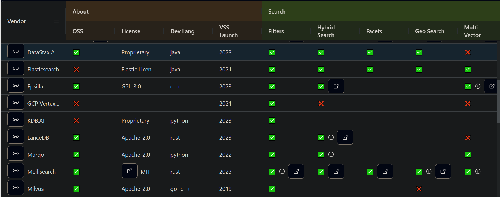
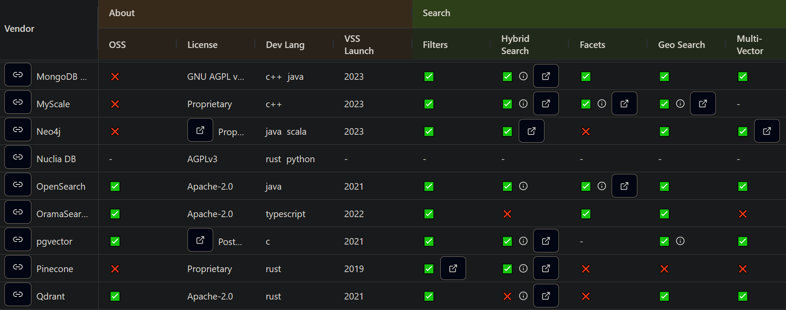
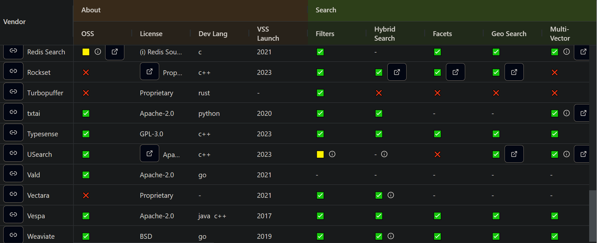

# 如何构建企业级RAG系统

# 1. 介绍

文章来自Galileo, llama-index CEO推荐


RAG的7个故障点



- Missing content (FP1)： 现有文档无法回答
- Missed the top ranked documents (FP2)：参考文档排序不在前
- Not in context - consolidation strategy limitations (FP3)：文档不在上下文中
- Not extracted (FP4)：文档无法提取
- Wrong format (FP5)：文档格式错误，如表格或列表
- Incorrect specificity (FP6)：回答不够具体
- Incomplete (FP7)：回答缺失信息


# 2. 方案
## 2.1 用户验证

问题：

- 用户授权
- 数据安全
- 隐私保护
- 合规

解决方案：

AWS Cognito or Firebase Authentication可以用于验证和授权 

## 2.2 输入校验

问题：

有害或者涉及隐私的问题需要被过滤，否则容易导致大模型越狱。

- 匿名化：对姓名、地址和联系方式匿名化，以保护隐私同时避免泄露敏感信息
- 严格化字符串：SQL注入和XSS攻击，避免出现不必要的输出
- 限制主题：避免暴力、攻击性和冒犯的主题
- 避免输入可执行代码
- 限制输入语言
- 避免prompt注入：避免用户输入误导或者有害的prompt可以操作系统或者影响LLM的表现
- 限定token数量：避免资源耗尽一级避免（DoS）攻击
- 毒性检测：检测并阻止有害和辱骂性语言

解决方案：

- Llama Guard: 
  - 介绍首页：https://llm-attacks.org/
  - 训练了一个模型来检测和阻止有害和辱骂性语言，避免用户输入误导或者有害的prompt可以操作系统或者影响LLM的表现
  - 论文：Universal and Transferable Adversarial Attacks on Aligned Language Models
    - https://arxiv.org/abs/2307.15043
  - Github (2.6k Stars): https://github.com/llm-attacks/llm-attacks
- Safeguarding Your RAG Pipelines: A Step-by-Step Guide to Implementing Llama Guard with LlamaIndex
  - 使用Sagemaker服务
  - https://towardsdatascience.com/safeguarding-your-rag-pipelines-a-step-by-step-guide-to-implementing-llama-guard-with-llamaindex-6f80a2e07756

## 2.3 输入重写

输入在校验通过后，进入输入重写阶段。输入重写是为了提高LLM的表现，避免输入的歧义和模糊性。

方案：

1. 基于历史重写

   样例如下：

   ```text
    Query History:

    "How many credit cards do you have?"
    
    "Are there any yearly fees for platinum and gold credit cards?"
    
    "Compare features of both."
    
    We must identify the context evolution based on the user's query history, discern the user's intent and relationship between queries, and generate a query that aligns with the evolving context.
    
    Rewritten Query: "Compare features of platinum and gold credit cards."
    ```

2. 构造子问题
   
   复杂问题很难回答，将问题拆解。

   llama-index参考样例：https://docs.llamaindex.ai/en/stable/examples/query_engine/sub_question_query_engine.html
    
   样例如下：

   ```text
   Given the query "Compare features of platinum and gold credit card," the system generates subqueries for each card that focus on individual entities mentioned in the original query.

    Rewritten Subqueries:
    
    "What are the features of platinum credit cards?"
    "What are the features of gold credit cards?"
    ```

3. 构造相似的问题

   提升检索的覆盖率

   样例如下：

   ```text
    Generated Similar Query:

    “I want to know about platinum credit cards” -> "Tell me about the benefits of platinum credit cards."
    ```

# 3. Encoder

把原始和改写的问题，转换成向量进行检索查询。

向量模型MTEB评测基准：https://huggingface.co/spaces/mteb/leaderboard

选择embedding模型需基于自己的测试集评估进行选择。

定制化评估：
- 选择一个基准标注数据集，对如下指标进行评估：Mean Reciprocal Rank (MRR) and Normalized Discounted Cumulative Gain (NDCG) 
- 通过模型评估：但人工评估更准确
- 通过聚类评估：HDBSCAN聚类算法，查看向量的聚类效果

使用本地还是在线模型：
- 向量生成费用
- 检索费用
- 存储费用
- 语言支持 (使用多语种模型，或者翻译模型+向量模型)
- 时延：使用低维向量，费用更低
- 隐私：本地模型更安全

# 4. 知识管理系统

- 知识管理系统是一个数据库，用于处理和存储文档。
- 文件被分割成chunk，每个chunk被编码成向量，然后存入数据库方便索引
- 文件解析器：支持处理各类文档格式，如PDF、Word、Excel、PPT、HTML、XML、JSON、CSV、TXT、RTF、Markdown、LaTeX、图片、音频、视频等
- 表格识别：表格被解析成结构化数据，然后存入数据库
  - 可以使用table-transformer: https://huggingface.co/spaces/nielsr/tatr-demo
- 图像识别：使用OCR提取文本
- 原始信息：如标题、作者、日志、类型、日期、标签等

# 5. 分割器

分割器是一个模型，用于将文档分割成chunk，然后编码成向量。分割对检索效果有很大影响。

问题：
- 文档过长，会包含过多噪声
- 文档过短，会丢失信息

优化方案：
- 优化方案 （降噪、文本大小、编码和存储成本）：https://www.youtube.com/watch?v=qaPMdcCqtWk
- 分块优化策略：https://www.rungalileo.io/blog/mastering-rag-advanced-chunking-techniques-for-llm-applications


# 6. 检索器

用于给文档建立索引，搜索和抽取文档。包括增删改查。

问题和挑战

- 随着文档数量的增加，可扩展性成为挑战。
- 实时索引，由于文档频繁更新，实时索引成为挑战。
- 连续性和原子性：随着文档的更新和修改，连续和原子性会成为挑战
- 存储优化
- 安全和访问控制
- 监控和维护：比如监控索引失败、资源瓶颈或者过期的索引，需要鲁棒的监控和维护流程

# 7. 数据存储

- embedding数据库：SQL/NOSQL, embedding存储作为备份，避免系统故障
- 原始文件：NOSQL，按原格式存储，便于以后的加工和使用
- 对话历史：NOSQL，便于分析用户行为
- 用户反馈：SQL/NOSQL, 通过thumbs-up/thumbs-down, star ratings and text 等反馈

# 8. 向量数据库

向量数据库对比：https://superlinked.com/vector-db-comparison/

如下截图部分列展示不全









- 召回 vs. 时延
  - Different indexes like Flat, HNSW (Hierarchical Navigable Small World), 
    PQ (Product quantization), ANNOY, and DiskANN make varying trade-offs between speed and recall. 
- 费用：权衡本地或云存储
- 插入 vs. 查询速度
  - 查询速度相对更重要
  - 要考虑插入的峰值和时延
- 索引在内存 vs. 在磁盘存储
  - 需权衡速度和成本
  - 新的索引，Vamana in DiskANN在内存外也很快
- 全文本搜索 vs. 向量混合搜索
  - 
  - 混合检索参考：https://www.pinecone.io/learn/hybrid-search-intro/
  - 稠密和稀疏检索可以通过参数配置：Pinecone, Weaviate & Elasticsearch.
    - https://www.pinecone.io/learn/hybrid-search-intro/
    - https://weaviate.io/blog/hybrid-search-fusion-algorithms
    - https://www.elastic.co/cn/blog/improving-information-retrieval-elastic-stack-hybrid
  - 过滤
    - 真实的问题往往需要进行信息过滤
    - 预过滤：可能忽略了源信息而导致错误
    - 后过滤：可能导致信息缺失
    - 自定义过滤：如Weaviate，混合预过滤使用倒排索引，在HNSW索引
      - https://weaviate.io/developers/weaviate/concepts/prefiltering

# 9. 检索性能提升

参考论文：
- Large Language Models Can Be Easily Distracted by Irrelevant Context
  - https://arxiv.org/abs/2302.00093
- Lost in the Middle: How Language Models Use Long Contexts
  - https://arxiv.org/abs/2307.03172

问题：

- 无关信息会对大模型产生干扰
- 过多的检索到的topK文档会导致错过重要的片段
- 处理短的和匹配错的问题，可能比较困难

解决方法：

- HyDE：混合向量
  - 论文：Precise Zero-Shot Dense Retrieval without Relevance Labels
    - https://arxiv.org/abs/2212.10496
  - 通过大模型生成文本总结作为待检索向量，对性能提升有明显帮助
- 问题路由
  - 文档包括技术文档、产品文档、任务和代码仓。比如询问产品特性，则导向产品文档
- 重排：降低幻觉，提升检索性能，但可能导致推理速度增加
  - cross-encoder
  - 基于大模型的：RankVicuna, RankGPT, and RankZephyr
- Maximal Marginal Relevance (MMR)
  - 用于让检索多样化，避免冗余信息
  - 平衡相关性和多样性
- 自动分割（Auto-cat）
  - 根据检索到的得分，判断相关和弱相关，找到变化的拐点
  - 样例：https://weaviate.io/developers/weaviate/api/graphql/additional-operators#autocut
  - ```text
    For example, consider a search that returns objects with these distance values:

    [0.1899, 0.1901, 0.191, 0.21, 0.215, 0.23].
    
    Autocut returns the following:
    
    autocut: 1: [0.1899, 0.1901, 0.191]
    autocut: 2: [0.1899, 0.1901, 0.191, 0.21, 0.215]
    autocut: 3: [0.1899, 0.1901, 0.191, 0.21, 0.215, 0.23]
    ```
- 递归检索
  - 
  - https://youtu.be/TRjq7t2Ms5I?si=D0z5sHKW4SMqMgSG&t=742
  - small-to-big 检索策略，使用小的chunk检索，性能更好，使用大的chunk给大模型做合成，
    有更多的上下文便于合成更好的性能
- 句窗口检索
  - 以单句检索，返回单句的上下问。保证检索的精确性，以及语义的完整性。

# 10. 生成

考虑使用本地还是在线大模型服务。

- API考虑：考虑安全、稳定性和幻觉检测
  - 性能：
    - tensor并行，加快处理速度
    - continuous batching，提升吞吐量
    - 量化：bitsandbytes and GPT-Q
    - 生成质量提升：用户可以根据需要调整 temperature scaling, top-p, top-k, and repetition penalty
    - Log probabilities：对于幻觉检测很重要，作为一个额外的优化手段
  - 安全
    - safetensor加载很重要
    - 水印增加额外一层
  - 用户体验
    - 流式推理对体验很重要
    - 使用Server-Sent Events (SSE)作为接口流式推理
  - 自由推理引擎
    - 考虑推理的效率、易用性和兼容性，如TGI, Ray, or FastAPI
    - 推理性能评估：https://github.com/ray-project/llmperf-leaderboard
      - 测试指标：time to first token (TTFT), inter-token latency (ITL), and success rate.
      - 正确性测试：https://www.rungalileo.io/blog/mastering-rag-8-scenarios-to-test-before-going-to-production
      - 负载测试
      - lorax: 多用户共享基础模型，使用不同的微调模型，单卡支持上前个用户的方案
        - https://predibase.com/blog/lorax-the-open-source-framework-for-serving-100s-of-fine-tuned-llms-in
# 参考

[1] mastering-rag-how-to-architect-an-enterprise-rag-system， https://www.rungalileo.io/blog/mastering-rag-how-to-architect-an-enterprise-rag-system?utm_medium=email&_hsmi=295778713&_hsenc=p2ANqtz-85wuBy2znSxOZGLNZu0n1UrH7Dwv32mKo8aChlTaZLJ-1LxzhZdx9QoRbar3nICeS82IoUbL8ogLGFcQN5EVYByozrmA&utm_content=295779191&utm_source=hs_email