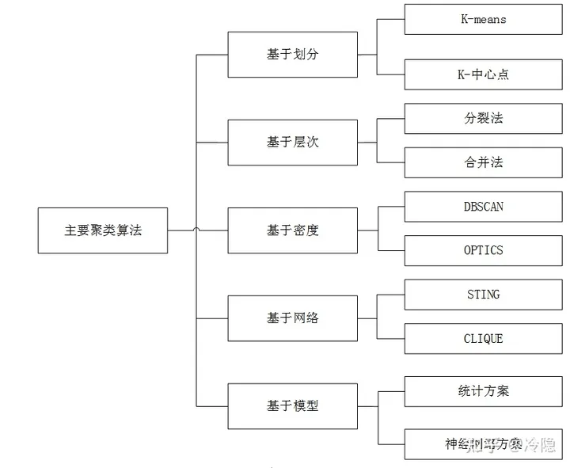

# 1. 概要

目前聚类主要分为以下几类：基于划分的聚类算法、基于层次的聚类算法、基于密度的聚类算法、基于网格的聚类算法、基于模型的聚类算法以及基于模糊的聚类算法。图1为目前主要的聚类算法分类图。

图1 聚类算法分类图

# 2. 详解

1. 基于划分的聚类算法

    基于划分的聚类算法是聚类算法中最为简单的算法，假设有一个数据集D，其中包含N个子数据，若要将D划分为 K个类簇,K<N，每个类簇中至少含有一个子数据，且类簇之间不会有交集。要达到的要求是簇中的数据之间有较高的相似度，而簇类之间的相似度尽可能地低。经过专家学者的不断研究， K-means算法、Single-Pass增量聚类算法、围绕中心划分（Partitioning Around Mediods，PAM）算法等等都得到了较为广泛的应用。而其中最为经典、应用最多的是K-means算法。
    
    K-means算法又称 K均值算法，是一种容易实现且应用广泛的聚类算法，其算法的思想是首先在数据样本集中随机选取K个样本作为簇中心；然后计算样本集中其他样本与这K个簇中心的距离，距离通常利用曼哈顿距离、欧式距离等来度量，再根据设定的阈值将每个样本划分到与其距离最近的簇中心所在的簇中；最后根据新划分的簇重新计算距离，将簇中所含样本的距离均值作为更新簇的中心，再重复计算距离直到达到条件。K-means算法最关键的就是确定K的个数。
    
    基于划分的聚类算法对于大部分数据都有较强的适用性，且计算简单高效，空间复杂度较低，但是在处理大规模样本时结果多数是局部最优，对于类簇中心选取也十分敏感并且无法解决非凸数据。

2. 基于层次的聚类算法

    层次聚类算法（Hierarchical Clustering，HC）又称为树聚类算法。主要思想是将样本集合合并或者分裂成凝聚度更高或者更细致的子样本集合，最终样本集合形成一棵层次树。同K-means算法不同，层次聚类算法不需要预先设定聚类数K，只要样本集合通过不断迭代达到聚类条件或者迭代次数即可。基于层次划分的经典聚类算法有：变色龙算法、AGNES（Agglomerative NE Sting）、CURE（Clustering Using RE Presentatives）等。根据聚类的方向基于层次的聚类算法可以分为凝聚式和分裂式，凝聚式是将簇结合起来，而分裂式则是将大的类簇分为小类。
    
    （1）凝聚式层次聚类算法
    
    凝聚式层次聚类（Hierarchical Agglomerative Clustering，HAC）顾名思义是凝聚数据样本，它的聚类方向是从子数据向上不断合并，该算法经常运用于话题检测中。凝聚式层次聚类首先从底部分散的单个样本开始依次计算与其他样本的距离，然后选择距离最小样本并与其合并成一个新的样本集，再重复上述过程直到形成一个包含所有样本的簇，或者达到迭代次数。凝聚式层次聚类只需要计算样本之间的距离然后合并，该方法计算简单，但是如果数据样本太大则算法复杂度会呈指数级增长，且已合并的操作无法逆转。
    
    （2）分裂式层次聚类算法
    
    分裂式层次聚类与凝聚式层次聚类处理样本数据的方向是相反的，它是将整个数据样本看作一个大类簇，然后根据距离公式或其他原则将大的类簇分为小的类簇，不断迭代直到将所有的样本数据分类到单独的类簇中或者是达到迭代次数。层次聚类被公认为是能够产生较好质量的聚类结果的聚类算法。此算法缺点是已操作不能撤回，对于大量数据样本时间复杂度高。

3. 基于密度的聚类算法

   基于密度的聚类算法的主要思想是首先找出密度较高的点，然后把周围相近的密度较高的样本点连成一片，最后形成各类簇。基于密度的聚类比较代表性的三种方法有：Ester等提出的DBSCAN方法、Ankerst 等提出OPTICS方法和 Hinneburg 提出的 DENCLUE技术。此类算法的优点是鲁棒性很强，对于任意形状的聚类都适用，但是结果的精度与参数设置关系密切，实用性不强。

4. 基于网格的聚类算法

   与其他聚类算法相比较，基于网格的聚类算法出发点不再是平面而是空间。在该空间中，有限个网格代表数据，聚类就是按一定的规则将网格合并。Wang等人提出的STING算法及其改进算法、Agrawa等人提出的CLIQUE算法等都是较为经典的基于网格的算法。基于网格的聚类算法由于处理数据时是独立的，仅仅依赖网格结构中每一维的单位数，因此处理速度很快。但是此算法对参数十分敏感，速度快的代价是精确度不高，通常需要与其他聚类算法结合使用。

5. 基于模型的聚类算法

   基于模型的聚类算法的思路是假设每个类簇为一个模型，然后再寻找与该模型拟合最好的数据，通常有基于概率和基于神经网络两种方法。概率模型即概率生成模型，是假设数据是由潜在的概率分布产生的，典型的算法是高斯混合模型（Gaussian Mixture Models，GMM）[50]；而来自芬兰的神经网络专家提出的自组织映射（Self Organized Maps，SOM）是典型的神经网络模型。对类簇而言，基于模型的聚类算法是用概率形式呈现，每个类的特征也可以直接用参数表示，但是与其他聚类方法相比，这类聚类方法在样本数据量大的时候执行率较低，不适合大规模聚类场合。

6. 基于模糊的聚类算法

    基于模糊的聚类算法主要是为了克服非此即彼的分类缺陷，它的主要思想是以模糊集合论作为数学基础，用模糊数学的方法进行聚类分析。此方法的优点在于对于满足正态分布的样本数据来说它的效果会很好，但是此算法过于依赖初始聚类中心，为确定初始聚类中心需要多次迭代以寻找最佳点，对于大规模数据样本来说会大大增加时间复杂度。

上述的聚类方法各有千秋，在面对不同的数据集时能起到不同的作用，表1直观展示几种主要算法在性能方面的差异。

表1 几种常用聚类算法对比

# 参考

[1] 六种常用的文本聚类方法介绍，https://zhuanlan.zhihu.com/p/141704985