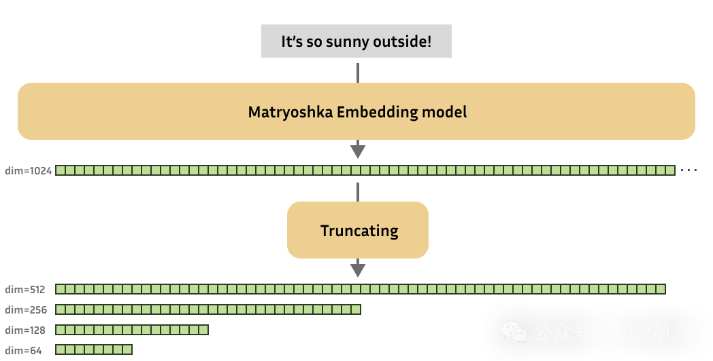
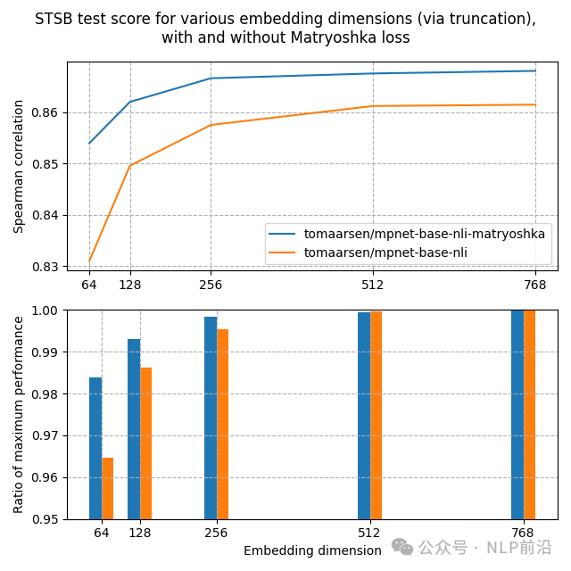

# Matryoshka Embeddings
# 1. 简介

- https://huggingface.co/blog/matryoshka

随着研究的进展，新的最先进的（文本）向量模型开始产生具有越来越高的输出维度的向量，
即每个输入文本都是用更多的值表示的。虽然这提高了性能，但却以牺牲搜索或分类等下游任务的性能效率为代价。

Matryoshka Embeddings 可以合理地缩小表征维度而不会在性能上受到太大影响。

这种可变尺寸的嵌入模型对实践者来说非常有价值，例如：

初步筛选和重新排名：与其在完整嵌入上执行下游任务（例如最近邻搜索），
你可以将嵌入缩小到更小的尺寸，非常高效地“初步筛选”你的嵌入。之后，你可以使用完整维度处理剩余的嵌入。

性能和成本权衡：套娃模型将允许你将嵌入解决方案缩放到所需的存储成本、处理速度和性能。

# 2. 原理



Matryoshka嵌入模型可以生成各种维度的有用嵌入。

“俄罗斯套娃”，是一组逐渐减小的木偶，它们被放置在彼此之内。类似地，
“Matryoshka Embeddings”旨在将更重要的信息存储在靠前的维度中，
将不太重要的信息存储在较后的维度中。Matryoshka Embeddings models的这一特性
使我们能够截断模型产生的原始（大）嵌入向量，同时仍然保留足够的信息来执行下游任务。

## 2.1 训练

Matryoshka表示学习（MRL）方法几乎可以应用于所有嵌入模型训练框架。
通常，嵌入模型的训练步骤涉及生成训练批次（例如文本）的嵌入，然后使用一些损失函数来创建代表生
成嵌入质量的损失值。优化器将在整个训练过程中调整模型权重以减少损失值。

对于Matryoshka嵌入模型，训练步骤仍热按时涉及生成训练批次的嵌入，但然后您使用一些
损失函数来确定不仅是全尺寸嵌入的质量，还有各种不同维度下的嵌入质量。例如，输出维度为768、
512、256、128和64。每个维度的损失值相加，得到最终的损失值。然后优化器会尝试调整模型权重以降低这个损失值。

实际上，这激励模型将最重要的信息前置到嵌入的开始部分，这样如果嵌入被截断，这些信息将被保留。

例如，如果一个模型的原始嵌入维度为768，现在可以在768、512、256、128和64上进行训练。
每个损失将被加在一起，可以选择加上一些权重。

```python
rom sentence_transformers import SentenceTransformer
from sentence_transformers.losses import CoSENTLoss, MatryoshkaLoss

model = SentenceTransformer("microsoft/mpnet-base")

base_loss = CoSENTLoss(model=model)
loss = MatryoshkaLoss(
    model=model,
    loss=base_loss,
    matryoshka_dims=[768, 512, 256, 128, 64],
    matryoshka_weight=[1, 1, 1, 1, 1],
)

model.fit(
    train_objectives=[(train_dataset, loss)],
    ...,
)
```

## 2.2 使用

在实践中，从一个Matryoshka嵌入模型获取嵌入的方法与普通嵌入模型相同。
唯一的区别在于，在接收到嵌入后，我们可以选择将它们截断为更小的维度。请注意，
如果嵌入已经被归一化，那么在截断后它们将不再是归一化的，因此您可能需要重新进行归一化。

在截断之后，您可以直接将它们应用于您的用例，或者存储它们以便以后使用。毕竟，
在您的向量数据库中使用更小的嵌入应该会导致显著的加速！

请记住，尽管处理更小的嵌入以用于下游任务（检索、聚类等）会更快，
但是从模型获取更小的嵌入与获取更大的嵌入一样快。

# 3. 实验结论

两个模型均是在AllNLI数据集上训练的，该数据集是SNLI和MultiNLI数据集合并到一起。
使用多个不同的嵌入维度在STSBenchmark测试集上评测模型。结果如下图所示：



在顶部的图中，您可以看到俄罗斯套娃模型在所有维度上都达到了比标准模型更高的Spearman相似度，
表明俄罗斯套娃模型在这个任务中更优秀。

此外，俄罗斯套娃模型的性能下降速度远远比标准模型慢。这清晰地显示在第二个图中，
该图显示了嵌入维度相对于最大性能的性能。即使在嵌入大小的8.3%处，俄罗斯套娃模型仍然保留了98.37%的性能，
远高于标准模型的96.46%。

这些发现表明，通过俄罗斯套娃模型截断嵌入可以

- 显著加快下游任务（如检索）的速度
- 显著节省存储空间，而性能几乎没有明显影响。

# 参考

[1] 从俄罗斯套娃中启发得到的维度可变向量模型，https://mp.weixin.qq.com/s/4aD9-FzlwFGubLgsWBUAXA