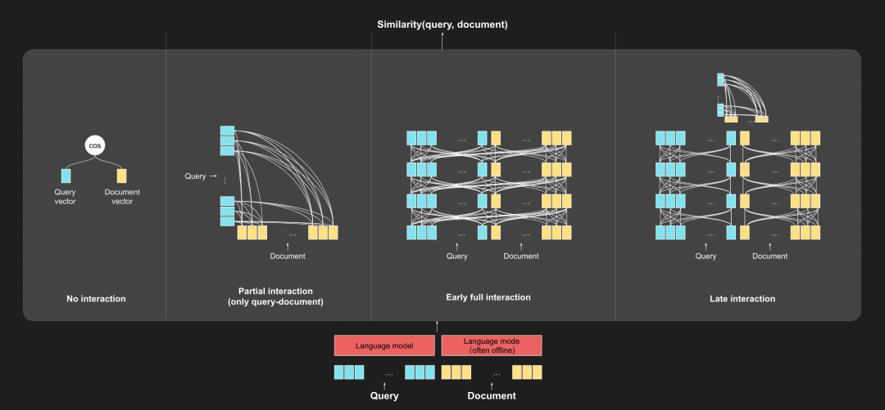
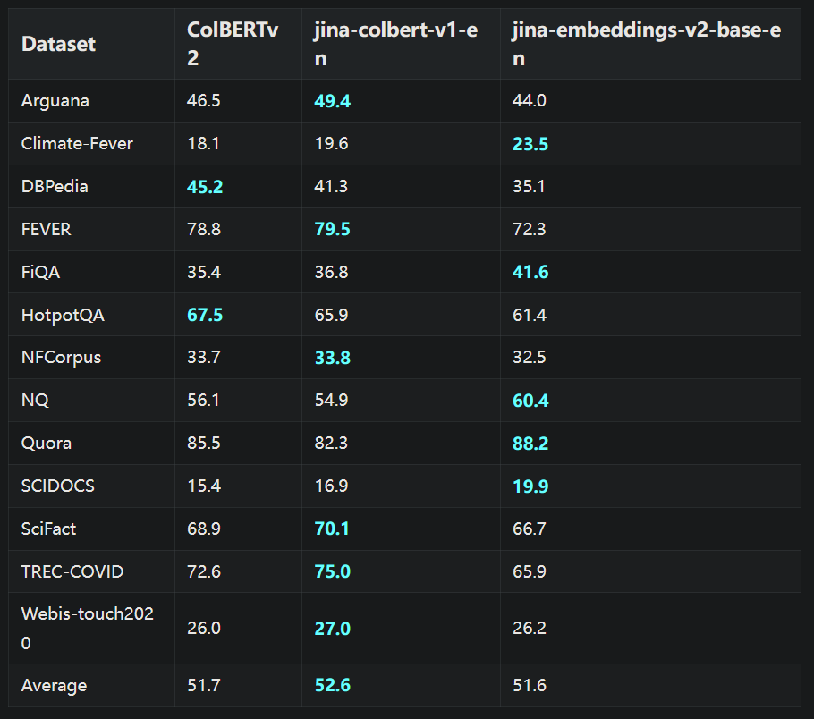

# 1. 简介

- Modelscope下载： https://modelscope.cn/models/jinaai/jina-colbert-v1-en/summary
- Huggingface下载：https://huggingface.co/jinaai/jina-colbert-v1-en
- 论文：
  - Jina Embeddings 2: 8192-Token General-Purpose Text Embeddings for Long Documents
  - https://arxiv.org/abs/2310.19923
- 相关论文
  - ColBERTv2: Effective and Efficient Retrieval via Lightweight Late Interaction：https://arxiv.org/abs/2112.01488v3
  - ColBERT: Efficient and Effective Passage Search via Contextualized Late Interaction over BERT：https://arxiv.org/abs/2004.12832
- 代码
  - Github (2.2k): https://github.com/stanford-futuredata/ColBERT
  
与 ColBERTv2 相比，Jina-ColBERT 在各项测试中都展现了顶尖的性能，特别在处理长文档数据集时，其表现更是显著优于 ColBERTv2

# 2. 原理

- 使用ALiBi编码更长序列，可达8k
- 使用MSMARCO passage ranking dataset进行训练 （和ColBERTv2类似的方案）
- base模型使用jina-bert-v2-base-en

单向量模型是将查询和文档简化为单一向量的表示，多向量模型 ColBERT 则 为每个 token 生成一个向量，
并通过 MaxSim（Maximum Similarity, 最大相似度）计算得分，即它对于每个查询词，从文档中找到与之最相似的词的向量，
并将这些最大相似度值相加作为最终的相关性分数。

ColBERT 通过采用 token 级别的细粒度交互，即首先将查询和文档在词粒度上逐项编码，再在查询阶段进行交互。也就是说，
文档侧的计算可以完全离线进行，这一点与单向量模型的做法一致，但在处理方法上更为精细。这就使得它的可解释性更好，在 token-level 匹配之后，
我们能够解释查询中哪个词与文档中的哪个词最匹配。

这种多向量的召回方式带来两大好处：一是逐 token 编码提供了更细粒度的表征，在 in-domain (同领域)具有很高的 MRR@10(头部排序能力)和 
Recall@1k(腰尾部召回能力)。并且提供了更好的可解释性。二是提供 out-of-domain (跨领域) 更强的泛化能力，
特别是在处理长尾查询或文档时，由于词粒度的精细表征，使得模型对于未见过的领域有更好的性能表现。

模型结构
- Attention with Linear Biases
- ALiBi
- Gated Linear Units
- Post Layer Norm

## 2.1 Colbert 迟交互机制

与传统的 query-doc 全交互型 BERT 及目前流行的 Embeddings 模型相比，ColBERT 提出的 Late Interaction (迟交互）机制 有着显著的优势。

具体来说，单向量模型是吃进一个句子，吐出一个向量，然后再基于这些向量做相似度比较。而同样是分别编码查询和文档，ColBERT 拿模型生成的 
Token Embedding 来做相似度计算，在后续阶段计算查询和文档 Token Embedding 之间的交互。这种方法既考虑了匹配效率，也充分利用了上下文信息，
使得 ColBERT 既能作为一个强大的召回模型，也可以用作召回之后的重排工具。



## 2.2 训练

- pretrain: masked language model
- finetune
  - text pairs
  - hard negatives
  - InfoNCE loss

# 3. 性能



从这个表里，我们能看到 Jina-ColBERT 的亮眼表现，各项测试里，它都能和 ColBERTv2 一较高下。

值得一提的是，Jina-ColBERT 只用了 MSMARCO 数据集来训练，而 Jina-Embeddings-v2-base-en 使用了更广泛的训练数据，后者在某些特定任务上表现得更好。

我们还特别在专为长文本设计的新 LoCo Benchmark 上进行了测评，可以看到 Jina-ColBERT 在处理那些超出 ColBERTv2 常规上下文长度的场景时，表现更是出色。


# 4. 总结

总的来说，Jina-ColBERT 在各项基准测试中都表现出和 ColBERTv2 相媲美的性能，当在文本的上下文更长时，它的表现就更胜一筹了。

如果你想在 RAG（检索增强生成）领域挑选出合适的向量模型，这里有几条建议，帮你判断哪个最合适。
1. 如果你偏好简单的单向量存储与检索，并且能够接受一定程度的精确度牺牲，那么 Jina-Embeddings-v1 是个不错的选择。
2. 对于那些追求细颗粒度检索、关注模型在 out-of-domain(未知领域)的表现、以及需要模型可解释性的用户来说，Jina-ColBERT 会是更优选。
3. 你也可以设计一个分阶段的检索流程：首先用 Jina-Embeddings-v2 快速定位候选文档，接着用 Jina-ColBERT 进行更细颗粒度的重新排序。
4. 请注意，目前 Jina-ColBERT 仅支持英文内容的处理。

# 5. 使用

安装

```shell
pip install git+https://github.com/stanford-futuredata/ColBERT.git torch
conda install -c conda-forge faiss-gpu  # use conda to install the latest version faiss
```

Indexing

```python
from colbert import Indexer
from colbert.infra import Run, RunConfig, ColBERTConfig

n_gpu: int = 1  # Set your number of available GPUs
experiment: str = ""  # Name of the folder where the logs and created indices will be stored
index_name: str = ""  # The name of your index, i.e. the name of your vector database

if __name__ == "__main__":
    with Run().context(RunConfig(nranks=n_gpu, experiment=experiment)):
        config = ColBERTConfig(
          doc_maxlen=8192  # Our model supports 8k context length for indexing long documents
        )
        indexer = Indexer(
          checkpoint="jinaai/jina-colbert-v1-en",
          config=config,
        )
        documents = [
          "ColBERT is an efficient and effective passage retrieval model.",
          "Jina-ColBERT is a ColBERT-style model but based on JinaBERT so it can support both 8k context length.",
          "JinaBERT is a BERT architecture that supports the symmetric bidirectional variant of ALiBi to allow longer sequence length.",
          "Jina-ColBERT model is trained on MSMARCO passage ranking dataset, following a very similar training procedure with ColBERTv2.",
          "Jina-ColBERT achieves the competitive retrieval performance with ColBERTv2.",
          "Jina is an easier way to build neural search systems.",
          "You can use Jina-ColBERT to build neural search systems with ease.",
          # Add more documents here to ensure the clustering work correctly
        ]
        indexer.index(name=index_name, collection=documents)
```

Creating Vectors

```python
from colbert.modeling.checkpoint import Checkpoint
ckpt = Checkpoint("jinaai/jina-colbert-v1-en", colbert_config=ColBERTConfig(root="experiments"))
queries = ckpt.queryFromText(["What does ColBERT do?", "This is a search query?"], bsize=16)
document_vectors = ckpt.docFromText(documents, bsize=32)[0]
```

Searching

```python
from colbert import Searcher
from colbert.infra import Run, RunConfig, ColBERTConfig

n_gpu: int = 0
experiment: str = ""  # Name of the folder where the logs and created indices will be stored
index_name: str = ""  # Name of your previously created index where the documents you want to search are stored.
k: int = 10  # how many results you want to retrieve

if __name__ == "__main__":
    with Run().context(RunConfig(nranks=n_gpu, experiment=experiment)):
        config = ColBERTConfig(
          query_maxlen=128  # Although the model supports 8k context length, we suggest not to use a very long query, as it may cause significant computational complexity and CUDA memory usage.
        )
        searcher = Searcher(
          index=index_name, 
          config=config
        )  # You don't need to specify the checkpoint again, the model name is stored in the index.
        query = "How to use ColBERT for indexing long documents?"
        results = searcher.search(query, k=k)
        # results: tuple of tuples of length k containing ((passage_id, passage_rank, passage_score), ...)
```

# 参考

[1] 社区供稿 | RAG 领域的新宠：为什么 AI 圈都在谈论 Jina ColBERT？，https://mp.weixin.qq.com/s/34wEZGGU7WR5UUcggRboLw