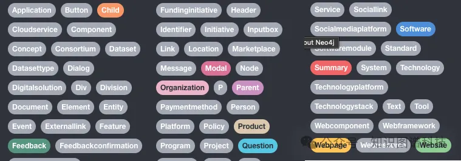

# 1. 方法
## 1.1 提取

使用提示工程和LLM来提取信息、节点及其连接。以下是一个提示的示例：

```text
# Instructions for Creating Knowledge Graphs
## Overview
You are engineered for organising data into knowledge graphs.
- **Nodes**: Represent entities and ideas.
- The objective is to ensure the knowledge graph is straightforward and intelligible for broad use.

## Node Labeling
- **Uniformity**: Stick to simple labels for nodes. For instance, label any entity that is an organisation as "company", rather than using terms like "Facebook" or "Amazon".
- **Identifiers for Nodes**: Opt for textual or comprehensible identifiers over numerical ones.
  - **Permissible Node Labels**: If there are specific allowed node labels, list them here.
  - **Permissible Relationship Types**: If there are specific allowed relationship types, list them here.

## Managing Numerical Data and Dates
- Integrate numerical information directly as attributes of nodes.
- **Integrated Dates/Numbers**: Refrain from creating distinct nodes for dates or numbers, attaching them instead as attributes.
- **Format for Properties**: Use a key-value pairing format.
- **Avoiding Quotation Marks**: Do not use escaped quotes within property values.
- **Key Naming**: Adopt camelCase for naming keys, such as `dateTime`.

## Uniformity
- **Entity Uniformity**: Ensure consistent identification for entities across various mentions or references.
  
## Adherence to Guidelines
Strict adherence to these instructions is mandatory. Non-adherence will result in termination.
```

## 1.2 图谱构建

使用 CSVLoader 和文档分割来处理我们的文档

将提取的信息映射到图节点和关系

通过我们的提取管道处理文档并将信息存储在 Neo4j 中



整个过程将近一个小时，导致最终提取的节点标签列表。

不幸的是，并非所有节点标签都对我们的上下文有用或符合我们的需求。

```text
{
  "identity": 1040,
  "labels": [
    "Feedbackstatus"
  ],
  "properties": {
    "id": "Feedback-Success",
    "message": "Sent. Thank you for the feedback!"
  },
  "elementId": "4:81cd2613-0f18-49c1-8134-761643e88b7a:1040"
},
{
  "identity": 1582,
  "labels": [
    "Feedbackstatus"
  ],
  "properties": {
    "id": "Feedbacksuccess",
    "status": "Sent. Thank you for the feedback!"
  },
  "elementId": "4:81cd2613-0f18-49c1-8134-761643e88b7a:1582"
},
{
  "identity": 1405,
  "labels": [
    "Header"
  ],
  "properties": {
    "id": "Modalcardhead",
    "class": "sgds-modal-card-head"
  },
  "elementId": "4:81cd2613-0f18-49c1-8134-761643e88b7a:1405"
},
{
  "identity": 1112,
  "labels": [
    "Feedbackindicator"
  ],
  "properties": {
    "id": "Feedbacksuccess",
    "title": "check",
    "message": "Sent. Thank you for the feedback!"
  },
  "elementId": "4:81cd2613-0f18-49c1-8134-761643e88b7a:1112"
...
```


# 参考

[1] 从传统RAG到GraphRAG - 当大模型遇见知识图谱，https://mp.weixin.qq.com/s?__biz=MzI3ODE5Mzc1Ng==&mid=2247486731&idx=1&sn=c11c328fd96b6832c857b0807407cabf&chksm=ea24733d3c233f7dfc5b833fe002582f2893c748c84af1f711b57ca5d7cf46d6384cc5bb438e&scene=132&exptype=timeline_recommend_article_extendread_samebiz&show_related_article=1&subscene=0&scene=132#wechat_redirect