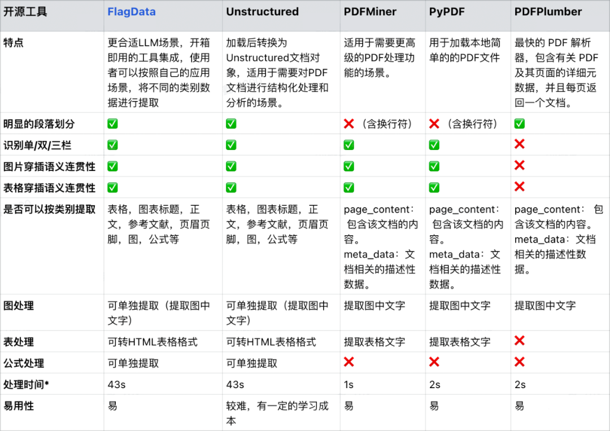
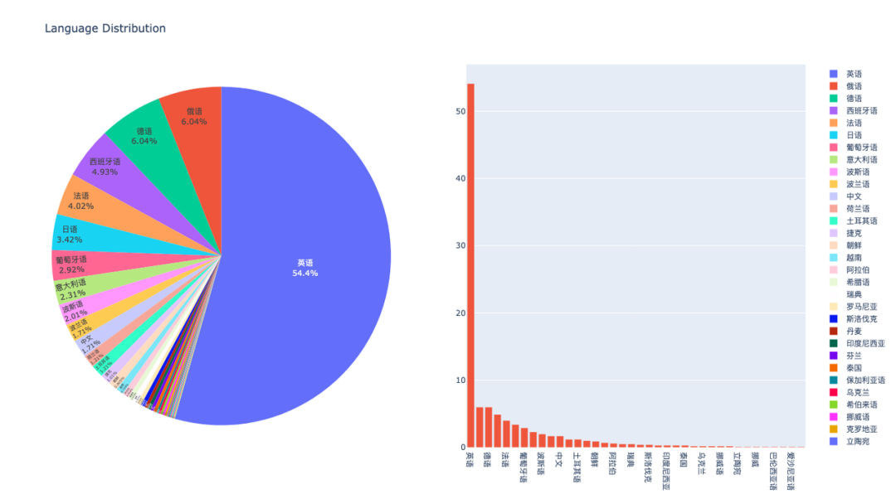

# 1. 工具汇总

1. MNBVC
   - https://github.com/esbatmop/MNBVC
   - 2k stars
   - MNBVC(Massive Never-ending BT Vast Chinese corpus)超大规模中文语料集。
     对标chatGPT训练的40T数据。MNBVC数据集不但包括主流文化，
     也包括各个小众文化甚至火星文的数据。MNBVC数据集包括新闻、作文、小说、
     书籍、杂志、论文、台词、帖子、wiki、古诗、歌词、商品介绍、笑话、糗事、
     聊天记录等一切形式的纯文本中文数据。
   - 包含数据清洗工具(***)

2. FlagData
   - https://github.com/FlagOpen/FlagData
   - 推荐：当前最全面最完整的数据处理流程代码
   - 79 Stars
   - 包含了完整的数据预处理流程，包括数据抽取、数据清洗、语种识别、质量评估、去重、数据分析
   - 包含数据增广的prompt模板和流程代码，依赖ChatGPT构造数据
   - 改流程主要适合基础模型数据处理的流程
   - 当前仅公开了质量评估的模型
   - 去重采用了minihash+Spark，速度较快
   - Fasttext文本质量模型：https://huggingface.co/CASIA-LM/ChineseWebText-fasttext/tree/main
   

# 2. 详细介绍

## 2.1 FlagData

1. 实现多种原始格式数据的高质量内容提取，极大降低处理成本

    大模型的发展依赖于干净、高质量的数据。然而，大多数数据难以发现、使用和清理。这些数据常以 
    HTML、PDF、CSV、PNG、PPTX 等不同格式存在，然而这些非结构化的数据形式难以让大模型“学到”有用的知识，“阅读”效率也欠佳。
    在全面对比了主流开源数据工具之后，FlagData针对数据清洗任务进行了专门优化，并对现有开源工具
    中的相关功能进行了扩展升级，更好地适应大模型训练场景，从而降低了新手的使用门槛，帮助用户极大
    降低收集和清理数据的成本，让用户可以专注于难度更大的数据建模和分析任务上。
    FlagData 能够有效地从多种不同原始格式数据中提取信息，并将其转换为干净、一致的 JSON 格式。
    JSON 格式对大模型训练非常友好，不仅便于进行分块、嵌入和集成到矢量数据库，还能轻松采用最先进的
    分块策略。将 PDF 和 EPUB 等原始数据转换 JSON 格式，可以确保了大模型训练过程中数据集能够持续更新。
    此外，FlagData 集成了 pdf2txt 和 epub2txt 两个非结构化到文本的转换工具，能够识别表格、
    图表标题、正文、参考文献、页眉页脚、图像和公式等，并且为用户提供了两种数据处理方式：
    一种是将完整文档保存为 txt 文件，另一种是将图像、正文、参考文献等类别分别保存为 jsonList 格式。
    如下是主流工具的对比：

    

2. 提供大模型微调数据透视功能

    一般来说，大模型微调数据处理的关键步骤包括：
    
    数据探索和理解：对微调数据进行初步的分析和探索，了解数据的分布、类别不平衡、特征之间的相关性等。这种理解有助于更好地选择微调策略和模型配置。
    
    微调策略选择：如选择合适的优化器、调整学习率的策略、冻结哪些层等，以便让模型更快地收敛并取得更好的性能。
    
    数据配比的选择：即通过对不同来源的数据做合适的上采样和下采样调整其在预训练数据中的占比。预训练的过程是比较耗资源的且训练过程往往是不可逆的，实验代价比较大，枚举比较完备的消融实验更是不太可能。同时单单数据维度就有很多种变量，尤其是数据配比，有中英文配比，不同来源的数据配比，不同任务的数据配比，不同质量的数据配比（被过滤的低质量仍可能有比较多的误过滤的好样本）。在实际的模型开发中，开发者往往在更小规模的模型上做消融实验对比，以此决定数据配比。
    
    例如，ChatGPT3.5数据配比应该是OpenAI最核心的“秘密”和领先之处。
    
    此外，专业领域的数据占比也是关键。专业知识需要和世界性知识进行合理的搭配才能训练出较好的领域大模型，否则大模型会同时损失世界性知识的问答效果以及专业性知识的问答能力。
    
    针对大模型微调数据集构建的需求，FlagData 提供大模型多维度的数据透视功能：
    
    文本内容和领域分析：对文本数据进行领域分析，了解微调数据的主题，以确保模型在微调阶段对数据有充分的理解。
    语言特征分析：分析文本中的语言特征，有助于了解文本的语言风格和复杂度。
    文本本长度分析：分析文本的长度分布情况，包括句子长度、段落长度、文档长度等，有助于确定微调过程中所需的最大长度限制或截断策略。
    以下是文本内容的领域分析和语言分析的效果图：

    

3. 一站式高效分布式数据处理功能

    FlagData 使用 MinHashLSH 算法和 Spark 分布式数据分析引擎，提供 TB级/小时的分布式数据去重能力。
    
    

    

    Spark + MiniHashLSH 也是GPT-3技术报告[1]中所披露的数据去重处理方案。MinHashLSH（最小哈希局部敏感哈希）
    算法是将文本转换为一系列哈希值，以便比较文本之间的相似性。在FlagData中，用户可以根据需要在FlagData配置中设置更高的 
    threshold 值（相似性阈值），以便只保留那些非常相似的文本，而丢弃那些相似性稍微低一些的文本，经验默认值为0.87。

    相比SimHash等算法，FlagData 中的 MinHashLSH 算法，在准召率以及处理速度上都具有优势。以下是一个实际的例子：
    该文本在开头、编辑姓名等方面有细微区别，利用 FlagData 可以识别出这两段文本高度相似。

4. OpenRefine
    
   - OpenRefine 是一个基于 Java 的强大工具，可让您加载数据、理解数据、清理数据、协调数据，
     并使用来自 Web 的数据对其进行扩充。一切都来自网络浏览器以及您自己计算机的舒适和隐私。
   - 官方网站：https: //openrefine.org
   - 社区论坛：https: //forum.openrefine.org
   - 国内源代码镜像：http://www.gitpp.com/aws/openrefine-cn
   
   

# 参考

[1] 数据清洗平台，开源！, https://mp.weixin.qq.com/s/BNI7okvqTJDKVntO9Ns6pw
