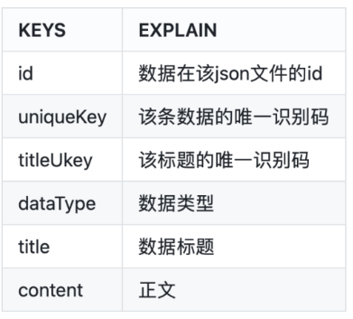

# 1. 百川

## 1.1 预训练数据

- 整合各类信息源，确保文化、科学、技术等方面广泛的知识覆盖；
- 建立了一套系统的数据质量体系，包括低质、优质、类别等
- 设计了一个多粒度的大规模聚类系统。通过使用先进的聚类算法和方法，识别和整合相似或相关的数据，为去重、采样提供支撑
- 一种细粒度的自动化匹配算法，自动配比各类任务，例如课程学习。从而实现个性化的模型学习，使预训练数据能够更精确地匹配用户需求

## 1.2 搜索增强

- 动态响应策略：依赖 Prompt，将指令任务细化为 16 个独立类别，覆盖各种用户指令的场景。
- 智能化搜索词生成：通过对问答样本进行精细化的人工标注，捕捉和理解用户多元化的志林需求。
- 高质量搜索结果筛选：百川构建了一个搜索结果相关性模型，对从搜索内容和知识库中获取的信息进行相关性频分，
                  从而筛选出高质量的搜索引用内容，减少在知识抽取阶段引入的无关、低质量的信息。
- 回答结果的搜索增强：RLHF，让 Baichuan 大模型参照搜索结果，针对用户请求生成高价值且具有实时性的回答。

# 2. Llama2-Chinese

- https://github.com/FlagAlpha/Llama2-Chinese
- 5.9k Stars

## 2.1 预训练数据

- 采用大规模的中文数据进行持续预训练，包含百科、书籍、博客、新闻、公告、小说、金融数据、法律数据、
  医疗数据、代码数据、专业论文数据、中文自然语言处理竞赛数据集等
- 数据来源：https://github.com/FlagAlpha/Llama2-Chinese#-%E6%95%B0%E6%8D%AE%E6%9D%A5%E6%BA%90
- 对庞大的数据进行了过滤、打分、去重，筛选出超过1T token的高质量中文数据，持续不断加入训练迭代中

# 3. 书生万卷1.0

1. 文本清洗流程如下：

    1）首先，从WARC原始文件中提取文本，然后使用不同的语言检测工具（pyclid2）对提取的文本进行分类，随后对中英文文本进行不同的处理。鉴于互联网上存在大量无效数据，采用以下规则进行过滤，以获得高质量数据：
    
    2）删除不规范的文档，包括平均单词长度和文档长度不合适的文档。如果出现频率最高的单词不是字母，或者出现频率过高，我们会将其视为不常见的文档格式并将其删除。
    
    3）删除内容过少的文档，如经过处理后句子少于三句的文档；段落少于三段的文档；长度超过200字的段落少于三段的文档；或停用词少于两个的文档。
    
    4）对段落进行清理，删除了一些特殊段落，如包含JavaScript等单词的段落、标点符号以外的段落以及超过1000字的段落。
    
    5）注意到获得的数据中包含重复数据，对文本数据进行标记化处理，并使用MinHashLSH和n-grams评估相似度，删除相似度大于0.8的内容。
    
    6）由于互联网数据中存在有害和低质量的内容，训练模型来评估质量并针对不同问题进行过滤，具体包括：
    
    7）使用FastText模型对色情、暴力、赌博、攻击和其他有毒主题的内容安全模型进行训练，分别针对中文和英文，以过滤潜在的有毒数据。
    
    8）针对网上的各种低质量数据，如自动生成的随机数据和广告内容，我们分别针对中文和英文训练数据质量模型，以降低低质量数据的比例。

2. 文本图片数据清理

   - To reduce the difficulty of cleaning and ensure data quality, we wrote specific parsing rules
     for each site. User-generated articles were sourced from a single open-source site.
   - We only extracted valid (ad-free, list-free, navigation bar-free, emoticon-free, comment-free)
     article content. We used a series of rules to filter. We also removed references, complex
     tables, lists, and other entry-related content for the text part of Wikipedia, retaining only
     the text paragraphs. For user-generated articles and authoritative media news, we used
     XPath, CSS selectors, and regular expressions to remove media sources, publishers, reposts,
     advertisements, and comments unrelated to the article theme, to obtain the article’s main
     body. Like with text data cleaning, we also performed deduplication based on similarity.
   - We believed the header images of Wikipedia articles are meaningful for image selection, so
     we only retained these. To ensure all images in user-generated articles had valid descriptions,
     we removed articles with more than 15 images and those where the number of text characters
     was less than twice the number of images. Based on this rule, we retained 55% of the valid
     articles.
   - We the valid text and images obtained from the above filtering. The format for Wikipedia
     was (the first paragraph, main image, and remaining paragraphs)
    
   The language distribution was 62.3% Chinese and 37.7% English.

# 4. wudao数据集

地址：https://www.sciencedirect.com/science/article/pii/S2666651021000152

数据清理的具体步骤：

1）在文本提取之前评估每个数据源的质量，并删除文本密度低于70%的网页。

2）使用simhash算法删除重复内容。

3）删除一个包含少于10个汉字的网页。

4）删除包含脏话、煽动性评论和其他非法内容等敏感信息的网页。

5）为了最大程度地保护每个人的隐私安全，使用正则表达式匹配并删除私人信息（如身份证号码、电话号码、QQ号码、电子邮件地址等）。

6）使用标点符号（如句号、感叹号、问号、省略号）来分隔提取出的文本，并删除最后一段。

7）过滤掉高频乱码词汇的网页，并使用解码测试进行二次检查，解决乱码问题。

8）将繁体汉字转换为简体汉字，以使的语料库中字符格式统一。

9）从网页中删除异常符号（如表情符号、标志等）。

10）删除包含超过十个连续非中文字符的网页。

11）删除网页标识符（如HTML、层叠样式表（CSS）和Javascript）。

12）删除每个句子中的所有空格，以规范化的语料库。

数据字段

# 参考

[1] LLM（一）| 百川智能baichuan7B、13B、53B以及baichuan2总结, https://zhuanlan.zhihu.com/p/656857636

[2] 大模型研发必备：两大开源可用且清洗过的中文文本语料库及大模型FLOPS、参数量快速估计工具推荐，
    https://mp.weixin.qq.com/s/uqU0LKzchGLmXiDswRFkrQ