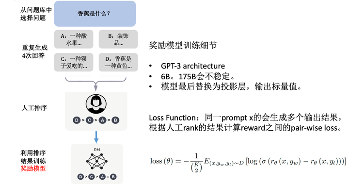
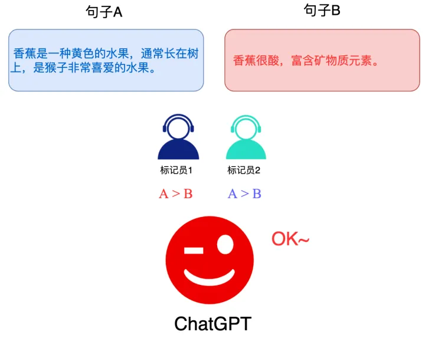
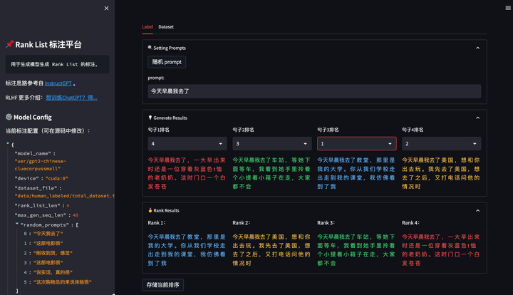

1. 原理

    RM数据集用来训练第2步的奖励模型，我们也需要为InstructGPT/ChatGPT的训练设置一个奖励目标，
    要尽可能全面且真实的对齐我们需要模型生成的内容。很自然的，我们可以通过人工标注的方式来提供这个奖励，
    通过人工对可以给那些涉及偏见的生成内容更低的分从而鼓励模型不去生成这些人类不喜欢的内容。
    InstructGPT/ChatGPT的做法是先让模型生成一批候选文本，让后通过labeler根据生成数据的质量对这些生成内容进行排序。

    
    
     用排序替代打分，避免主观差异

     

2. 标注原则

   InstructGPT和ChatGPT的提出动机，论文中用3H概括了它们的优化目标：

   - 有用的（Helpful）;
   - 可信的（Honest）;
   - 无害的（Harmless）

3. 数据量
    
   RM: A prompt and several model outputs are sampled, and a labeler ranks the outputs from the best to worst. 
   This data is used to train the reward model. (33k prompts)

4. 标注平台

   

# 参考

[1] InstructGPT: Few-Shot Instruction-Guided Task-Oriented Dialogue System

[2] ChatGPT/InstructGPT详解, https://zhuanlan.zhihu.com/p/590311003
