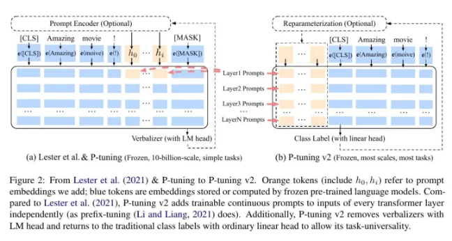

# 简介

微调对话任务的时候，微调会导致模型的理解能力别削弱（无法理解相似语义的输入），
即当输入数据prompt的分布与训练数据分布不一致时，模型不会按照训练集的response进行输出，
而是使用模型原有的能力进行输出，模型输出结果出现不可控的情况。这个时候需要对输入的数据进行数据增强，
数据的方法很多，但个人认为对于样本比较少的对话，最有效的方式应该是人工进行标注，
即人工写出输入数据prompt的各种可能的语义相似的样本来(根据对数据增强方式的理解，如：释义、采样和加噪)

# 1. Prompt Tuning

当前大多数大模型都是通过让用户做prompt工程来提高模型的输出准确性，
方法的优点是不改变模型参数即可获得正确的结果，缺点则是需要对输入进行反复尝试和调优。

# 2. Decoder Tuning

Decoder Tuning则是对输出结果进行调整获得更好的结果，尽管这种方法相比prompt工程需要
多一点的时间，但是效果却更好。官方宣称该方法可以仅仅使用API的情况下，不访问和修改模型
参数即可大幅提高下游任务的性能。测试结果CPM-Bee 10B的任务效果从基础模型的61.9分提高
到了85.6分，这也是十分值得期待的特性。

# 3. P-Tuning V2

- Github: https://github.com/THUDM/P-tuning-v2
- 论文：P-Tuning v2: Prompt Tuning Can Be Comparable to Fine-tuning Universally
       Across Scales and Tasks，https://arxiv.org/abs/2110.07602

Prompt tuning（Lester等人，2021），或Ptuning（Liu等人，2021b），引入了可训练的连续提示，
作为主干模型的参数被冻结时对NLU的自然语言提示的替代。例如，V指的是语言模型M的单词表，e作为模型M的嵌入函数。

要把一篇电影评论x="了不起的电影！"分类为正面或负面，自然会想到在评论中附加一个提示 "它是[MASK]"，
并生成mask token被预测为 "好 "或 "坏 "的条件概率作为分类。在这种情况下，提示token{"它"、"是"、"[MASK]"}
都属于模型的单词表V，而输入嵌入序列将为

然而，由于模型M本质上是连续的，从优化的角度来看，用离散的自然提示语永远不可能达到最优。
相反，P-tuning建议用可训练的连续嵌入[h0，...，hi]代替提示token，并将输入序列变成

因此，可以进行不同的优化（参考图2（a））。在骨干预训练模型的参数被冻结的严格约束下，
在简单的NLU任务（Lester等人，2021；Kim等人，2021）和知识探测（Liu等人，2021b）中，
提示优化已被证明具有与100亿参数模型的微调相当的性能。

图：从Lester等人（2021）&P-tuning到P-tuning v2。 橙色token（包括h0，hi）是指我们添加的提示嵌入；
蓝色token是由冻结的预训练语言模型存储或计算的嵌入。与Lester等人（2021）相比，
P-tuning v2将可训练的连续提示独立添加到每个transformer层的输入中（正如前缀优化（Li and Liang, 2021）所做的那样）。
此外，P-tuning v2删除了带有LM头的verbalizers，并返回到带有普通线性头的传统类别标签，以允许其任务的普遍性。

# 4. Q-Lora

- QLoRA: Efficient Finetuning of Quantized LLMs
- https://arxiv.org/abs/2305.14314

QLoRA中比较重要的几个做法如下：

- 4-bit NormalFloat：提出一种理论最优的4-bit的量化数据类型，优于当前普遍使用的FP4与Int4。
- Double Quantization：相比于当前的模型量化方法，更加节省显存空间。每个参数平均节省0.37bit，
  对于65B的LLaMA模型，大约能节省3GB显存空间。
- Paged Optimizers：使用NVIDIA统一内存来避免在处理小批量的长序列时出现的梯度检查点内存峰值。
- 增加Adapter：4-bit的NormalFloat与Double Quantization，节省了很多空间，
  但带来了性能损失，作者通过插入更多adapter来弥补这种性能损失。在LoRA中，
  一般会选择在query和value的全连接层处插入adapter。而QLoRA则在所有全连接层处都插入了adapter，
  增加了训练参数，弥补精度带来的性能损失。

作者使用GPT4对各个模型进行评价，结果显示，使用QLoRA在OASST1数据集上微调得到的Guanaco-65B模型达到了ChatGPT的99.3%的性能。

作者使用LLaMA-7B和Alpaca数据集进行了实验。下图结果表明，通过插入更多的adapter，能够弥补QLoRA量化带来的性能损失，复现全量参数微调的效果。

在指令微调阶段，数据质量和数据数量，哪一个更重要？作者使用三种不同的训练集，每个数据集分别使用5万、10万、15万的数据量进行训练。
对于下表，纵向来看，随着数据量的增加，指标并没有明显的提升，说明数据量不是关键因素。横向来看，
对于不同的数据集，指标差距甚大，说明数据质量更关键。

# 参考
[1] 清华大学100亿参数规模的免费商用授权大模型：CPM-Bee 10B, https://mp.weixin.qq.com/s/hqE1UIhnAI23uQ0Z5R9opw
[2] P-Tuning v2: 与微调性能相等的提示性优化，https://zhuanlan.zhihu.com/p/423902902
[3] ChatGLM多轮对话微调-多轮对话训练数据的自动生成（标注）, https://blog.csdn.net/wxl781227/article/details/131005577