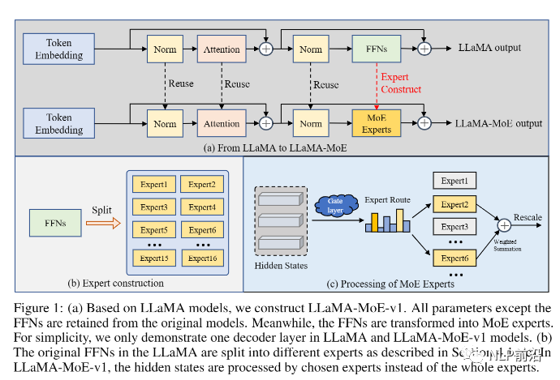
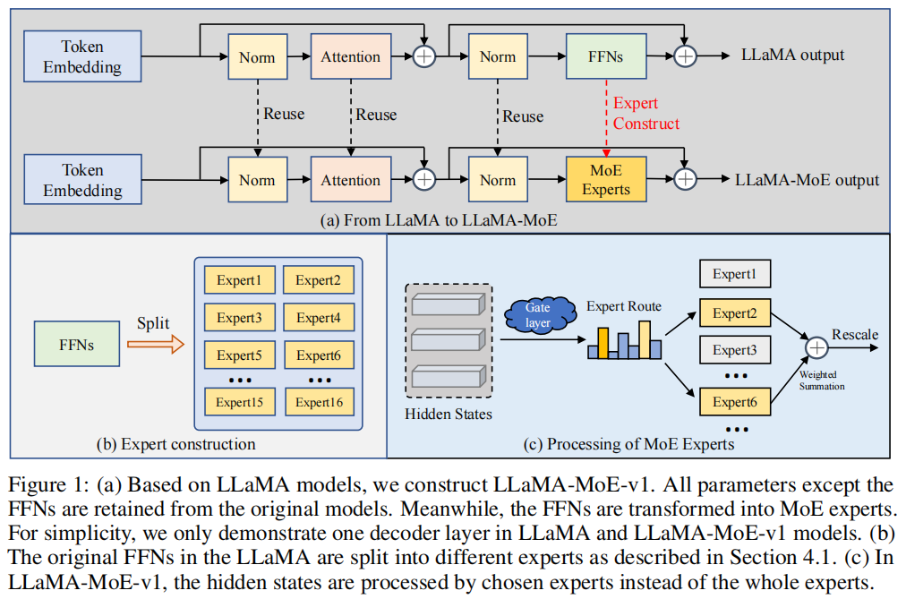
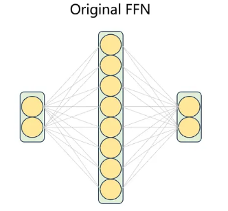
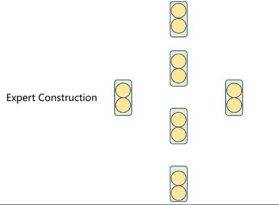
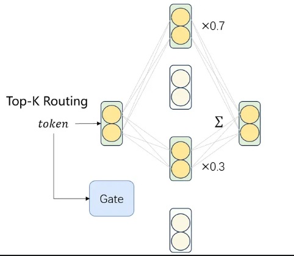
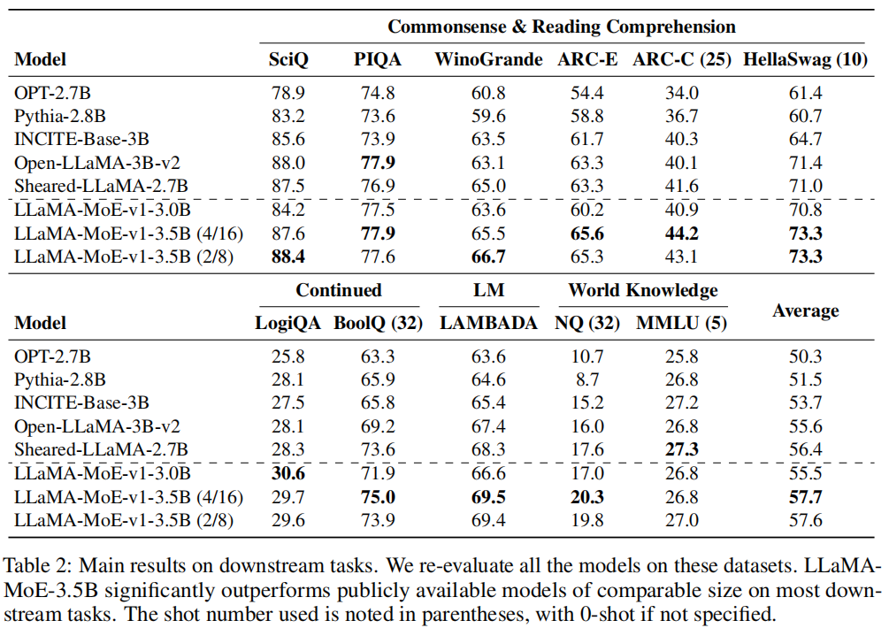

# 1. LLaMA-MoE详解

LLaMA-MoE
   - 原有模型拆解为小的专家模型
   - LLaMA-MoE: Building Mixture-of-Experts from LLaMA with Continual Pre-training
   - https://github.com/pjlab-sys4nlp/llama-moe

## 1.1 摘要

在这篇论文中，作者提出了一种名为LLaMA-MoE的新型稀疏混合专家（MoE）模型。
该模型基于现有的大型语言模型（LLM），如LLaMA和ChatGPT，通过将原始模型的前馈神经网络
（FFN）划分为多个功能模块（即专家），并对转换后的MoE模型进行持续预训练，以保持其语言能力。
与之前的工作不同，LLaMA-MoE专注于解码器风格的LLM，并在每个层次都包含一个MoE模块。

核心观点：

1. 从现有的解码器风格的LLM构建稀疏MoE模型。
2. 对SwiGLU-based FFN进行全面探索，实现有效的专家构建。
3. 构建全MoE模型，使每个层次都包含一个MoE模块。

算法原理：

在构建LLaMA-MoE模型时，首先将原始LLaMA模型的FFN划分为多个专家。
然后，通过持续预训练来改善模型性能。具体而言，作者提出了两种类型的专家构建方法：
神经元独立和神经元共享。在神经元独立方法中，作者将FFN的参数均匀划分为多个子集；
而在神经元共享方法中，作者根据预先聚类的数据组来构建专家。此外，
作者还引入了一个缩放因子，并对专家输出进行重新缩放，以保持模型的表示能力。

结论：

通过实验，作者发现LLaMA-MoE模型在各种任务上的性能显著优于具有相似激活参数的其他流行LLM，
如OpenLLaMA、Sheared LLaMA和Pythia。特别是，
LLaMA-MoE-v1-3.5B模型在激活参数相近的情况下，明显优于其他模型。这表明LLaMA-MoE
提供了一种从现有LLM构建MoE模型的有效方法。值得注意的是，该框架可以很容易地应用到更多解码器风格的LLM。

## 1.2 原理

从头开始训练一个小号MoE模型的代价仍然是非常大的，
依然需要训练trillion级别的tokens。那么有没有一种
方法可以最大化复用之前的参数，从而得到一个小一点的MoE模型呢？

对于transformer block中一个正常的Feed-Forward Network（FFN）层，通常包含两层线性变换：

1. 第一层将hidden size变换为intermediate size（如4096→11008）
2. 第二层将intermediate size转换为原来的hidden size（如11008→4096）

既然MoE由多个FFN组成的专家构成，那我直接把现有的大FFN拆成多个小FFN不就可以了？

原始FFN拆解成小专家

topK路由

不管是以何种拆分方法进行大化小式的专家构建，都破坏了原有的模型结构。这里考虑一种极端情况，
如果将1个FFN拆为4个专家，每次只选择一个专家，那么就相当于丢弃了75%的参数。
这对于一个“dense”模型来说，显然是不可忽略的。

等等，“丢弃参数”，类似dropout吗？

是的没错！对于大化小方案来说，既可以使用MoE的动态路由机制选择需要“丢弃”哪些
（专家）参数，将推理时的激活参数量控制在较小的范围，又可以保留原有模型的容量（因为总参数量没变）。

为了进一步恢复模型在拆分后的性能，我们使用SlimPajama数据对其进行了200B 
tokens的继续预训练。虽然最终结果比7B的dense模型差，但比同等激活参数量的其它dense模型较好。

*** 

数据采样

To obtain better performances, we investigate the following data sampling strategies 
for LLaMAMoE-v1 continual pre-training. Data sampling weights are adjusted every 2.5B tokens in dynamic
settings and the total training budget is 30B tokens.

数据过滤

As our training budget is limited, we further explore two data filter strategies to
speed up model convergence. Specifically, we filter out ∼50% advertisements and ∼15% non-fluent
texts in CommonCrawl and C4 datasets.

## 1.3 实验结果

## 1.4 问题

Q: 什么数据配比比较好？
A: 使用Sheared LLaMA的静态数据采样率就已经很好了。训练时的loss和最终结果的指标不
   是非常对应（loss小不一定代表结果就高）。动态数据采样比较tricky，起始采样率和目标loss对结果影响比较大，效果不一定就好。

Q：不同来源的数据会选择不同的专家吗？
A: 浅层差异不大，层数越深，不同数据源之间的专家选择情况差异越明显。

Q: 那种expert切分方法最好？
A: 独立随机切分最好，

# 参考

[1] 训不动Mixtral，要不试试LLaMA-MoE？, https://zhuanlan.zhihu.com/p/674085893
[2] 2个开源中文moe大模型 + 1个从大模型到moe模型的continual pretraing开源框架，
https://mp.weixin.qq.com/s/LQ6owGnVxVDHpPsaBTp52g