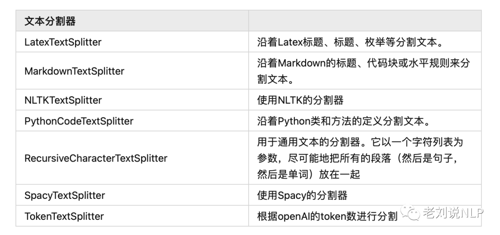

# 1. 简介

注入领域知识从方法论上，可以分成领域微调［增量预训以及领域微调］与上下文注入［外挂知识库］ 两类方法。

# 2. 文档工具

1. 文档解析：ppstructure

   - https://github.com/PaddlePaddle/PaddleOCR/blob/release/2.6/ppstructure/README_ch.md
   - 版面恢复将输入的图片、pdf内容仍然像原文档那样排列着，段落不变、顺序不变的输出到word文档中等。

2. 文档拆分：langchain

   - 通常会使用特定的分隔符进行切分，如句号，换行符，问号等。
   - 我们来看看langchain中都有哪些文本拆分的方案。可以参考的链接是源代码：https://github.com/hwchase17/langchain/blob/master/langchain/text_splitter.py

    langchain的内置文本拆分模块设定了几个参数：
    - chunk_size：文本块的大小，即文本块的最大尺寸；
    - chunk_overlap：表示两个切分文本之间的重合度，文本块之间的最大重叠量，保留一些重叠可以保持文本块之间的连续性，可以使用滑动窗口进行构造，这个比较重要。
    - length_function：用于计算文本块长度的方法，默认为简单的计算字符数；

    

# 参考

[1] 也谈langchain大模型外挂知识库问答系统核心部件：如何更好地解析、分割复杂非结构化文本, 
    https://mp.weixin.qq.com/s?__biz=MzAxMjc3MjkyMg==&mid=2648401563&idx=1&sn=af4bddce6f3701050266221b2dd495a5&chksm=838375ceb4f4fcd857e4142cc746e72d4c9a2ce714848c09fcfab02d32e9863227be52c86a7f&scene=178&cur_album_id=2120957806534033409#rd