# 介绍

视频：https://zhuanlan.zhihu.com/p/664921095

分享大纲
1. 广告词引发的“血案”：5 分钟搭建问答系统
   - 大模型时代催生了：问答系统的重构
   - 在传统问答模型的基础上，LLM 带来了哪些新的价值，新的影响
   - 通用大模型在垂直领域的局限，进而介绍 RAG 的能力
2. Embedding 召回方案及局限性分析
   - 朴素的 RAG 实现，通过向量召回的诸多局限，比如：不精确、粒度粗、不支持条件查询/统计、不能替代信息提取等。
   - 使用 LLM 做信息提取的几种方案和弊端。
3. 意图识别优化：传统NLP不是“破落户”
   - 基于词性标注和成分句法分析（Constituency Parsing、CON），解决并列关系的多实体、多条件提取问题。
   - 意图识别的重要性
   - 意图识别涉及的意图分类和槽位填充的解决方案。涉及：rule-based 、 BERT fine-tuning，DIET 等。
   - 上下文补全的解决方案
   - 复杂多轮对话中，如何与用户交互直到其补全所有信息。
4. 检索优化：从向量到关系
   - 知识库召回其实不仅仅是 vector store，还可以使用关系型数据库和图数据库
   - vector store 使用 embedding 召回的上下文补全解决方案
   - 关系型数据的查询方案：小型数据基于 pandas dataframe，大型数据基于 sql
   - 图数据库应用：主要解决多度关系和推荐问题。
5. 未来也许是 AI Agent？
   - 提出我们当前 AI Agent 的涉及思想
   - 简单示例

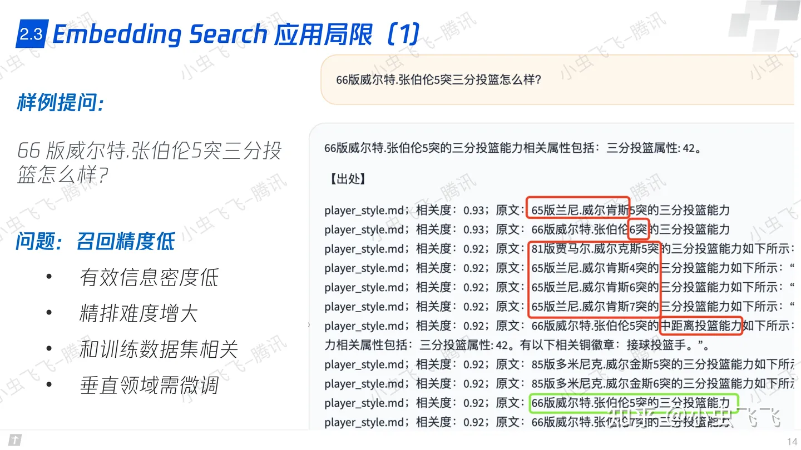

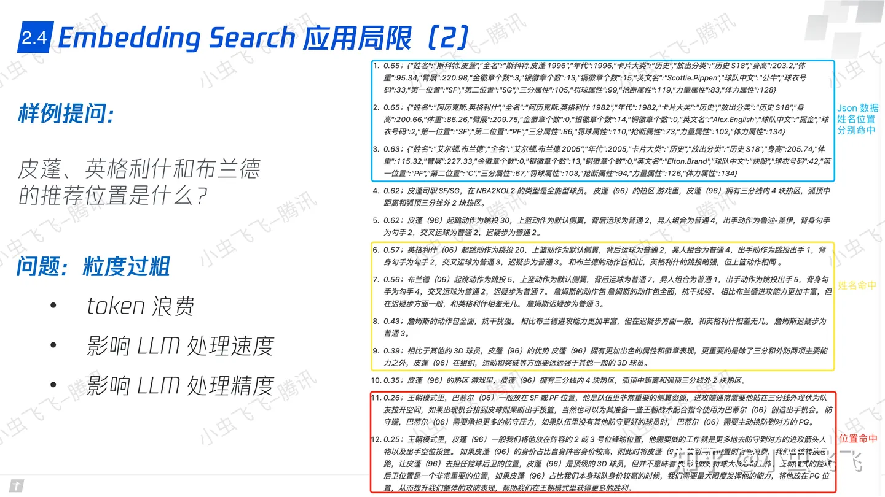

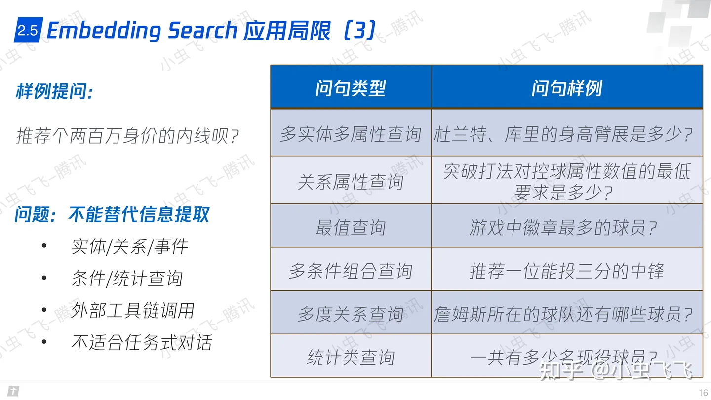

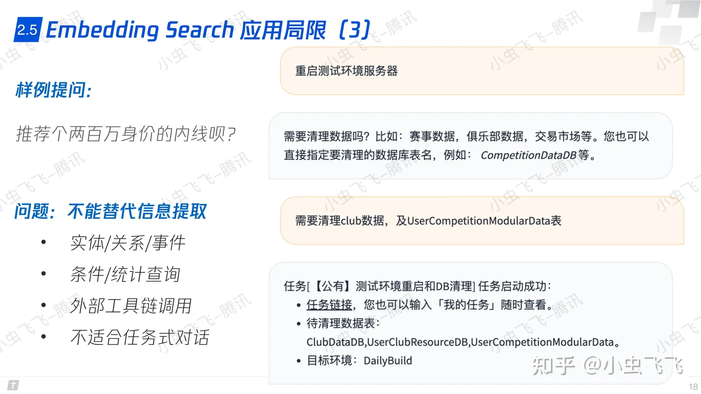

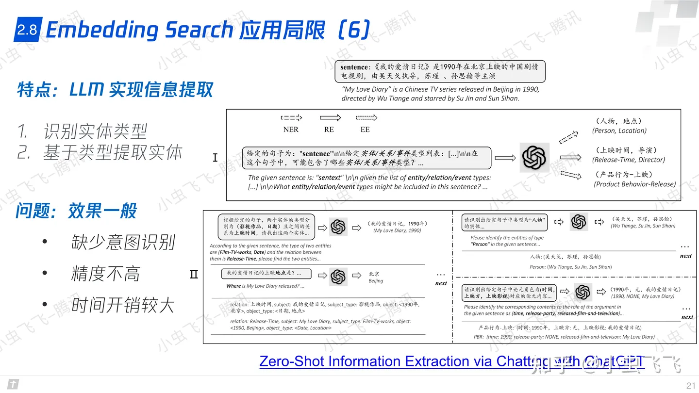

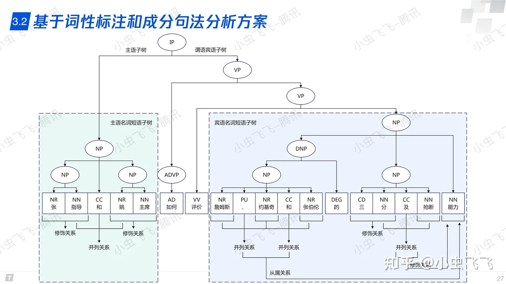

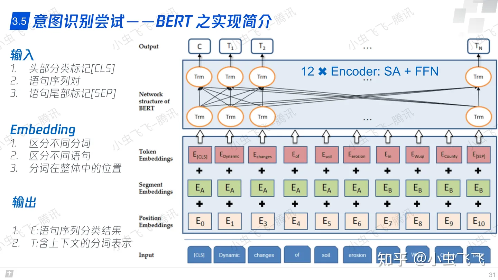

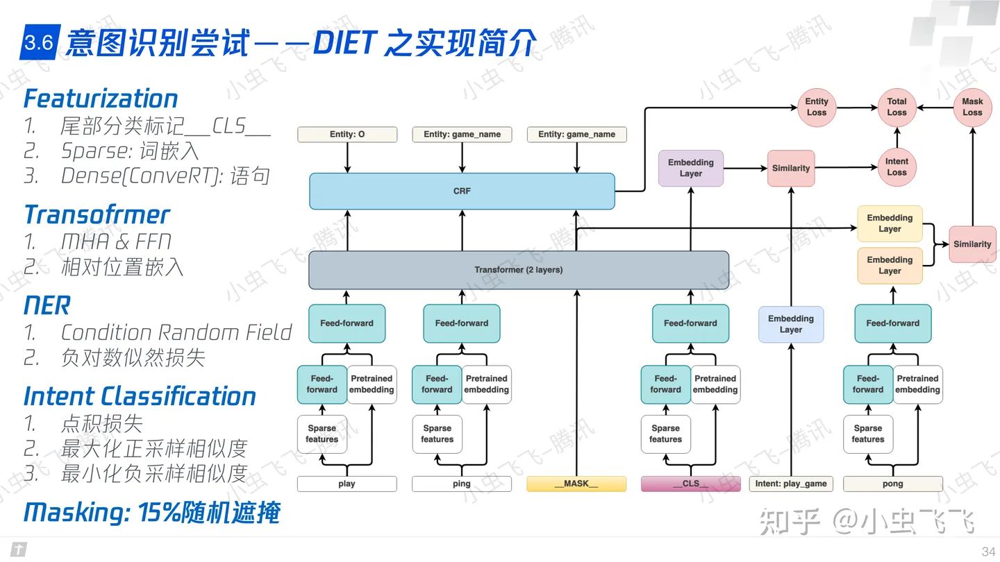

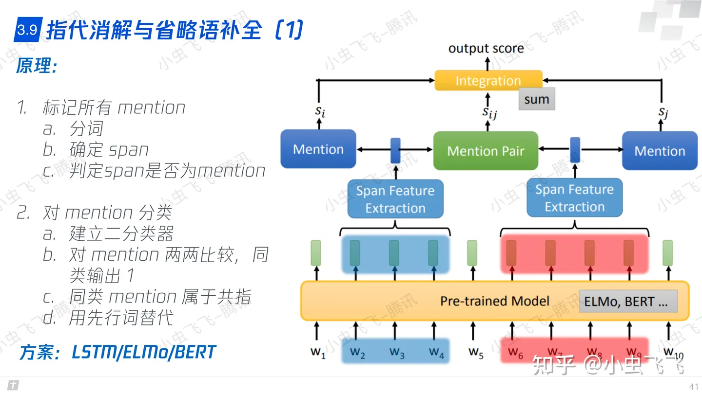

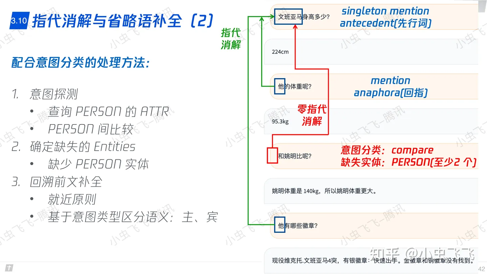

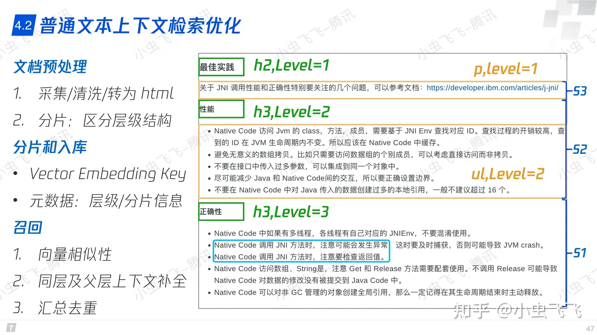

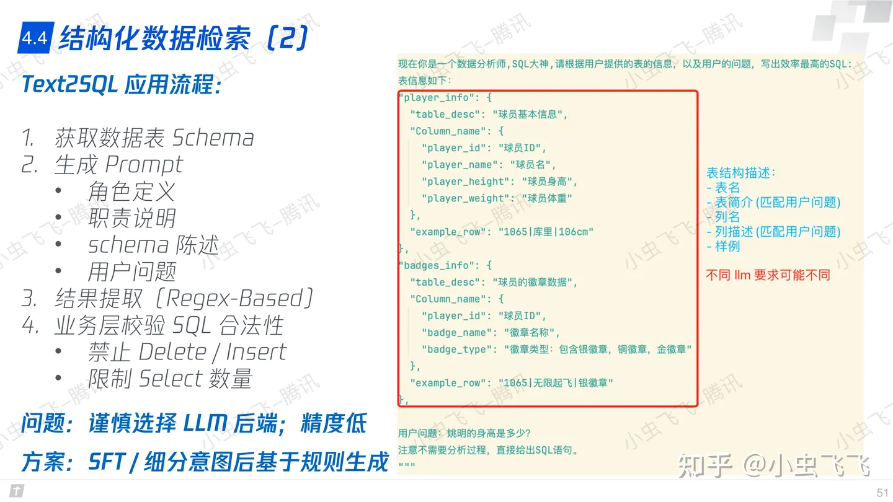

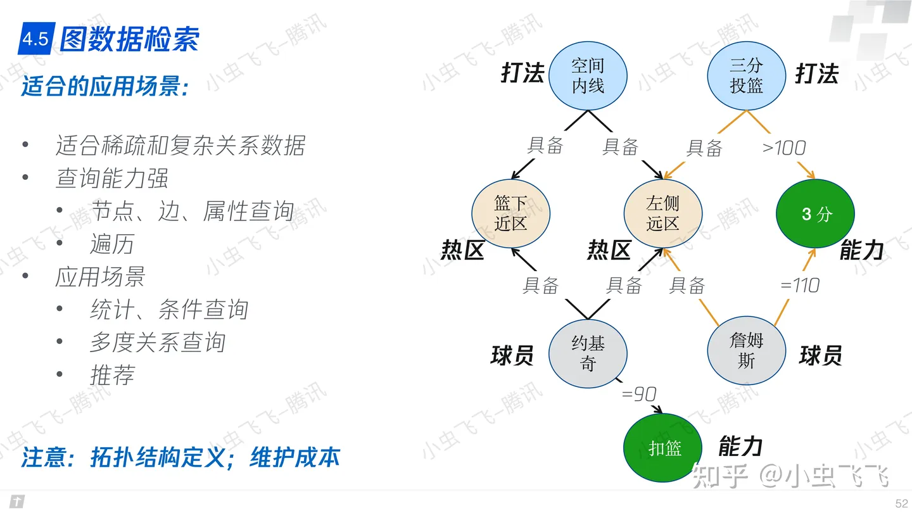

# 参考

[1] RAG探索之路的血泪史及曙光, https://zhuanlan.zhihu.com/p/664921095