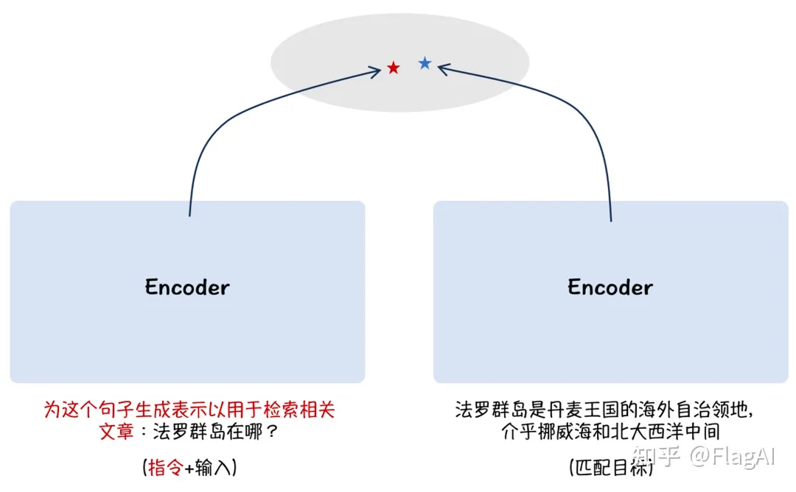

# 1. 中文词向量排行榜

- https://huggingface.co/spaces/mteb/leaderboard
- 论文(2022)：MTEB: Massive Text Embedding Benchmark

# 2. 数据集

- 中文自然语言推理与语义相似度数据集， https://github.com/zejunwang1/CSTS#chinese-sts-b-%E6%95%B0%E6%8D%AE%E9%9B%86

# 3. 各类模型

## 3.1 text2vec-base-chinese

1. 数据
   
    中文自然语言推理与语义相似度数据集： https://github.com/zejunwang1/CSTS#chinese-sts-b-%E6%95%B0%E6%8D%AE%E9%9B%86

    选用 chinese-sts-b数据集 【 该数据集通过翻译加部分人工修正的方法，从英文原数据集生成，
    可以一定程度上缓解中文语义相似度计算数据集不够的问题。每条数据包含三列，分别表示 sentence1、
    sentence2 和相似等级（Label），相似等级范围为 0~5，5 表示语义一致，0 表示语义不相关

    数据样例如下：

    ```
        一个女孩在给她的头发做发型。	一个女孩在梳头。	2
        一群男人在海滩上踢足球。	一群男孩在海滩上踢足球。	3
        一个女人在测量另一个女人的脚踝。	女人测量另一个女人的脚踝。	5
        一个人正在切黄瓜。	一个人在切黄瓜。	4
    ```

## 3.2 BGE

链接
- FlagEmbedding： https://github.com/FlagOpen/FlagEmbedding
- BGE 模型链接：https://huggingface.co/BAAI/
- BGE 代码仓库：https://github.com/FlagOpen/FlagEmbedding
- C-MTEB 评测基准链接：https://github.com/FlagOpen/FlagEmbedding/tree/master/benchmark ,
   https://huggingface.co/spaces/m
- FlagOpen官网：https://flagopen.baai.ac.cn/

原理
- 针对表征的预训练
- 大规模文本对训练

BGE 针对中文、英文分别构建了多达120M、232M的样本对数据，从而帮助模型掌握实际场景中各种不同的语义匹配任务，
并借助负采样扩增 [7] 与难负样例挖掘 [8] 进一步提升对比学习的难度，实现了多达65K的负样本规模，增强了语义向量的判别能力。


数据
- Pile
- 悟道

将低掩码率的输入编码为语义向量（Embed），再将高掩码率的输入与语义向量拼接以重建原始输入。
这样一来，BGE 得以利用无标签语料实现语言模型基座对语义表征任务的适配。


BGE 借鉴 Instruction Tuning [9] 的思想，采取了非对称的指令添加方式，在问题端添加场景描述， 提升了语义向量在多任务场景下的通用能力



注入场景提示提升多任务通用能力


# 4. 评测

当前最全面的中文语义向量评测基准C-MTEB 开源，涵盖6大类评测任务（检索、排序、句子相似度、推理、分类、聚类），
涉及31个相关数据集，已合并至 Hugging Face MTEB leaderboard 中。

# 参考

[1] 中文Sentence Embeddings text2vec-base-chinese VS OpenAIEmbedding，https://zhuanlan.zhihu.com/p/623912895
[2] 大模型知识“外挂”，智源开源最强语义向量模型BGE, https://zhuanlan.zhihu.com/p/649145407