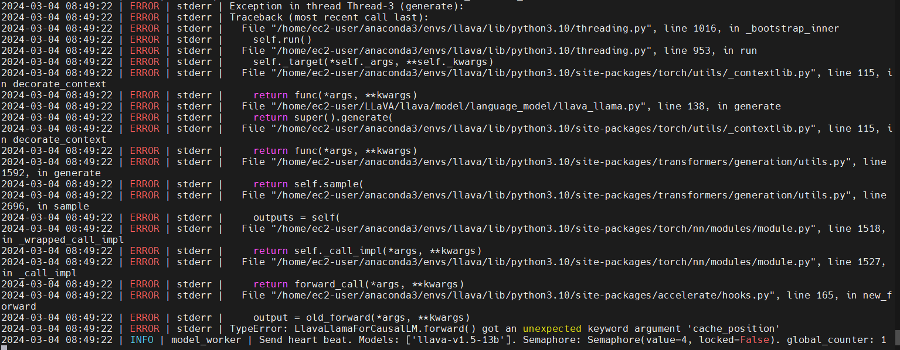

# 1. 问题：cannot import name 'LlavaLlamaForCausalLM' from 'llava.model'

问题详情：

```
python3 -m llava.serve.model_worker --host 0.0.0.0 --controller http://localhost:10000 --port 40000 --worker http://localhost:40000 --model-path liuhaotian/llava-v1.5-13b --load-4bit
Traceback (most recent call last):
  File "/usr/lib/python3.10/runpy.py", line 187, in _run_module_as_main
    mod_name, mod_spec, code = _get_module_details(mod_name, _Error)
  File "/usr/lib/python3.10/runpy.py", line 110, in _get_module_details
    __import__(pkg_name)
  File "/mnt/a/KI/LLaVA/llava/__init__.py", line 1, in <module>
    from .model import LlavaLlamaForCausalLM
ImportError: cannot import name 'LlavaLlamaForCausalLM' from 'llava.model' (/mnt/a/KI/LLaVA/llava/model/__init__.py)
```

解决方法：

参考Github Issue：https://github.com/haotian-liu/LLaVA/issues/1101

- flash-attn编译的和pytorch不匹配
- deepspeed版本不匹配

```bash
pip install flash-attn --no-build-isolation --no-cache-dir
```

# 2. 问题：[Usage] TypeError: LlavaLlamaForCausalLM.forward() got an unexpected keyword argument 'cache_position' #1218

问题详情：



解决方法：

参考Github Issue：https://github.com/haotian-liu/LLaVA/issues/1218

升级transformers到4.37.2，transformers==4.37.2

# 3. 问题：AttributeError: 'str' object has no attribute 'eos_token_id' #292

问题详情：

```text
INFO 03-13 07:48:22 weight_utils.py:163] Using model weights format ['*.safetensors']
Rank 0: load weight end.
Special tokens have been added in the vocabulary, make sure the associated word embeddings are fine-tuned or trained.
Rank 0: max_total_num_token=52678, max_prefill_num_token=32768, context_len=32768,
disable_radix_cache=False, enable_flashinfer=False, disable_regex_jump_forward=False, disable_disk_cache=False, attention_reduce_in_fp32=False
router init state: Traceback (most recent call last):
File "/usr/local/lib/python3.10/dist-packages/sglang/srt/managers/router/manager.py", line 68, in start_router_process
model_client = ModelRpcClient(server_args, port_args)
File "/usr/local/lib/python3.10/dist-packages/sglang/srt/managers/router/model_rpc.py", line 619, in init
self.model_server.exposed_init_model(0, server_args, port_args)
File "/usr/local/lib/python3.10/dist-packages/sglang/srt/managers/router/model_rpc.py", line 137, in exposed_init_model
self.regex_fsm_cache = FSMCache(
File "/usr/local/lib/python3.10/dist-packages/sglang/srt/constrained/fsm_cache.py", line 8, in init
self.outlines_tokenizer = TransformerTokenizer(
File "/usr/local/lib/python3.10/dist-packages/outlines/models/transformers.py", line 63, in init
self.eos_token_id = self.tokenizer.eos_token_id
AttributeError: 'str' object has no attribute 'eos_token_id'
```

解决方法：

参考Github Issue：https://github.com/sgl-project/sglang/issues/292

It's due to outlines API changes, please downgrade outlines<=0.0.34, we will make it compatible with latest outlines soon.

sglang[all]=0.1.12
outlines<=0.0.30
vllm==0.3.2