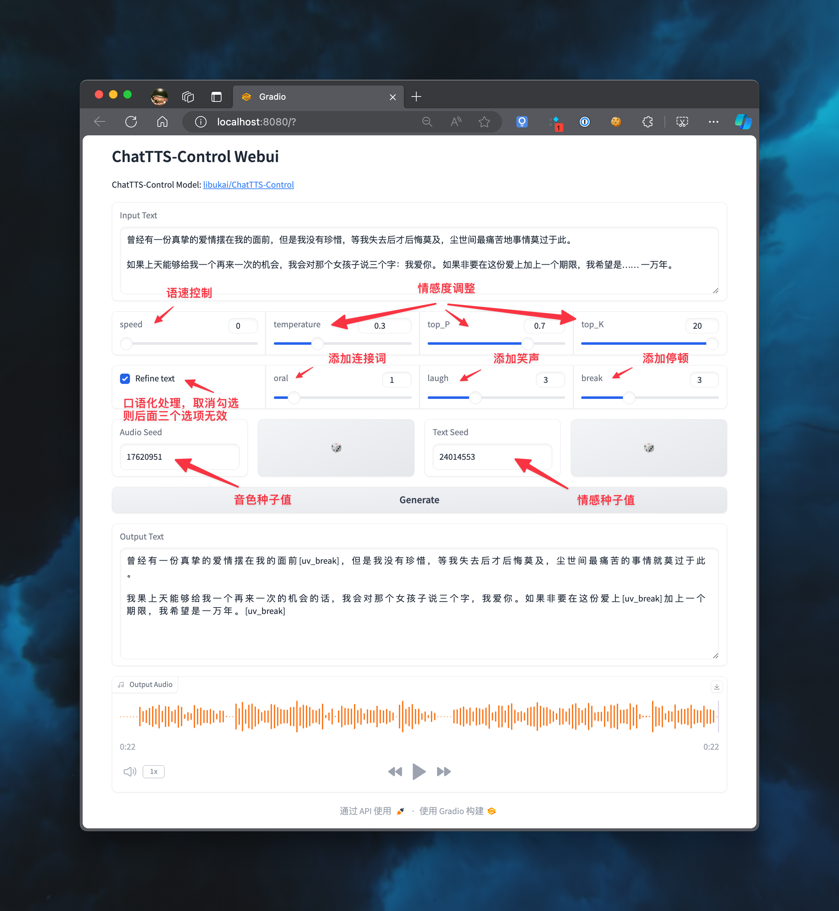

# 1. 资源

- 官网：https://chattts.com/zh
- Github (20.3k): https://github.com/2noise/ChatTTS
- modelscope模型下载网站：https://modelscope.cn/models/pzc163/chatTTS/summary

## 相关推荐
|                            项目                             | Star  | 亮点                          |
|:---------------------------------------------------------:|:-----:|-----------------------------|
|       [ChatTTS](https://github.com/2noise/ChatTTS)        | 20.6K | 源仓库，问题较多，issue 中问题讨论热烈      |
| [ChatTTS-ui](https://github.com/jianchang512/ChatTTS-ui)  | 3.1k  | 提供 Docker 镜像和 API，方便与其他项目集成 |
| [ChatTTS_colab](https://github.com/6drf21e/ChatTTS_colab) |  444  | Google Colab 一键部署，还有音色抽卡功能  |
|   [ChatTTS-fork](https://github.com/yihong0618/ChatTTS)   |  195  | Pypi 包一键安装，便于小白体验项目效果       |
| [ChatTTS-Forge](https://github.com/lenML/ChatTTS-Forge) |  65   | 提供了完善的 ChatTTS 封装，适合技术流深入研究 |
| [ComfyUI-ChatTTS](https://github.com/AIFSH/ComfyUI-ChatTTS) | 38 | ComfyUi 版本，可作为工作流节点引入       |
| [ChatTTS-Control](https://github.com/libukai/ChatTTS-Control) |  10   | 提供更多控制参数和详细解读，汇总相关资源推荐      |

# 2. 使用心得

优点：
- 截至20240605，最好的中文TTS，声音细腻

缺点：
- 速度很慢，暂不支持流式 （H800 21秒音频4秒才生成）
- 没有开源训练代码
- 笑声随机，不够稳定
- 安装使用坑很多，不够友好

没有原理介绍，从简单的介绍中得知，技术栈如下：
- bark, XTTSv2 and valle demostrate a remarkable TTS result by a autoregressive-style system.
- fish-speech reveals capability of GVQ as audio tokenizer for LLM modeling.
- vocos which is used as a pretrained vocoder.

# 3. 安装

## 3.1 模型下载

```bash
#安装ModelScope
pip install modelscope
```

```python
#SDK模型下载
from modelscope import snapshot_download
model_dir = snapshot_download('pzc163/chatTTS')
```

## 3.2 安装依赖

依赖

```text
ChatTTS
vocos
omegaconf~=2.3.0
tqdm
einops
vector_quantize_pytorch
IPython
transformers~=4.41.1
pynini==2.1.5
nemo_text_processing
WeTextProcessing
soundfile
torch~=2.1.0
torchaudio
```

## 3.3 使用

使用代码

```python
import ChatTTS
import soundfile


base_path = '/data/chatTTS'
chat = ChatTTS.Chat()
chat.load_models(source='local', local_path=base_path) # Set to True for better performance

texts = ["PUT YOUR TEXT HERE",]

wavs = chat.infer(texts)

soundfile.write("output1.wav", wavs[0][0], 24000)

```

```python
import torch
import ChatTTS
from IPython.display import Audio

# 初始化ChatTTS
chat = ChatTTS.Chat()
chat.load_models()

# 定义要转换为语音的文本
texts = ["你好，欢迎使用ChatTTS！"]

# 生成语音
wavs = chat.infer(texts, use_decoder=True)

# 播放生成的音频
Audio(wavs[0], rate=24_000, autoplay=True)
```

# 4. 超参介绍

参考：
- https://github.com/2noise/ChatTTS/issues/274



项目ChatTTS-Control中开放了更多的参数
- https://github.com/libukai/ChatTTS-Control

情感控制
- speed : 控制音频速度，范围为 0-9，数字越大，速度越快
- temperate : 控制音频情感波动性，范围为 0-1，数字越大，波动性越大
- top_P ：控制音频的情感相关性，范围为 0.1-0.9，数字越大，相关性越高
- top_K ：控制音频的情感相似性，范围为 1-20，数字越小，相似性越高

文本控制
- Refine text : 控制是否对文本进行口语化处理，取消勾选则后面三个选项无效
- oral : 控制文本口语化程度，范围为 0-9，数字越大，添加的“就是”、“那么”之类的连接词越多
- laugh : 控制文本是否添加笑声，范围为 0-9，数字越大，笑声越多
- break : 控制文本是否添加停顿，范围为 0-9，数字越大，停顿越多

种子控制
- Audio Seed : 配置音色种子值，不同种子对应不同音色，不同种子间差异性较大
- Text Seed : 配置情感种子值，不同种子对应不同情感，不同种子间差异性较小

### 男生

| Seed | 类型 | 年龄 | 风格   |
|:----:|:--:|:--:|------|
| 111  | 男声 | 青年 | 文艺范  |
| 333  | 男声 | 青年 | 食草系  |
| 666  | 男声 | 中年 | 白领   |
| 7777 | 男声 | 中年 | 港系配音 |
| 9999 | 男声 | 中年 | 低沉深邃 |

### 女生

| Seed | 类型 | 年龄 | 风格   |
|:----:|:--:|:--:|------|
|  2   | 女声 | 青年 | 情感丰富 |
|  4   | 女声 | 中年 | 感情深邃 |
| 1111 | 女声 | 中年 | 清澈干净 |
| 3333 | 女声 | 中年 | 淡然平静 |

# 5. 错误

1. 问题：TypeError: Chat.load_models() got an unexpected keyword argument 'compile'
   
    解决：直接pip安装ChatTTS，如果不行。将代码仓中的ChatTTS目录考到和运行目录的同级目录下

2. 问题：local variable 'Normalizer' referenced before assignment 
    
   解决：
   - 方法1：
     - 参考：https://github.com/2noise/ChatTTS/issues/164
     - 安装pynini=2.1.5，nemo_text_processing，WeTextProcessing
   - 方法2 (不推荐)：
     - 参考：https://github.com/2noise/ChatTTS/issues/173
     - Normalizer 有些问题，可以在调用 infer 的时候把 do_text_normalization=False 加进去，跳过 normalizer 这一步，等后续修复吧

3. 问题：torchaudio 加载wav报错 Couldn‘t find appropriate backend to handle uri *** and format None

    解决：
    - 方法1：
      - 参考：https://github.com/2noise/ChatTTS/issues/181
      - 使用 soundfile 代替 torchaudio
    - 方法2（未测试）：可能是缺少音频库，通过 pip install pysoundfile来安装音频库

4. 问题：UserWarning: Plan failed with a cudnnException

    解决：
    - 参考：https://github.com/pytorch/pytorch/issues/121834
    - 暂时不管，初步看也没有影响，仅仅是一个警告
    - 从参考中得知，降低torch版本暂时就没有这个警告了 （暂未测试）

5. 问题：合成速度太慢

   解决：
   - 参考：https://github.com/2noise/ChatTTS/issues/265
   - 原因：这个模型分两部分执行，上边的进度条执行文本识别，应该是添加情感标识和辅助语气词，下边的进度条是语音合成。如果把top_p这几个参数调的太大，他就会在原句子中添加过多的新内容。多分句，多段行，执行起来就快了。负面的就是句和句之间情感可能不一样。
   - 解决：关掉Refine text，调小top_p、top_k，调大speed，调小temperate。其中Refine text，以及第一次运行，是导致速度慢的主要原因
   - 优化：
     - 可以通过调整参数，来提高合成速度，但是会影响合成效果。
     - 另外，初始加载的时候，最好先运行一遍，之后的就会很快了。因为英文部分第一次需要加载nemo_text_processing构建FST，会比较慢，中文也会有些初始化操作，第一次运行在文本处理上会比较慢