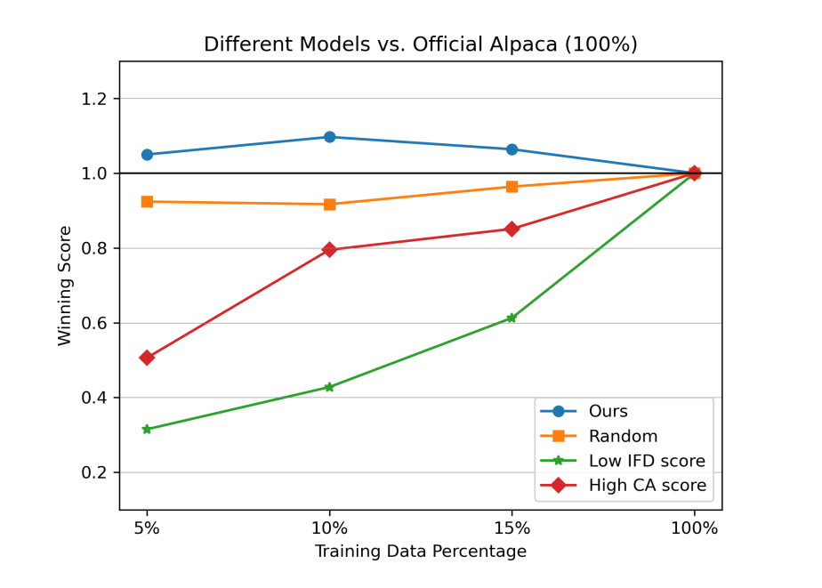
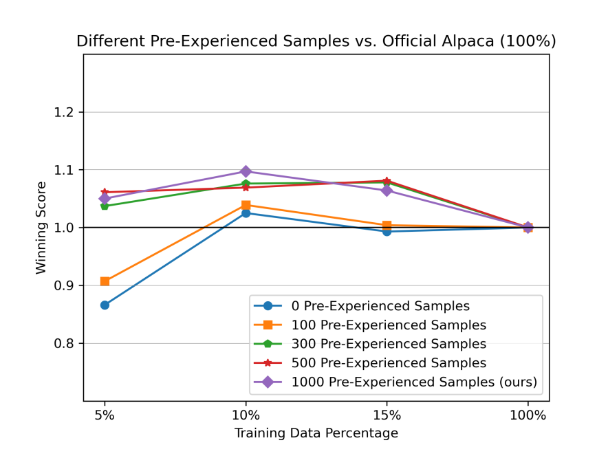
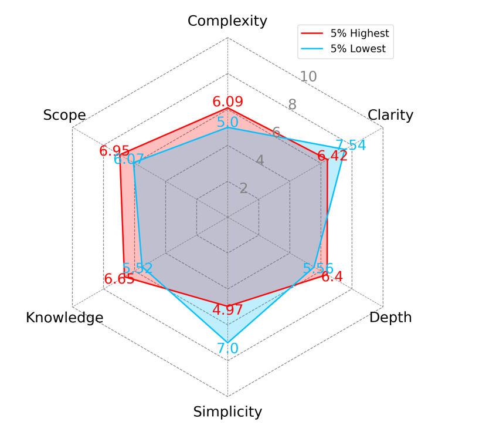
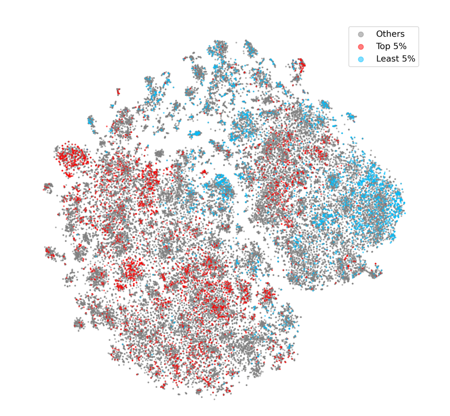

## 1.2 IFD

### 1.1.1 方法介绍

1. 概要

   核心内容是提出一个指令跟随难度（Instruction-Following Difficulty，IFD）指标，
   通过该指标来筛选具有增强LLM指令调优潜力的数据样例（樱桃数据，cherry data），而模型仅使用原始数据
   5%-10%的樱桃数据就可以达到全量数据微调的效果，甚至可以有所提高。

   - Paper: https://arxiv.org/abs/2308.12032
   - Github: https://github.com/MingLiiii/Cherry_LLM
   - From Quantity to Quality: Boosting LLM Performance with Self-Guided 
     Data Selection for Instruction Tuning

2. 方法

   利用IFD指标自动筛选樱桃数据，再利用樱桃数据进行模型指令微调，获取更好地微调模型，主要涉及三个步骤：

   - Learning from Brief Experience：利用少量进行进行模型初学；
   - Evaluating Based on Experience：利用初学模型计算原始数据中所有IFD指标;
   - Retraining from Self-Guided Experience：利用樱桃数据进行模型重训练。

   

3. 动机
  
   利用少量数据进行模型初学习的原因如下：

   - 一些模型为Base模型，只能进行续写，并没有指令遵循的能力；
   - LIMA已经证明高质量数据可以让模型具有指令遵循能力；
   - 如果采用大量数据进行学习，时间成本和资源成本较高。
   
   而在少量数据的选择上，数量选择1k条样本，为了保证数据的多样性，采用K-Means方法对指令进行聚类，
   共聚出100个簇，每个簇里选择10个样本。并且仅在初始模型上训练1个epoch获取简要预经验模型（Brief Pre-Experience Model）。

4. 根据经验验证

   利用简要预经验模型可以对数据集中所有样本进行预测，通过指令内容预测答案内容，
   并可以获取预测答案与真实答案直接的差异值（利用交叉熵），即条件回答分数（ Conditioned Answer Score，CAS），如下：
   
   

   根据CAS的高低，可以判断出模型对指令Q生成答案A的难易，但也可能收到模型生成答案A的难易程度的影响。
   我们利用模型直接对答案进行续写，再根据答案真实内容获取直接的差异值，即直接答案分数（Direct Answer Score，DAS），如下：

   

   DAS得分越高，可能表明该答案对模型生成来说本身就更具挑战性或更复杂。为了获取更好的指令数据，也就是哪些指令对模型的影响更高，
   需要刨除答案本身的影响，因此提出了指令跟随难度（Instruction-Following Difficulty，IFD）分数，如下：
   
   

   利用IFD指标对数据进行筛选，减缓了大模型对答案本身拟合能力的影响，可以直接衡量给定指令对模型生成答案的影响。
   较高的IFD分数表明模型无法将答案与给定的指令内容进行对齐，表明指令的难度更高，对模型调优更有利。

### 1.1.2 实验结果

先说结论，在Alpaca和WizardLM两个数据集上利用Llama-7B进行实验，发现在5%的Alpaca樱桃数据上进行训练就超过了全量数据训练结果。

如何判断IFD指标是有效的？对比随机采样、IFD采样、IFD低分采样、CAS采样四种方法对模型指令微调的影响，
发现IFD采样在不同数据比例下，均高于全量数据微调效果，但其他采样方法均低于全量数据微调方法。

在前期，利用了1000条数据进行了模型简要学习，那么模型简要学习过程中数据量的影响如何呢？对模型简要学习不同数据量进行对比实验，
发现不进行模型简要学习，在樱桃数据占比10%时，模型依然效果由于全量参数，说明IFD指标的有效性而。
模型简要学习主要是为了让Base具有一定的指令遵循能力，在100样本时，模型训练并没有作用，当样本增加到300时，
模型具有了一定的指令遵循能力。

同时对于简要模型学习过程中的样本采样方式进行比较，对比样本分布采用（上文用的K-Mean的方法）和指令遵循难度
（IDF分数）采样的区别，发现都有效，因此对于模型来说简要学习的这个过程是更重要的。

对高质量数据和低质量数据进行分析，发现樱桃数据通常在范围、复杂性、深度和知识方面得分更高，
在清晰度和简单性方面得分更低。并且发现高难度和低难度的样本之间存在明显的界限。

# 参考

[1] 如何从数据集中自动识别高质量的指令数据-IFD指标的使用, https://mp.weixin.qq.com/s?__biz=MjM5ODkzMzMwMQ==&mid=2650439114&idx=4&sn=8b51735a61ab4e52ec196ec9fb149af6&chksm=becdfb9089ba728632bf503d59adf110b9a6260f1f6aa145de4355ef75a7b60b24b33ff63699&scene=21#wechat_redirect