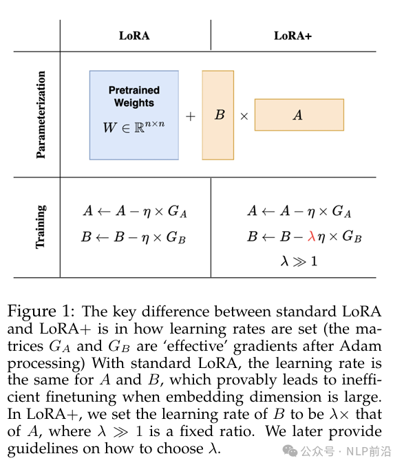

# 1. 介绍

论文： https://arxiv.org/pdf/2402.12354.pdf

# 2. 原理

LoRA是一种用于大型模型微调（finetuning）的方法，它通过在预训练模型的权重上添加低秩矩阵
（称为adapter）来实现，而不是调整所有模型参数。这种方法在保持计算成本较低的同时，能够有效地适应新任务。

然而，原始LoRA在处理具有大宽度（embedding dimension）的模型时，由于adapter矩阵
A和B使用相同的学习率进行更新，导致微调效果不佳。这是因为在大宽度网络中，
使用相同的学习率不利于有效的特征学习。

为了解决这个问题，LoRA+提出了一种新的方法，即为LoRA的adapter矩阵A和B设置不同的学习率，
并且这些学习率之间有一个固定的比率。LoRA+建议将B的学习率设置为A的学习率的λ倍（λ > 1），
这样可以有效提高特征学习效率。通过大量实验，LoRA+在保持与LoRA相同计算成本的同时，
能够提高性能（1% - 2%的改进）和微调速度（大约2倍的速度提升）。

λ的设置：

- 经验法则：文章建议，作为一个经验法则，可以尝试设置λ = 24。
  这个值是在多个实验中发现的一个较好的起点，可以在不同的任务和模型上进行微调。
- 性能比较：在实际应用中，可以通过比较不同λ值下模型的性能（如准确率、损失等指标）
  来选择最佳的λ值。这通常涉及到一个网格搜索或者更高级的超参数优化技术。
- 任务难度：如果微调任务对于预训练模型来说较为困难，那么选择合适的λ值尤为重要，
  因为需要更有效的特征学习来适应新任务。相反，如果任务相对容易，λ的影响可能不那么显著。

文章还提供了理论分析，通过无限宽度网络的缩放理论来支持LoRA+的设置。在无限宽度极限下，
LoRA+通过调整学习率来优化特征学习动态，从而提高了微调的效果。此外，
文章还提供了实验结果来验证LoRA+在不同语言模型和任务上的有效性，并给出了在实践中如何设置λ比率的指导建议。

# 参考

[1] LoRA+： 提高LORA微调效果的一个trick， https://mp.weixin.qq.com/s?__biz=MzkyOTU5NzY1Mw==&mid=2247485561&idx=1&sn=d526d80d8f4401d6462180fbb0931936&chksm=c359e7a8fa09b0280d96c6c2831965583c2c7aa259b87de92fa5ec91ac5c1c920600d1e9e27e&scene=132&exptype=timeline_recommend_article_extendread_samebiz&show_related_article=1&subscene=0&scene=132#wechat_redirect