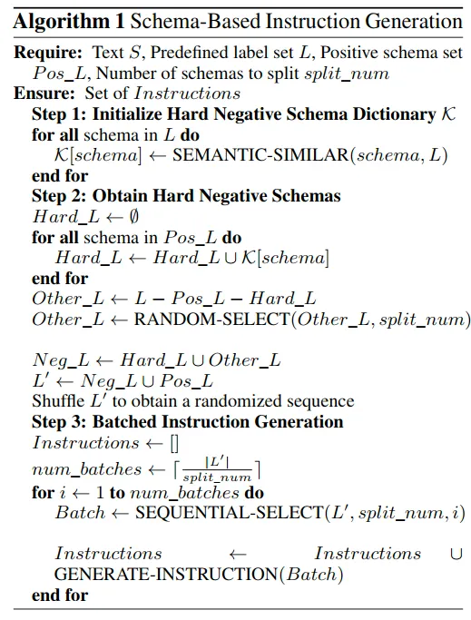
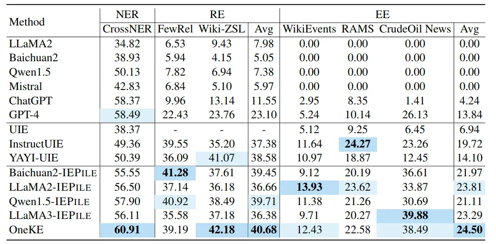
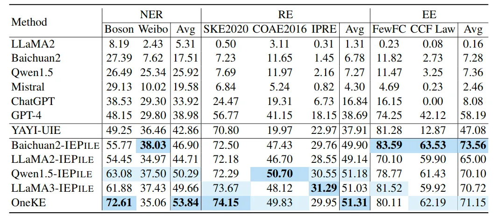
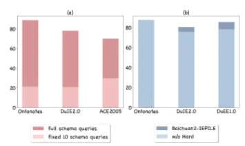

# 1. 资源

论文题目：IEPile: Unearthing Large-Scale Schema-Based Information Extraction Corpus

本文作者：桂鸿浩（浙江大学、蚂蚁集团）、袁琳（蚂蚁集团）、叶宏彬（浙江大学）、张宁豫（浙江大学、浙江大学-蚂蚁集团联合实验室）、孙梦姝（蚂蚁集团、浙江大学-蚂蚁集团联合实验室）、梁磊（蚂蚁集团、浙江大学-蚂蚁集团联合实验室）、陈华钧（浙江大学、浙江大学-蚂蚁集团联合实验室）

发表会议：ACL2024

论文链接：https://arxiv.org/abs/2402.14710

代码链接：https://github.com/zjunlp/IEPile

# 2. 介绍

- 一个全面的双语（英语和汉语）IE指令语料库——IEPile，它包含大约0.32B个字符
- 实验表明，IEPile提高了LLMs的信息提取性能，特别是在零样本泛化方面有显著提升
- 本语料库主要涉及中英双语的材料，并集中于命名实体识别（NER）、关系抽取（RE）和事件抽取（EE）三大类信息抽取任务。我们总共收集了15个英文NER数据集，3个中文NER数据集，8个英文RE数据集，2个中文RE数据集，以及3个英文EE数据集和2个中文EE数据集。为保证数据质量和格式的统一，我们对数据进行了规范化处理，包括格式统一、实例去重、筛除低质量数据。
- 三条启发式规则以排除质量较低且无意义的数据：1）非字母字符占比超过80%；2）文本长度小于5个字符且不含任何标签；3）停用词如'the'、'to'、'of'等占比超过80%。我们认为以上所述的清洗措施将对模型的训练产生积极影响，并提高其性能

# 3. 方法

## 3.1 数据清洗

我们构建了三条启发式规则以排除质量较低且无意义的数据：1）非字母字符占比超过80%；2）文本长度小于5个字符且不含任何标签；3）停用词如'the'、'to'、'of'等占比超过80%。我们认为以上所述的清洗措施将对模型的训练产生积极影响，并提高其性能

## 3.2 构造方法

我们专注于基于指令的信息抽取，因此指令中的schema的构造至关重要，因为它反映着具体抽取需求，是动态可变的。然而，现有研究在构造指令时往往采取一种较为粗放的schema处理策略，即利用标签集内全部schema进行指令构建。这种方法潜在地存在三个重要的问题：

1. 缺乏纯正的反例样本。例如，在像conll2004这种数据集中，每个样本至少关联一个标签，从而在输出中至少含有一个有效值。这可能使模型在预测时过分依赖至少输出一个值的假定。
2. 训练和评估阶段schema询问的数量不一致，即使这些schema在内容上相似，可能损害模型的泛化能力。若训练过程中每次询问的schema数量大约是20个，而评估时询问的是10个或30个schema，即使这些schema在内容上与训练阶段相似，模型性能仍可能受到影响。
3. 指令中的schema之间的对比性不足。语义近似的schema，如“裁员”、“离职”与“解雇”，它们的语义模糊性可能造成模型混淆。这类易混淆的模式应当在指令集中更为频繁地出现。

因此，我们提出如下解决方案：1、轮询式的指令生成；2、构造难负样本字典。

### 3.2.1 指令中的 正、负Schema 机制

首先，我们将输入文本中真实存在的schema定义为正schema，输入文本中不存在的schema定义为负schema。如图1所示，annotation中存在的location contains是正schema，预定义标签集中的其他schema均为负schema。传统的信息抽取模型作为序列标注任务，其输入为文本，而输出则是每个token的标签，输入中不涉及正、负schema的概念。但在生成式IE时代，例如UIE，提出了在模型输入中包含schema序列(论文中称为Structural Schema Instructor，SSI)以指导模型的输出，模型的输出中的标签范围被限制在SSI范围内。由于在推理阶段，模型使用整个数据集的预定义标签集作为SSI来引导输出。如果训练阶段的SSI仅包含正向schema，那么模型在推理时将倾向于对SSI中每个标签生成对应的答案。因此，为了使模型显式地拒绝为负向schema生成输出，有必要在SSI中纳入负向schema。

### 3.2.2 难负样本

假设数据集D有其全量标签集L，D中某一文本S，S中真实存在的标签构成正例标签集Pos L，而不存在的标签则形成负例标签集Neg L。在我们的分析中，我们发现模型误判的主要原因在于schema的语义模糊，导致了模型的混淆。传统方法中，负例标签Neg L通常简单地定义为L - Pos L。然而，这种方法忽视了一个重要方面：需要特别注意那些与正例标签语义相近的负例标签。受对比学习理论的启发。我们构造了一个难负样本字典，其键值对应的是Schema及其语义上相近的Schema集。因此难负样本Hard L = D[Pos L]。然而，若Neg L仅由Hard L构成会缺少足够的负例让模型学习。因此，我们定义其他负样本Other L = L - Hard L，最终，负例标签Neg L由Hard L和少量的Other L组成。这种难负样本的构建旨在促进语义近似的模式更频繁地出现在指令中，同时也能在不牺牲性能的情况下减少训练样本量（例如，原本需12个指令集的49个schema可减至3个）。

算法一展示了上述方法的数学表示

我们基于上述方法，形成了一个高质量的信息抽取指令数据集，即IEPile。此数据集大约蕴含200万条指令数据，包含约3.2亿个token（使用Baichuan2 tokenizer）。下图展示了不同领域与数据集在IEPile中的分布情况。

# 4. 实验

基于IEPile，我们对几个最新的模型进行了微调，然后比较它们与一系列基准模型的零样本泛化能力。

评价指标：我们采用基于跨度的Micro-F1作为衡量模型性能的指标。

基准模型：我们选择了一系列强大的模型进行对比分析，包括UIE 、LLaMA2-13B-Chat、Baichuan2-13B-Chat、Qwen1.5-14B-Chat、Mistral-7B-Instruct-v0.2、ChatGPT 、GPT-4、LLaMA3-8B-Instruct、InstructUIE、YAYI-UIE。

零样本基准：我们收集了13个未在训练集中出现的数据集。

OneKE：此外，我们利用IEPile和其他专有的信息抽取数据集对alpaca2-chinese-13B模型进行了全参数微调。

主要实验

在表1和1中，我们报告了三个任务和两种语言的零样本性能。总体而言，在经过IEPile训练后，模型在大部分任务中都取得了更好的结果。我们认为成功的原因在于难负样本构造和轮询式指令生成策略，这两种策略能够缓解训练-评估不匹配和语义模糊的问题。我们也观察到，在英文NER任务中，IEPile-模型稍微落后于GPT-4。我们推测这种差距可能是由于GPT-4在其训练过程中接触了大量的类似数据。另外，需要注意的是，InstructUIE专注于英文数据，而IEPile同时涵盖了英文和中文数据。这种数据差异可能影响模型在英文方面的表现，从而降低性能。此外，OneKE在几乎所有的零样本评估任务中实现了最佳的结果。我们将其成功归因于全参数微调带来的增强效果。

# 5. 分析

schema查询数不一致伤害泛化能力

我们研究了在训练和评估中使用不同数量的模式查询对模型性能的影响。我们在Ontonotes（18个schema）、DuIE2.0（49个schema）和ACE2005（33个schema）这三个数据集上用完整schema指令训练Baichuan2。对于评估，我们测试了两种策略：一种使用完整的schema查询集合，另一种使用固定数量的10个schema查询。下图（a）所示的结果表明，评估期间schema查询数量的不一致显著降低了模型的表现。对模型输出的进一步分析揭示出，模型总是倾向于针对每个查询生成输出。我们假设schema查询的数量是影响泛化能力的关键因素之一。模型需要先适应训练中罕见的schema查询数量，然后再适应未见的schema。

schema之间的区分不足导致语义相似混淆

我们还评估了移除“难负schema字典”对Baichuan2-IEPile性能的影响，特别关注难以区别的schema。根据下图（b)的结果，我们注意到难负schema字典在NER任务中的作用相对有限，这可能是由于实体识别固有的清晰边界。然而，使用难负schema字典明显提升了DuIE2.0和DuEE1.0数据集上的模型性能。我们观察到，语义相似且容易混淆的模式经常出现在模型的输出中，例如“离职”事件与“解雇”和“辞职”事件。因此，处理语义易混淆的指令提出了重大挑战，而难负schema字典在增强模型鲁棒性和提高预测准确性方面起着关键作用。

# 6. 局限性

从数据角度来看，我们的研究主要集中在基于schema的信息抽取（IE）上，这限制了我们对不符合我们特定格式要求的人类指令的泛化能力。此外，我们的工作仅限于两种语言，并没有解决开放信息抽取（Open IE），我们计划未来扩展到更多语言和Open IE场景。从模型的角度来看，由于计算资源的限制，我们的研究评估了有限的模型和一些基准。理论上，IEPile可以应用到任何其他的LLMs，比如ChatGLM和Gemma。

# 参考

[1] ACL2024 | IEPILE:大规模基于Schema的信息抽取语料库，https://mp.weixin.qq.com/s/9h7k3HGffthXCygWqinWzQ