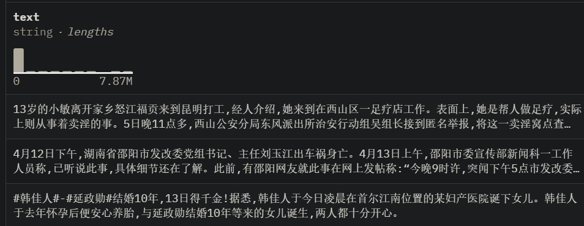
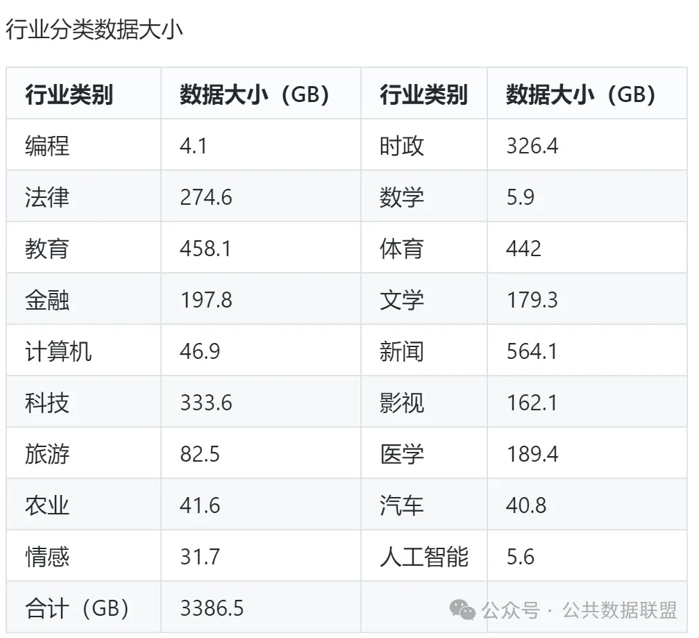
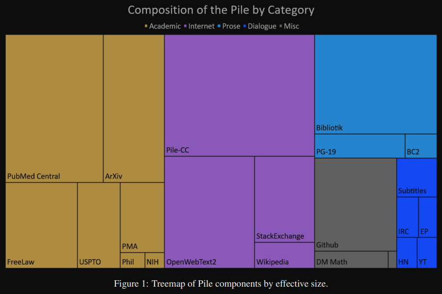
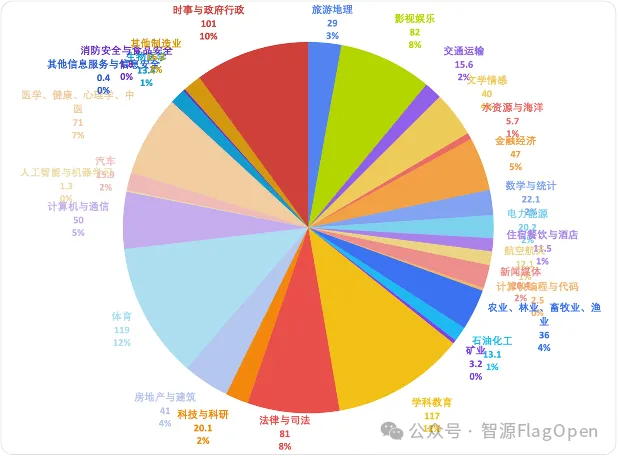
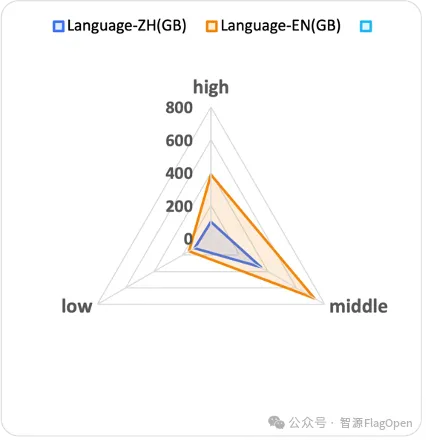

# 1. 中文

## 1.1 通用领域

1. Wikipedia: 中文Wikipedia的数据
   - https://github.com/goldsmith/Wikipedia
   - 2.7k stars
   - 提供python API

2. 悟道（智源）
   - 5T, 开源200G
   - 采用 20 多种规则从 100TB 原始网页数据中清洗得出最终数据集，注重隐私数据信息的去除，源头上避免 GPT-3 
     存在的隐私泄露风险；包含教育、科技等 50+个行业数据标签，可以支持多领域预训练模型的训练
   - https://data.baai.ac.cn/details/WuDaoCorporaText
   - https://github.com/yuanzhoulvpi2017/zero_nlp/wiki/%E6%95%B0%E6%8D%AE%E5%85%B1%E4%BA%AB%E2%80%94%E2%80%94%E6%82%9F%E9%81%93200G%E6%95%B0%E6%8D%AE%E5%88%86%E4%BA%AB

3. MNBVC
   - https://github.com/esbatmop/MNBVC
   - 2k stars
   - MNBVC(Massive Never-ending BT Vast Chinese corpus)超大规模中文语料集。
     对标chatGPT训练的40T数据。MNBVC数据集不但包括主流文化，
     也包括各个小众文化甚至火星文的数据。MNBVC数据集包括新闻、作文、小说、
     书籍、杂志、论文、台词、帖子、wiki、古诗、歌词、商品介绍、笑话、糗事、
     聊天记录等一切形式的纯文本中文数据。
   - 包含数据清洗工具

4. 书生·万卷1.0
    - 地址：https://arxiv.org/pdf/2308.10755.pdf
    - 下载路径：https://opendatalab.org.cn/OpenDataLab/WanJuan1_dot_0/tree/main/raw/nlp
    - 包含多种模式的大规模训练语料库：书生·万卷文本数据集1.0由来自网页、百科、书籍、专利、教材、
      考题等不同来源的清洗后预训练语料组成，数据总量超过5亿个文档，数据大小超过1TB
    - 该语料将html、text、pdf、epub等多种格式的数据统一处理为字段统一的jsonl格式，并经过细粒度的清洗、去重、价值对齐，
      文本数据包括6亿多篇文档，数据存储量超过1TB；图像-文本数据经过处理后成为文档，共有2200多万篇文档，
      数据量超过200GB（图像通过URL链接提供）；视频文件共有1000多个，数据量超过900GB。
    - 中文数据占比35.1%，约2.2亿个文件，466.54GB。英文数据集占比61.4%，共3.83亿个文件，542.51GB
    - 采用多步骤文本提取流程、语言检测、语料库过滤和重复数据删除
    - 在精细处理方面，书生·万卷1.0经历了语言甄别、正文抽取、格式标准化、基于规则及模型的数据过滤与清洗、多尺度去重、数据质量评估等精细化数据处理环节，因而能更好地适配后续的模型训练需求。
    - 

     在数据存储上，提供统一的JSON格式，数据样例如下：
     
    ```{
    "id": "BkORdv3xK7IA0HG7pccr",
    "content": "\\*诗作[222]\n录自索菲娅·马克思的笔记本\n#### 人生\n时光倏忽即逝，\n宛如滔滔流水；\n时光带走的一切，\n永远都不会返回。\n生就是死，\n生就是不断死亡的过程；"
    }
    ```
 
5. CCI中文互联网语料库
    - 在数据来源上均为高质量可信的、中国境内的互联网站，经过严格的数据清洗和去重，
      并在内容质量、价值观等方面进行了针对性的检测和过滤，进一步提升数据质量和安全可信程度。数据处理的规则包括：
      - 基于规则的过滤：文字密度提取、关键词过滤、垃圾信息过滤、简繁体转换等
      - 基于模型的过滤：低质量内容过滤
      - 数据去重：数据集内部 / 数据集间去重
    - CCI语料库首期开放的数据（CCI v1.0.0）规模为 104GB。数据集总体的时间跨度为 2001年1月至2023年11月
    - https://data.baai.ac.cn/details/BAAI-CCI

6. 安娜的檔案
   - ***强烈推荐***
   - 世界最大的图书馆，包含了大量的文本数据
   - 其中书籍类，有重复数据，可用种子，并发下载
   - https://tw.annas-archive.org/

7. pleisto/wikipedia-cn-20230720-filtered
   - https://huggingface.co/datasets/pleisto/wikipedia-cn-20230720-filtered
   - Wiki中文百科（25w词条）
   - 500MB
   - 

8. BaiduBaiKe
   - 563w词条
   - 百度网盘：https://pan.baidu.com/share/init?surl=jIpCHnWLTNYabftavo3DVw&pwd=bwvb  ， 提取码：bwvb
   - 4.5G

9. ChineseWebText
   - Github: https://github.com/CASIA-LM/ChineseWebText
   - Data: https://huggingface.co/datasets/CASIA-LM/ChineseWebText
   - Data Intro:  1.42 TB all, 600G cleaned
   
   

   ```json
   {
     "title": "潍坊银行2021年上半年净利润同比增长29.57% 不良率降至1.10%_财经_中国网",
     "score": 0.95,
     "text": "潍坊银行2021年上半年净利润同比增长29.57% 不良率降至1.10%\n中国网财经8月24日讯 潍坊银行昨日披露2021年二季度信息报告显示，截至2021年6月末，潍坊银行资产总额1920.44亿元，较上年末增长9.34%；负债总额1789.16亿元，较上年末增长10.54%。2021年上半年，潍坊银行实现净利润6.09亿元，同比增长29.57%。\n资产质量方面，截至2021年6月末，潍坊银行不良贷款率1.10%，较上年末下降0.13个百分点。\n资本金方面，截至2021年6月末，潍坊银行资本充足率、核心一级资本充足率、一级资本充足率分别为11.66%、7.89%、10.13%，分别较上年末下降1.89、0.89、1.15个百分点。",
     "url": "http://finance.china.com.cn/news/special/2021bnb/20210824/5638343.shtml",
     "source_domain": "finance.china.com.cn"
   }
   ```
   
   - "title": 【string】The title of the data text.
   - "score": 【float】Quality score generated by the quality evaluation model.
   - "text": 【string】Text content of data sample.
   - "url": 【string】External URL, points to the original web address of the text.
   - "source_domain": 【string】The domain name of the source website.

10. 电信
    - 开源项目链接地址：1T高质量数据 
    - https://gitee.com/Tele-AI/tele-chat
    - https://github.com/Tele-AI/Telechat 
   
11. 整理好的wiki
    - https://github.com/brightmart/nlp_chinese_corpus?tab=readme-ov-file
    - 8.9k Stars
    - 数据集类别
      - 1.维基百科(wiki2019zh)，100万个结构良好的中文词条
      - 2.新闻语料(news2016zh)，250万篇新闻，含关键词、描述
      - 3.百科问答(baike2018qa)，150万个带问题类型的问答
      - 4.社区问答json版(webtext2019zh)，410万个高质量社区问答，适合训练超大模型
      - 5.翻译语料(translation2019zh)，520万个中英文句子对

12. 各类数据全面收录Chatterbox
    - 127 Stars
    - https://github.com/enze5088/Chatterbox
    - 主要搜集预训练数据集、指令微调数据集

13. Firefly继续预训练数据
    - Huggingface: https://huggingface.co/datasets/YeungNLP/firefly-pretrain-dataset/tree/main
    - Modelscope下载存在问题，建议使用Huggingface下载
    - 一共约22GB文本，主要包含CLUE、ThucNews、CNews、COIG、维基百科等开源数据集，以及我们收集的古诗词、散文、文言文等，数据分布如下图
    - 
    - 数据样例
    - 
    - Github: https://github.com/yangjianxin1/Firefly-LLaMA2-Chinese

14. 序列猴子
    - 出门问问开源
    - 介绍：https://github.com/mobvoi/seq-monkey-data/blob/main/docs/pretrain_open_corpus.md
    - 下载：http://share.mobvoi.com:5000/sharing/O91blwPkY
    - 通用文本数据集由来自网页、百科、博客、问答、开源代码、书籍、报刊、专利、教材、考题等多种公开可获取的数据
      进行汇总清洗之后而形成的大语言模型预训练语料。
    - 开源数据集（以下简称序列猴子数据集）是从序列猴子通用文本数据集的中文数据集中抽取 13,000,000 份数据而得到。

15. 北京700TB通用数据集
    - 通用数据集为用于通用基础模型训练的多种模态数据。当前已经汇聚在数据运营平台的通用数据集有116个，总数据量700.27TB，其中文本数据9.76TB，多模态图文数据量75.31TB，视频数据量615TB，音频数据0.2TB
    - 行业数据集包含了行业领域特有的知识和信息，用于训练各种行业模型，推动人工智能从通用向专业化、精细化持续发展。目前行业专区数据集28个，数据量4.33TB，其中文本数据集22个，数据量4.3TB，多模态图文行业数据集6个，数据量0.03TB。
    - 

16. 万卷2.0
    - 下载地址：https://opendatalab.com/OpenDataLab/WanJuanCC/tree/main
    - 下载SDK：https://opendatalab.com/OpenDataLab/WanJuanCC/cli/main
    - Github:
    - 数据量：100B token
    - 介绍：英文，从CommonCrawl清洗而来
    - 

17. CCI 3.0
    - 中文互联网语料库CCI 3.0(Chinese Corpora Internet，简称 CCI)，包括1000GB的数据集以及498GB的高质量子集CCI3.0-HQ
    - 下载地址
      - Flopsera：http://open.flopsera.com/flopsera-open/data-details/BAAI-CCI3
      - ModelScope：https://www.modelscope.cn/datasets/BAAI/CCI3-Data
      - Datahub：https://data.baai.ac.cn/details/BAAI-CCI3
      - 规模扩大，来源广泛：CCI 3.0收录超过2.68亿个网页，涵盖新闻、社交媒体、博客等多个领域。CCI 3.0的数据规模相较于CCI 2.0扩大近一倍，数据来源机构扩展至20多家
      - 精细标注，赋能应用：CCI 3.0对原始数据进行了覆盖语法、句法、教育程度等10多个维度的细粒度分类和详细标记，以筛选高价值数据，为企业定制个性化训练数据提供可能性。此外，CCI 3.0 HQ是基于70B模型自动标注样本，然后训练小尺寸质量模型进行优中选优得到的高质量子集
      - 效果显著，更懂中文：同一500M模型基于不同的数据集从零开始训练100B数据对比实验表明，CCI 3.0在单独中文语料训练和中英文语料混合训练的效果上优于其他数据集，而CCI 3.0 HQ的效果更加突出。
        - 

## 1.2 合成通用数据

1. OpenCSG Chinese Cosmopedia
    - 下载地址：https://www.modelscope.cn/datasets/opencsg/chinese-cosmopedia
    - 通过整合中文互联网中的多种数据来源和内容类型，构建了涵盖约1500万条数据和600亿个token的庞大数据集。该数据集包括了多种文体和风格，如大学教科书、中学教科书、幼儿故事、技术教程和普通故事等，内容广泛涉及学术、教育、技术等多个领域。这些多样化的数据能够满足不同应用场景的需求
    - 在数据生成过程中，通过种子数据和prompt设计来控制数据的主题和风格，确保数据的多样性和高质量。例如，种子数据来源于各类中文百科、知识问答和技术博客等，而prompt则用于生成具有不同受众和风格的内容，从学术教科书到儿童故事，内容广泛且具有针对性。团队还利用先进的生成技术，确保生成数据具备连贯性和深度。
    - 数据来源丰富，涵盖了多种中文内容平台和知识库，包括：
      - 中文维基百科：提供了大量精确、权威的知识性文章。
      - 百度百科：作为国内最具影响力的百科平台之一，百度百科为数据集提供了广泛的中文知识资源。
      - 知乎问答：从互动式问答平台中提取的内容，涵盖了多个领域的讨论与见解。
      - 技术博客：来自技术社区的文章，涵盖了从编程到人工智能等多个技术方向的深入讨论。
    - 数据集特别注重生成内容的风格与形式，涵盖了从学术到日常应用的多种文本类型，主要包括以下几类：
      - 大学教科书：内容结构严谨，深入探讨各类大学学科的核心概念。
      - 中学教科书：适合中学生的教学内容，简洁易懂，注重基本知识的传达。
      - 幼儿故事：面向5岁儿童，语言简洁易懂，帮助幼儿理解世界和人际关系。
      - 普通故事：通过引人入胜的情节和人物对话，展开对某一概念的生动描述。
      - WikiHow风格教程：详细的步骤指导，帮助用户完成特定任务。
    - 种子数据来源：{'blog': 2111009, 'baike': 10939121, 'wiki': 173671, 'knowledge QA': 2291547}
    - 数据形式：{'preschool story': 1637760, 'normal story': 3332288, 'middle school textbook': 4677397, 'college textbook': 3127902, 'wikihow': 2740001}
    - 数据生成基于OpenCSG团队自主开发的OpenCSG-Wukong-Enterprise-Long模型。该模型通过强大的长文本生成能力，确保了生成数据的连贯性和内容深度。在数据生成过程中，OpenCSG团队为每种文体和内容类型设计了专门的prompt（提示词），以确保数据生成的风格与内容准确匹配。例如，对于教科书类型的内容，prompt会引导模型生成严谨且具有深度的学术文本，而对于故事类内容，则引导模型创造生动、引人入胜的情节。
    - prompt
      - 大学教科书
      - ```text
        这是一段来自网页的摘录：“{}”。
        请编写一个针对大学生的足够详细的教科书课程单元，该单元与给定的摘录中的某个概念或多个概念相关。
        不需要包含摘录中的所有内容，只需要发掘其中适合作为教科书内容的部分。你可以自由补充其他相关知识。
        不能仅仅列出概念，而是要深入发展和详细探讨每个概念，因为我们优先考虑深入理解主题内容，而不是广度。
        要求：1. 严谨性：确保对概念/章节的深入覆盖。
        2. 吸引性：用学术、专业且引人入胜的语气撰写，以吸引兴趣。
           3. 应用：融入具体的实践例子，例如微积分中要给出公式、严格证明，历史中要给出关键日期和人物，计算机操作中要给出代码。
           4.不需要给出参考文献。内容中不应包含广告或涉及隐私的信息。
           请记住，要针对大学生制作内容，他们可能拥有一些基础知识，但不是该领域的专家。内容应该详细且发人深省。
           请立即开始撰写教科书，不要使用图片，不要输出除了教科书以外的内容。
        ```

## 1.3 专有领域

1. 医疗类数据
   - https://huggingface.co/datasets/shibing624/medical
   - 预训练362k条，约1G
    
   - 微调2.07M条
     
   - 奖励模型4k条
     

2. Stack v2
    - 是一个涵盖大多数公开可访问代码的数据集。它在最大的变体中包含7750亿个词元，尽管如果你想要常见语言和更严格的近乎重复移除，那么大约是一半。

# 2. 英文
## 2.1 通用数据
1. Pile
   - 论文：https://arxiv.org/abs/2101.00027
   - Github: https://github.com/EleutherAI/the-pile
   - 825GB
   - 
   - 

2. Redpajama
   - https://www.together.ai/blog/redpajama
   - 复刻llama最好的数据
   - 1.2 T tokens
   - 数据来源
     - CommonCrawl: Five dumps of CommonCrawl, processed using the CCNet pipeline, 
        and filtered via several quality filters including a linear 
        classifier that selects for Wikipedia-like pages.
     - C4: Standard C4 dataset
     - GitHub: GitHub data, filtered by licenses and quality
     - arXiv: Scientific articles removing boilerplate
     - Books: A corpus of open books, deduplicated by content similarity
     - Wikipedia: A subset of Wikipedia pages, removing boilerplate
     - StackExchange: A subset of popular websites under StackExchange, removing boilerplate
      
     
   
3. FinWeb
    - FineWeb 由 huggingface 领导的团体研发，提供超过15万亿个Token，这些Token来自2013年至2024年的 CommonCrawl转储
    - 
    - FineWeb在设计时一丝不苟，使用datatrove进行流水线处理。这个过程针对数据集进行清理和重复数据删除的操作，从而提高其质量和适用性以便利于大语言模型的训练和评估。
    - FineWeb的主要优势之一在于其性能。通过精心策划和创新的过滤技术，FineWeb在各种基准测试任务中优于C4、Dolma v1.6、The Pile和 SlimPajama 等已建立的数据集。在FineWeb上训练的模型表现出卓越的性能，它已经成为自然语言处理的宝贵资源。
    - 该数据集及其处理管道代码在ODC-By 1.0许可下发布
    - FineWeb利用了URL 过滤、语言检测和质量评估等过滤步骤提高数据集的完整性和丰富性。每个CommonCrawl转储都使用高级MinHash技术单独删除重复数据，进一步提高了数据集的质量和实用性。

4. DCLM-POOL
    - 从未经过滤的爬虫网站Common Crawl上，扒下来来足足有240T的数据集，涵盖了2023年之前所有的数据

5. DCLM 官网: https://datacomp.ai/dclm/
   - DCLM-Baseline-7B HuggingFace 页面: https://huggingface.co/apple/DCLM-7B
   - DCLM 论文: https://arxiv.org/abs/2406.11794
   - 数据集地址：https://huggingface.co/datasets/mlfoundations/dclm-baseline-1.0

6. 全球最大的多行业中英双语数据集 IndustryCorpus 1.0，
    - 数据集开源地址：http://open.flopsera.com/flopsera-open/details/BAAI-IndustryCorpus
    - 中文 1TB，英文 2.4TB
    - 覆盖了 18 类行业的预训练数据集，其中科技类 334GB，法律类 275GB，医学类 189GB，金融类 198GB，新闻类 564GB。除此之外，还包含教育、旅游、体育、汽车等，未来将进一步扩展至 30 类行业

7. IndustryCorpus 2.0
    - IndustryCorpus2.0: Flopsera：http://open.flopsera.com/flopsera-open/data-details/BAAI-IndustryCorpus-v2
    - Huggingface：https://huggingface.co/datasets/BAAI/IndustryCorpus2
    - Datahub：https://data.baai.ac.cn/details/BAAI-IndustryCorpus-v2
    - IndustryCorpus2.0行业预训练数据集充分参考了国家标准对行业的划分，形成更加细致广泛、贴合实际行业用户需求的30类行业分类，并通过构造新的行业类目，制作新的行业标签数据，重新训练了0.5B规模行业分类模型。利用新的行业分类模型，最终完成了总量3.4TB的行业预训练数据分类。
    - 
    - 全新训练了数据质量打分模型，质量打分的准确率达到86%，并针对0-10质量分，去除2分以下的无效数据，在中英文划分的基础上，近一步划分成高（4+），中（3-4），低（2-3）三档数据，给模型训练工程师更多的数据配比混合选择，方便AI开发者使用。
    - 

## 2.2 通用合成数据

1. Hugging Face Cosmopedia
    - 数据集链接：https://huggingface.co/datasets/HuggingFaceTB/cosmopedia
    - Cosmopedia 是 Hugging Face 社区开发的一个庞大的开放合成数据集，旨在支持大语言模型（LLM）的预训练。该数据集包含超过 3000 万个文件，总共约 250 亿个 tokens，是迄今为止最大规模的公开合成数据集之一。Cosmopedia 的主要目的是生成用于模型训练的多样化、高质量数据，以复现类似于微软的 Phi-1.5 模型的训练数据。
    - 内容覆盖面广泛
      - Cosmopedia 涵盖多种文本类型，包括合成教科书、博客文章、故事以及类似 WikiHow 的教程文章。这些内容从不同的来源获取和加工，既包括精选的教育资源，如 斯坦福课程、可汗学院、OpenStax 和 WikiHow。这些资源涵盖了许多有价值的主题可供 LLM 学习。
      - Cosmopedia 中 80% 以上的提示数据来自网络，经过复杂的聚类算法，确保生成数据的多样性和质量。这些数据广泛覆盖多个主题，从教育、科学到日常生活，几乎涵盖了人类知识的方方面面。
    - 生成方法与挑战
      - Cosmopedia 的生成过程中，使用了 Mixtral-8x7B-Instruct-v0.1 模型。提示生成是该项目的核心部分，为了确保生成的内容在不同主题和受众间保持多样性，开发团队设计了数百万条不同的 prompts，调整了生成文本的风格和目标受众。这些提示不仅包括学术教科书式的生成任务，还包括为少年儿童、研究人员等不同受众定制的内容。


# 参考

[1] 大模型研发必备：两大开源可用且清洗过的中文文本语料库及大模型FLOPS、参数量快速估计工具推荐，
    https://mp.weixin.qq.com/s/uqU0LKzchGLmXiDswRFkrQ
[2] 智源研究院开源中文互联网语料库CCI3.0，1000GB数据集，498GB高质量子集，魔搭社区可下载！https://mp.weixin.qq.com/s/th_0KrL1qNt-gtFk9Ho-Dw
[3] 智源研究院行业数据集2.0升级发布，新增10类行业指令数据, https://mp.weixin.qq.com/s/EvW96o7hc4FBhjz2kY76HQ
[4] 社区供稿 | OpenCSG开源最大中文合成数据集Chinese Cosmopedia，1500万条数据 60B token，https://mp.weixin.qq.com/s/1PAENpAA0g2hDicERoi4RQ
