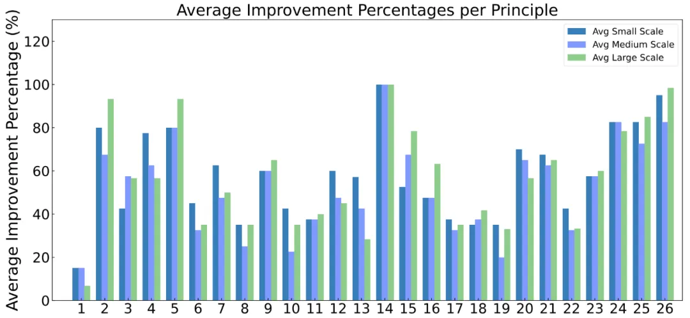
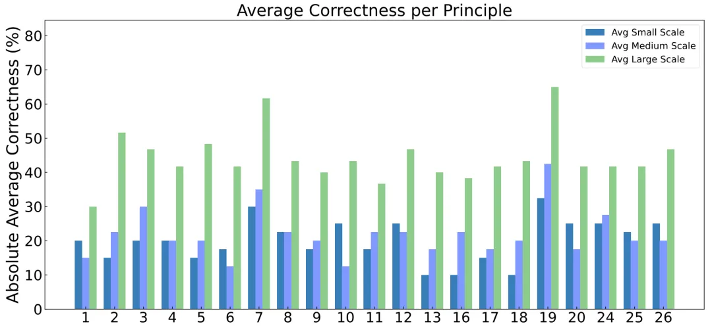

# 1. 资源

论文地址：

https://arxiv.org/abs/2312.16171

相关代码：

https://github.com/VILA-Lab/ATLAs

测试集：

https://raw.githubusercontent.com/VILA-Lab/ATLAS/main/data/general_dataset.json

# 2. 介绍

如果你想要简洁的回答，不用太客气，直接说就行，不用加上“请”、“如果你不介意”、“谢谢”、“我想要”等客套话。

在提问时说明目标受众，例如，告诉 LLM 你的受众是该领域的专家。

把复杂的任务分成几个简单的小问题，逐步解决。

用肯定的语气说“做某事”，避免用否定语气说“不要做某事”。

当你需要更清楚或深入了解某个话题时，可以这样提问：

用简单的语言解释[具体话题]。

向我解释，就像我 11 岁一样。

向我解释，就像我是[领域]的新手一样。

用简单的英文写[文章/文本/段落]，就像你在向 5 岁的小孩解释。

加上“如果有更好的解决方案，我会奖励 xxx”。

用具体的例子来提问（即使用几个示例来引导）。

在你的提问前写上“###指示###”，如果相关的话，再加上“###示例###”或“###问题###”，然后再写你的内容。用空行分隔指示、示例、问题、背景和输入数据。

使用“你的任务是”和“你必须”这样的短语。

使用“你将受到惩罚”这样的短语。

使用“像人一样自然地回答问题”这样的短语。

用引导词，比如“一步步来思考”。

在提问中加上“确保你的回答没有偏见，避免刻板印象”。

让 LLM 向你提问，直到它有足够的信息来回答你。例如，“从现在起，请你问我问题，直到你有足够的信息……”。

如果你想测试对某个话题的理解，可以这样说：“教我[定理/话题/规则]，最后加个测试，等我回答后告诉我是否正确，但不要提前给答案。”

给 LLM 指定一个角色。

使用分隔符。

在提问中多次重复某个特定的词或短语。

将链式思维（CoT）和少量示例的提示结合使用。

使用输出引导语，在你的提问结尾加上预期回答的开头部分。

想写详细的文章、段落或文本时，可以这样说：“请为我写一篇详细的[文章/段落]，内容涉及[话题]，并加入所有必要的信息。”

如果你要修改特定文本但不改变风格，可以这样说：“请修改用户发送的每个段落，只需改进语法和词汇，使其听起来自然，但保持原有的写作风格，确保正式的段落仍然正式。”

当你有复杂的代码提示需要分成不同文件时，可以这样说：“从现在起，每当你生成跨多个文件的代码时，生成一个[编程语言]脚本，以自动创建指定的文件或修改现有文件以插入生成的代码。”然后提问。

当你想用特定的词、短语或句子来开始或继续一段文字时，可以使用以下提示：“我提供给你开头部分[歌词/故事/段落/文章...]: [插入歌词/词语/句子]。请根据提供的词语完成它，并保持一致的流畅性。”

明确指出模型必须遵循的要求，以关键词、规则、提示或指令的形式。

想写与提供的样本相似的文本时，可以这样说：“请根据提供的段落[/标题/文本/文章/答案]使用相同的语言。”

# 3. 效果比较

在不同尺寸的模型

质量提升：小型（7B）、中型（13B）和大型 LLMs（70B 以及 GPT-4.5/4） 的回答质量都显著提高。其中套路 2、5、15、16、25 和 26，对大型模型的提升效果最明显。而套路 14，在所有尺寸的模型中，都获得了显著的提升：

让 LLM 向你提问，直到它有足够的信息来回答你。例如，“从现在起，请你问我问题，直到你有足够的信息……”。

准确提升：不同规模的模型应用这些套路后，平均准确率在20%到40%之间。小型和中型模型的准确率在10%到40%之间，而大型模型的准确率超过40%。在相对准确性方面，各模型的性能平均提高了10%以上，大型模型的提升甚至超过20%。

更细致的的比较

# 参考

[1] 数据说话：26 种 prompt 套路，效果比较，https://mp.weixin.qq.com/s/V5KqSWN5RitWnxanPYqQZA