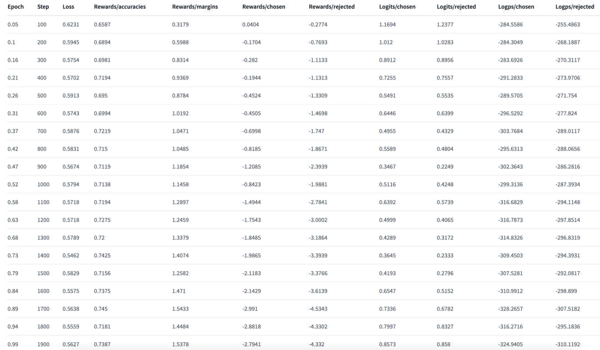
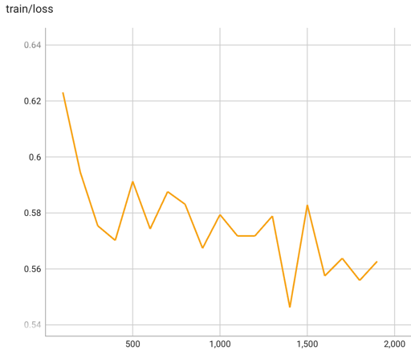
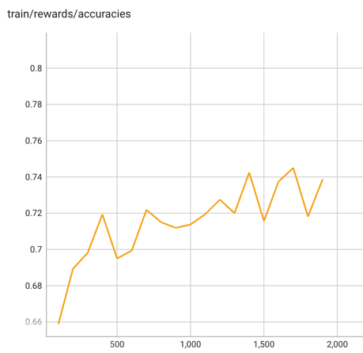
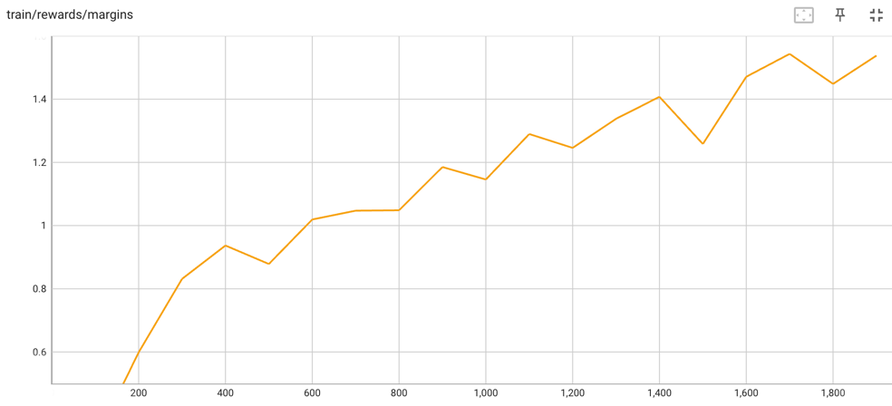

# 1. 简介

项目链接：https://github.com/yangjianxin1/Firefly

模型权重：
- https://huggingface.co/YeungNLP/firefly-qwen1.5-en-7b
- https://huggingface.co/YeungNLP/firefly-qwen1.5-en-7b-dpo-v0.1

本文将分享我们使用Firefly项目对Qwen1.5-7B进行训练的实验。我们对训练数据进行精细化筛选，
然后在单张V100上进行SFT和DPO。经过两阶段的训练，我们的模型在Open LLM Leaderboard上的表现显著优于官方的
Qwen1.5-7B-Chat、Gemma-7B-it、Vicuna-13B等模型。比Qwen1.5-7B-Chat高7.12分，比Gemma-7B-it高8.8分。


# 2. 原理

## 2.1 DPO原理简介

大模型训练主要可以分为以下三大阶段：

1. 预训练: 使用超大规模文本对模型进行训练，训练任务为“预测下一个token”，训练的数据量往往需要几万亿token。
2. SFT(指令微调): 使用指令数据，让模型的输出格式与人类对齐，使其具备chat的能力。
3. RLHF: 使用人类反馈或者偏好数据来训练模型，使模型的输出更加符合人类的价值观或者预期行为。

在RLHF阶段，以往的许多大模型，例如Llama2、InstructGPT等，大多采用PPO来对模型进行价值观对齐训练。
但是采用PPO进行RLHF存在流程繁琐、显存需求多（需要将策略网络、参考网络、critic网络、奖励模型同时加载到显存中）
等问题，这导致大部分普通玩家对其敬而远之。


使用PPO进行RLHF的主要流程大致如下：

1. 构建奖励模型的训练数据：对于同一个prompt产生多个生成结果，对这些生成结果进行人工排序，两两一组，
   形成chosen和rejected的pair。每条训练数据包含三个字段，prompt、chosen、rejected。
2. 训练奖励模型：使用上述数据训练奖励模型，对于每条训练数据，训练目标为最大化chosen与rejected的奖励的差值。
3. PPO训练：使用奖励模型的反馈对语言模型进行训练。

上面描述的PPO流程复杂且冗长，而DPO则绕过了奖励模型的构建，可直接使用人类偏好数据对模型进行训练，
且在训练时仅需加载策略网络和参考网络，极大地节省了显存占用。训练数据包含三个字段，prompt、chosen、rejected。

DPO损失函数的计算过程也极具对称性，其公式如下所示：


对于上述公式，根据对数运算法则进行变换，在代码实现中，其计算过程大致如下：

1. 计算对数概率：将prompt分别与chosen和rejected进行拼接，然后分别输入策略网络和参考网络，得到4个对数概率。
2. 计算策略网络的diff：策略网络的chosen对数概率 - rejected对数概率。
3. 计算参考网络的diff：参考网络的chosen对数概率 - rejected对数概率。
4. 计算损失函数：策略网络的diff - 参考网络的diff。

## 2.2 训练设置

在Qwen1.5-7B的基础上，我们进行了SFT和DPO两阶段的训练，整个训练流程仅使用一张V100 GPU，采用QLoRA技术，
在所有Linear层都添加adapter以提升训练效果。两阶段均使用英文数据进行训练。我们与Qwen1.5官方的对话模板保持一致：

```text
<|im_start|>system
You are a helpful assistant.<|im_end|>
<|im_start|>user
hello, who are you?<|im_end|>
<|im_start|>assistant
I am a AI program developed by Firefly<|im_end|>
```

在SFT阶段，实验参数设置如下：

```yaml
num_epochs: 1
learning_rate: 2e-4
total_train_batch_size: 32
max_seq_length: 2048
optimizer: paged_adamw_32bit
lr_scheduler_type: constant_with_warmup
warmup_steps: 700
lora_rank: 64
lora_alpha: 16
lora_dropout: 0.05
gradient_checkpointing: true
fp16: true
```

在DPO阶段，我们采用ultrafeedback数据集，实验设置如下：

```yaml
num_epochs: 1
learning_rate: 2e-4
total_train_batch_size: 32
max_seq_length: 1600
max_prompt_length: 500
optimizer: paged_adamw_32bit
lr_scheduler_type: constant_with_warmup
warmup_steps: 200
lora_rank: 64
lora_alpha: 16
lora_dropout: 0.05
gradient_checkpointing: true
fp16: true
```

# 3. 性能评测

我们在Open LLM Leaderboard上对模型进行评测，我们的模型的表现显著优于官方的Qwen1.5-7B-Chat、
Gemma-7B-it等模型。经过DPO之后，模型的平均分也有接近1分左右的提升。


DPO训练过程中的训练指标的变化如下图所示。在训练过程中，Rewards/accuracies和Rewards/margins均处于上升趋势。



DPO训练loss变化趋势如下：



DPO训练的Rewards/accuracies的变化趋势如下，该指标表示较优回答的奖励大于较劣回答的奖励的频率的均值：



DPO训练的Rewards/margins变化趋势如下，该指标表示较优回答的奖励与较劣回答的奖励二者之差的均值：




# 参考

[1] 使用Firefly在单卡V100上对Qwen1.5进行SFT和DPO，大幅超越Qwen1.5和Gemma，https://mp.weixin.qq.com/s/fTaGzuIZq3Uig0524GiGPA