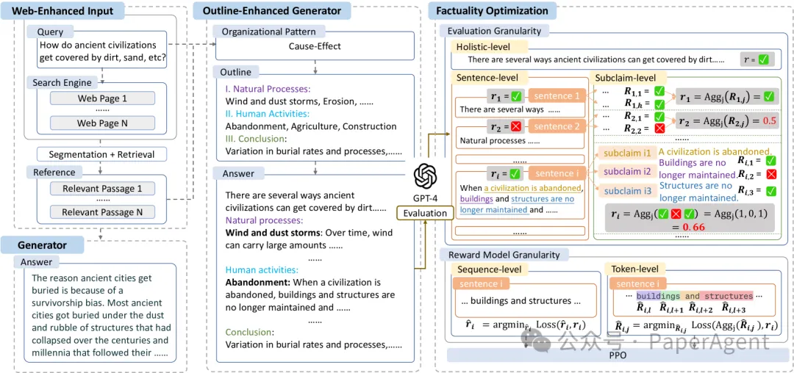
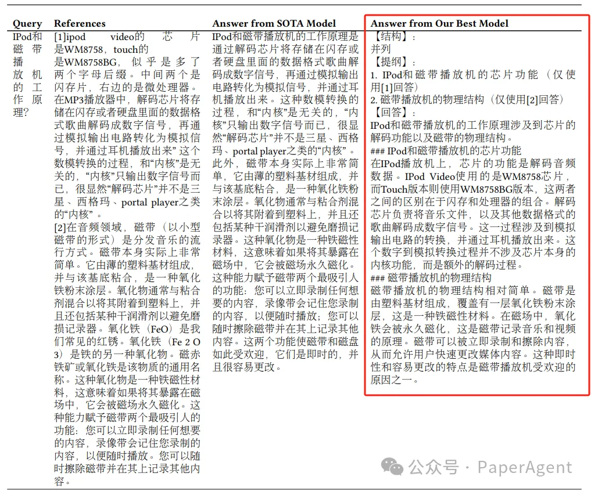

# 1. 资源

- FoRAG: Factuality-optimized Retrieval Augmented Generation for Web-enhanced Long-form Question Answering
- https://huggingface.co/forag
- https://arxiv.org/abs/2406.13779v1

# 2. 方法

RAG通过结合LLMs和检索器，利用搜索引擎增强了长篇问答（Long-form Question Answering）的质量。尽管存在多种开源方法和商业系统，如Bing Chat，但生成的长形答案中存在两个关键问题：事实性不足和逻辑清晰度不够。

为了解决这些问题，提出了一种新颖的大纲增强生成器（outline-enhanced generator），以实现多面性答案的清晰逻辑生成，并构建了两个相应的数据集。接着，提出了一种基于精心设计的事实性优化方法，该方法采用双细粒度的RLHF（Reinforcement Learning from Human Feedback）框架，包含不同粒度级别的自动评估和奖励建模。

展示了用于网络增强型长篇问答任务（LFQA）的LLM输入（左上），现有的生成器（左下），大纲增强生成器（中间）以及我们双细粒度的事实性优化方法（右）。在生成长答案之前，大纲增强生成器首先起草一个组织模式和大纲，以促进生成的清晰逻辑。双细粒度的RLHF通过在两个核心步骤中纳入细粒度设计来优化事实性，即事实性评估和奖励建模，在每个步骤上提出了多个粒度级别的方法。



大纲增强生成器：

1. 大纲增强生成器（Outline-Enhanced Generator）：提出了一种新的两阶段生成技术，首先生成一个组织模式和大纲，以提高生成答案的逻辑清晰度。在第一阶段，生成器使用大纲模板，根据用户查询和上下文草拟答案大纲。第二阶段基于生成的大纲扩展每个观点，构建最终答案。

2. 两阶段生成过程：

    - 大纲阶段（Outline Stage）：生成器首先根据问题和上下文，选择最合适的组织模式（如因果关系、比较对比等），然后输出一个包含关键点的大纲。

    - 扩展阶段（Expansion Stage）：根据前一阶段生成的大纲，LLM扩展每个关键点，形成完整的答案。

新颖的事实性优化方法：

1. 直接应用RLHF的困难：直接将传统的基于人类反馈的强化学习（RLHF）应用于事实性优化所面临的两个主要困难：人工标注事实性标签的成本高昂，以及整体性奖励（holistic reward）提供的稀疏训练信号，这在长答案中尤为突出。

2. 双细粒度RLHF框架：为了克服这些困难，提出了一个双细粒度的RLHF框架。该框架通过在事实性评估和奖励建模两个核心步骤中引入细粒度设计，提供了更密集的奖励信号。

3. 细粒度评估：三种评估粒度：

    - 整体性：将整个答案作为一个单元进行评估。

    - 句子级别：将答案分割成句子，并分别评估每个句子。

    - 子声明级别：进一步将每个句子分解为多个子声明，并分别评估每个子声明。

4. 细粒度奖励建模：提出了两种奖励建模粒度：

    - 序列级别：为每个序列学习单一的奖励，反映相应序列的事实性。

    - 标记级别：为序列中的每个标记学习奖励，通过聚合所有标记级别的奖励来计算序列的奖励。

5. PPO优化：采用近端策略优化（PPO）方法来优化生成模型，通过最大化训练好的奖励模型提供的奖励。

通过广泛的实验，验证了所提出的事实性优化RAG（FoRAG）方法在英文和中文基准测试中的优越性。特别是，当将该方法应用于Llama2-7B-chat时，得到的模型FoRAG-L-7B在连贯性、有用性和事实性这三个常用指标上超过了WebGPT-175B，而FoRAG-L-7B的参数数量仅为WebGPT-175B的1/24。

现有网络增强型RAGs与我们的FoRAG的性能比较


有无提纲增强（Out. Enh.）和事实性优化（Fac. Opt.）的FoRAG变体的比较


在我们的FoRAG-L 7B上使用各种事实性优化技术的性能比较。"-"表示没有进行额外的事实性优化，即标准的事实性优化模型（SFT模型）


提纲增强技术构建的答案比较。答案具有组织模式，即提纲和答案，答案更长，并且具有更好的逻辑结构。



生成部分Prompt模版：

```text

###任务###
根据资料回答问题。
###要求###
第一步：根据问题和资料生成回答提纲。
1. 决定回答结构，从总分总、递进、对比、因果、并列、时序等结构中选择合适的来组织回答。
2. 根据回答结构，在提纲中要完整地列出答案中需要包括的要点。
3. 要点之间可以是并列、对照、递进等关系，不可以是重复或者包含关系。
4. 要点要保持精炼，至少有1点，不能多于5点，
5. 每个要点仅可参考1段资料，并在提纲中标注资料编号。
第二步：根据资料和提纲对问题进行回答。
1. 回答要以提纲为蓝本，对问题进行详细的回答。
2. 回答中可以采用编号或项目列表、小标题、latex公式等格式。
3. 回答中减少使用“首先”、“其次”、“再者”等简单的连接词。
4. 回答中不要生成重复内容。
5. 回答中不要标注资料来源。
6. 回答应当严格依据资料，不采用不在资料中的内容。
###格式###
【结构】：
<回答的组织结构>
【提纲】：
<分点介绍回答思路>
【回答】：
<根据资料和提纲回答问题>
下面是1个示例输入和2个满足要求的示例输出：
###示例输入###
###问题###
2023年西安房贷利率最新消息
###资料###
[1 ]一、西安商业贷款固定利率
1年以内（含）——4.35%
5年(含)以下——4.75%
5年以上——4.9%
贷款市场报价利率LPR：目前1年期LPR为3.45%，5年期LPR为4.2%
首套住房商业性个人住房贷款利率下限为不低于相应期限LPR减20个基点。
二套住房商业性个人住房贷款利率下限为不低于相应期限贷款市场报价LPR利率加20个基点。
二、西安公积金贷款利率
5年(含)以下——2.6%
5年以上——3.1%
[2 ]目前西安主流银行的首套房利率集中在4%左右，二套房利率差基本维持在4.9%。
[3 ]首先，虽然LPR在7月没有变动，但西安首套房贷款利率已经低至4%，并且低于2009年房贷利率打七折后的4.156%！
这点也恰恰和楼市走访到的信息不谋而合，据了解，西安目前多数银行首套房贷利率主要集中于4%，二套房贷利率基本在4.9%左
右。
[4 ]7月20日，中国人民银行授权全国银行间同业拆借中心公布了最新一期贷款市场报价利率（LPR）：1年期LPR为3.55%，5年期以
上LPR为4.20%，均与上个月持平。但西安房贷利率较上月小幅下行，西安多家银行首套房贷利率从4.1%降至4%。
今年6月，LPR时隔10个月迎来下调，1年期和5年期以上LPR均跟随政策利率下调10个基点。记者了解到，从6月下旬开始，西安各
大银行相继落实首套房贷利率政策动态调整机制，进行利率调整。目前，西安地区六大行及招商银行、宁夏银行、北京银行、西
安银行等十余家银行首套房贷利率降至4%，较LPR下浮0.2%。二套房贷利率同步下行，跌破5%大关，维持在4.9%。
###示例输出1###
【结构】：
总分总
【提纲】：
1. 首套房商业贷款利率(仅使用[2 ]回答)
2. 二套房商业贷款利率(仅使用[2 ]回答)
3. 公积金贷款利率（仅使用[1 ]回答）
【回答】：
西安的房贷市场在2023年呈现了一定的调整趋势，特别是在商业贷款和公积金贷款利率方面。针对不同的贷款年限，首套和二套
住房的贷款利率有所不同。下面是具体的利率情况和银行对房贷利率的调整概述。
### 首套房商业贷款利率
首套住房商业贷款利率集中在4%左右，较LPR下浮0.2%。
### 二套房商业贷款利率
二套房商业贷款利率基本维持在4.9%左右。
### 公积金贷款利率
公积金贷款利率5年(含)以下为2.6%，5年以上为3.1%。
西安的房贷市场在2023年经历了积极的调整，尤其是首套房贷款利率的下降，为购房者带来了更为优惠的借款条件。与此同时，
公积金贷款的低利率也为有资格的借款人提供了额外的经济支持。这些调整对于稳定房地产市场、支持合理住房需求有着重要的
作用。
###示例输出2###
【结构】：
并列
【提纲】：
1. 西安商业贷款固定利率（仅使用[1 ]回答）
2. 西安公积金贷款利率（仅使用[1 ]回答）
3. 首套与二套房贷款利率最新变化（仅使用[4 ]回答）
【回答】：
2023年西安的房贷利率最新消息如下：
商业贷款固定利率：
- 1年以内（含）的利率为4.35%
- 5年（含）以下的利率为4.75%
- 5年以上的利率为4.9%
公积金贷款利率：
- 5年（含）以下为2.6%
- 5年以上为3.1%
据报道，7月20日，虽然LPR没有变动，但西安首套房贷款利率已经低至4%，低于2009年房贷利率打七折后的4.156%，二套房贷利
率同步下行，维持在4.9%。在6月LPR下调后，西安各大银行相继落实首套房贷利率政策动态调整机制，进行利率调整。
下面是你要回答的问题和相应的资料，请根据上述要求、格式和示例进行输出：
###问题###
{query}
###资料###
{doc}
```

答案事实性评估部分Prompt模版：

````text
我将向您展示一个问题、一系列文本片段和一份参考文档。所有的片段可以连起来形成对问题的完整回答。您的任务是在参考文
档的帮助下评估每个文本片段是否包含事实错误。
请按照以下要求进行评估：
1. 如果文本片段仅包含类似“方法如下”、“根据资料可得”这样的通用开场白而没有传递具体信息，直接判定为“正确”。
2. 如果文本片段都能在参考文档或者问题中找到相应句子作为支持，或者可以从相应句子推理得到，直接判定为“正确”。关注关
键词和细节的语义一致性。
3. 如果文本片段中有任何信息在参考文档或者问题中找不到明确的支撑，也不能根据相应句子推理得到，直接判定为“错误”。
请按照以下格式生成输出：
评估明细：对于每一条片段，结合参考文档或者问题说明判定理由和判定结果。
最终答案：列出带有错误的片段的编号（用逗号分隔）。请只输出编号，不要输出更多细节。如果所有文本片段中的信息都得到
了支持且与参考文档语义一致，即使参考文档中有其他信息未被涵盖，请输出“完全正确”。
这里有一个例子：
问题：全世界共有多少座核电站？
片段：
<1>世界上共有440座运行中的核电反应堆，总装机容量超过390吉瓦特（GW）。
<2>这些反应堆分布在世界上30个国家，美国拥有最多的反应堆，其次是法国、中国、日本和俄罗斯。
<3>其中，中国正在新建16座反应堆，增长最快，其次是印度，有8座在建。
参考文档：
```
[1]核电站在32个国家运营，产生了世界上约十分之一的电力。大多数位于欧洲、北美、东亚和南亚。美国是最大的核能生产国，
而法国的核电所占的电力比重最大，约为70%。中国拥有增长最快的核电计划，正在建设16座新的反应堆，其次是印度，有8座在
建。
[2]截至2023年5月，世界上有410座可运行的核电反应堆，总电力容量为368.6吉瓦特。
```
以下是您的输出：
评估明细：
<1>片段1提到：“世界上共有440座运行中的核电反应堆，总装机容量超过390吉瓦特（GW）。” 这一信息与参考文档[2]中的信息
不一致：“世界上有410座可运行的核电反应堆，总电力容量为368.6吉瓦特。” 因此片段1是错误的。
<2>片段2中的信息“反应堆分布在世界上30个国家”与参考文档[1]中的信息不一致：“核电站在32个国家运营”，而且参考文档中没
有提及“法国、中国、日本和俄罗斯”的核反应堆数量，因此片段2是错误的。
<3>片段3提到：“中国正在新建16座反应堆，增长最快，其次是印度，有8座在建。”与参考文档[1]一致：“中国拥有增长最快的核
电计划，正在建设16座新的反应堆，其次是印度，有8座在建。”，因此片段3是正确的。
最终答案：1,2
这意味着只有片段1和2包含错误，而片段3都能在参考文档中找到相应句子作为支持，被判定为正确。
以下是我的输入：
问题：{question}
片段：{segments}
参考文档：``` {docs} ```
````

答案连贯性评估部分Prompt模版：

```text
你将获得针对某个问题编写的一个答案。
你的任务是根据一项指标对答案进行评分。
请你确保仔细阅读并理解这些说明。请在审阅时保持本文档处于打开状态，并根据需要进行参考。
评价标准：
连贯性(1-5) - 所有句子的集体质量。答案不应包含日期线、系统内部格式、大写错误或明显不合语法的句子（例如片段、缺少组
件），以免文本难以阅读。答案中不应有不必要的重复。不必要的重复可能表现为重复整个句子或重复事实。答案应该结构良
好、组织良好。答案不应该只是一堆相关信息，而应该逐句构建有关某个主题的连贯信息体。
评估步骤：
1. 通读整个答案，大致了解内容和结构。
2. 查找任何日期线引用或系统内部格式错误。这些问题不应该出现在一个连贯的答案中。
3. 检查语法和句子结构是否存在缺陷，例如句子片段、连贯句子或可能妨碍可读性的缺失成分。
4. 找出答案中任何不必要的重复。这包括重复的句子或对文本的进展没有贡献的冗余信息。
5. 评估答案的结构和组织。它应该有一个逻辑流程，每个句子都建立在前面的信息的基础上，并有助于全面理解该主题。
6. 根据评估标准，按照1 到5 的范围为一致性打分，其中1 为最低，5 为最高。
回答：{answer}
评估形式（仅分数）：
- 连贯性：
```

答案帮助性评估部分Prompt模版：

```text
你将获得针对某个问题编写的一个答案。
你的任务是根据一项指标对答案进行评分。
请你确保仔细阅读并理解这些说明。请在审阅时保持本文档处于打开状态，并根据需要进行参考。
评价标准：
帮助性(1-5) - 答案有效满足寻求信息的人的需求的程度。答案应该以易于理解的方式表达。答案应直接解决提出的问题，重点关
注询问者寻求的具体信息或解决方案。所提供的信息应正确且基于事实、可验证的数据或公认的专业知识。答案包括完整回答问
题的所有必要细节。它没有遗漏问题的所有关键方面。
评估步骤：
1. 首先彻底阅读并理解所提出的问题。确定要点以及询问者想要什么。
2. 仔细阅读答案，理解所提供的信息。评估答案是否以易于理解的方式表达。
3. 评估答案是否直接解决问题。提供的信息应与所询问的内容相关。
4. 确保所提供的信息正确、真实，并且基于可验证的数据或公认的专业知识。
5. 确定答案是否包含所有必要的详细信息。有用的答案应该充分回答问题，同时不遗漏关键方面。
6. 根据评估标准，按1 到5 的等级为帮助性打分，其中1 为最低，5 为最高。
问题：{query}
回答：{answer}
评估形式（仅分数）：
- 帮助性：
```

# 3. 训练配置

- The maximum context length is set to 4096 for Llama2-7B-chat and 8192 for
  ChatGLM2-6B. Both models are fine-tuned on 8 A100 GPUs for 5
  epochs with an initial learning rate of 1e-5 and a cosine learning
  rate scheduler.
- we adopt beam search for each inference on a single A100 GPU with
  the num_beams parameter set to 3.
- We use our outline-enhanced
  dataset to conduct supervised fine-tuning (SFT) [36], and our multigranularity evaluation data to conduct corresponding factuality
  optimization.

# 参考

[1] 支付宝+清华FoRAG：用创作的思路解决RAG生成逻辑问题！，https://mp.weixin.qq.com/s/7uqZ5U10Ec2Pa7akCLCJEA