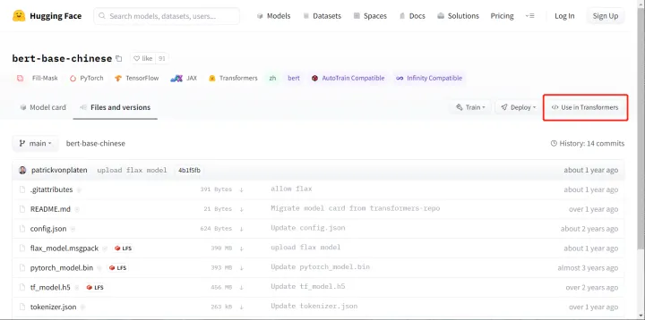

# 1. 简介

本教程主要基于ChatGLM2-6B模型

ChatGLM2-6B 是开源中英双语对话模型 ChatGLM-6B 的第二代版本，
在保留了初代模型对话流畅、部署门槛较低等众多优秀特性的基础之上，
ChatGLM2-6B 引入了如下新特性：

- 更长的上下文：上下文长度由 ChatGLM-6B 的 2K 扩展到了 32K，
  并在对话阶段使用 8K 的上下文长度训练，允许更多轮次的对话。
  多轮对话后出现复读和遗忘的情况明显减少。
- 更节约显存与内存：INT4 量化下，6G 显存支持的对话长度由 1K 提升到了 8K。
- 更高的性能：在官方的模型实现下，推理速度相比初代提升了 42%。
- 回答质量提升：对比 ChatGLM2-6B 与 ChatGLM-6B 的回复，
  ChatGLM2-6B 的回答质量提升非常明显

# 2. 部署要求

## 2.1 硬件依赖

1. CPU版本要求

- 随便一个CPU（差不多就行，毕竟我看网友还有用赛扬N6210这种东西跑的）
- 至少32GB的内存（因为模型运行大概需要23~25GB内存）
- 大于30GB硬盘可用空间
- 最好有SSD（最开始要将模型读到内存中，模型本体大概就需要占用11GB内存，使用HDD会经历一个漫长的启动过程）

2. GPU版本要求

| **量化等级**   | **最低 GPU 显存**（推理） | **最低 GPU 显存**（高效参数微调） |
| -------------- | ------------------------- | --------------------------------- |
| FP16（无量化） | 13 GB                     | 14 GB                             |
| INT8           | 8 GB                     | 9 GB                             |
| INT4           | 6 GB                      | 7 GB                              |

## 2.2 软件依赖安装

1. 安装conda环境
   
   需要python3.8以上环境

   https://docs.conda.io/projects/conda/en/latest/user-guide/install/download.html
   
2. 安装Git

   https://git-scm.com/download
   
   命令行运行git --version，查看是否安装成功

3. 安装 Git Large File Storage
   
   - 点击 git-lfs.github.com 并单击“Dowdload”。
   - 在计算机上，找到下载的文件。
   - 双击文件 git-lfs-windows-3.X.X.exe , 打开此文件时，Windows 将运行安装程序向导以安装 Git LFS。
   - 命令行运行git lfs install,返回Git LFS initialized.就是安装成功了

## 2.3 python包依赖安装

```
pip install protobuf transformers==4.30.2 cpm_kernels torch>=2.0 gradio mdtex2html sentencepiece accelerate
```

注：如果上述出现问题，把torch单独安装，或者改为“torch==2.0”

GPU版本安装torch

```
pip install torch==2.0.0+cu117 torchvision==0.15.1+cu117 -f https://download.pytorch.org/whl/cu117/torch_stable.html
```

或者，

```
# 下载项目源代码
git clone https://github.com/THUDM/ChatGLM2-6B
# 切换到项目根目录
cd ChatGLM2-6B
# 安装依赖
pip install -r requirements.txt
# 安装web依赖
pip install gradio
```

# 3. 模型下载
  
  参考资料：见参考[1]
  
  1. 直接从网页的下载按钮下载
  
  2. 使用命令 
      
     安装大文件下载工具
     ```
      git lfs install    
     ```

     打开具体的模型面，可以看到右上角有一个Use in Transformers的button
     
     
     
     点击该Button，我们就可以看到具体的下载命令了。
     
     
     
     从 Hugging Face Hub 下载模型需要先安装Git LFS，然后运行
     
     ```
     git clone https://huggingface.co/THUDM/chatglm2-6b
     ```
     
     如果你从 Hugging Face Hub 上下载 checkpoint 的速度较慢，可以只下载模型实现
     
     ```
     GIT_LFS_SKIP_SMUDGE=1 git clone https://huggingface.co/THUDM/chatglm2-6b
     ```
     
     清华大学模型下载目录：https://cloud.tsinghua.edu.cn/d/674208019e314311ab5c/
     
     注意：该命令在 powershell 中会报错，提示不认识 GIT_LFS_SKIP_SMUDGE 命令，
     放在 git bash 终端中则可顺利执行
     
  3. Hugging Face Hub 模型下载方案
     
     ```
     pip install huggingface_hub
     ```
     
     ```python
      from huggingface_hub import snapshot_download
      snapshot_download(repo_id="bert-base-chinese")
     ```
     
  4. IDE下载

   
 
 
# 4. 推理使用  

## 4.1 推理使用

文件路径修改：

你需要修改web_demo.py，web_demo.py，old_web_demo2.py，cli_demo.py，api.py
等文件中涉及模型部分的代码,一般在文件的开头或者结尾附近。（你需要那个文件就改哪个文件，不需要全改）

1. CPU推理

    差异在于CPU版本不支持half及cuda
    
    ``` python
    model = AutoModel.from_pretrained(mdl_path, trust_remote_code=True).float() 
    ```

2. GPU推理

    ``` python
    from transformers import AutoTokenizer, AutoModel
    mdl_path = 'C:\\LLM\\chatglm2-6b'
    tokenizer = AutoTokenizer.from_pretrained(mdl_path, trust_remote_code=True)
    model = AutoModel.from_pretrained(mdl_path, trust_remote_code=True).half().cuda()
    model = model.eval()
    response, history = model.chat(tokenizer, "你好", history=[])
    print(response)
    response, history = model.chat(tokenizer, "晚上睡不着应该怎么办", history=history)
    print(response)
    ```
    
    量化模型加载
    
    ```python
    #原始代码
    tokenizer = AutoTokenizer.from_pretrained("THUDM/chatglm-6b", trust_remote_code=True)
    model = AutoModel.from_pretrained("THUDM/chatglm-6b", trust_remote_code=True).half().cuda()
    #INT8量化 显卡GPU加载
    tokenizer = AutoTokenizer.from_pretrained("THUDM/chatglm-6b", trust_remote_code=True)
    model = AutoModel.from_pretrained("THUDM/chatglm-6b", trust_remote_code=True).quantize(8).half().cuda()
    #INT4量化 显卡GPU加载
    tokenizer = AutoTokenizer.from_pretrained("THUDM/chatglm-6b", trust_remote_code=True)
    model = AutoModel.from_pretrained("THUDM/chatglm-6b", trust_remote_code=True).quantize(4).half().cuda()  
    ```

    全量模型多轮对话后，大概需要14~15GB显存，IN8多轮对话后大概需要10GB显存，
    INT4多轮对话后大概需要6~7G显存。量化过程需要在内存中首先加载 FP16 格式的模型，


## 4.2 网页版

代码见https://github.com/THUDM/ChatGLM2-6B

[**注意：记得修改代码的路径**]

1. 使用gradio发布网页版

    ```bash
    python web.py
    ```
    
    执行上述指令后，命令好窗口有访问的连接地址
    
    程序会运行一个 Web Server，并输出地址。在浏览器中打开输出的地址即可使用。最新版 Demo 实现了打字机效果，
    速度体验大大提升。注意，由于国内 Gradio 的网络访问较为缓慢，
    启用 demo.queue().launch(share=True, inbrowser=True) 时所有网络会经过 Gradio 服务器转发，
    导致打字机体验大幅下降，现在默认启动方式已经改为 share=False，如有需要公网访问的需求，
    可以重新修改为 share=True 启动。

2. Streamlit 的网页版 Demo

    比gradio速度更快
    
    ```bash
    pip install streamlit
    ```
   
    启动网页
    
    ```bash
    streamlit run web_demo2.py
    ```
   
    首次启动会询问是否输入E-mail接受信息，可以回车跳过该步骤
    
    
    

## 4.3 量化模型加载

仅支持GPU版本

消耗大概 13GB 的内存。如果你的内存不足的话，可以看下一步直接加载量化后的模型

# 5. 推理参数含义

1. Maximum length 参数

    通常用于限制输入序列的最大长度，因为 ChatGLM-6B 是2K长度推理的
    （ChatGLM2-6M 是32K长度训练，8K对话训练），一般这个保持默认就行。
    太大可能会导致性能下降

2. Top P 参数

    Top P 参数是指在生成文本等任务中，选择可能性最高的前P个词的概率累加和。
    这个参数被称为Top P，也称为Nucleus Sampling。简单理解这个就是镇定剂，
    数值越低AI越冷静，质量越高，但也越无趣。
    
    例如，如果将Top P参数设置为0.7，那么模型会选择可能性排名超过70%的词进行采样。
    这样可以保证生成的文本更多样，但可能会缺乏准确性。相反，
    如果将Top P参数设置为0.3，则会选择可能性前30%的词进行采样，
    这会导致生成文本的准确性提升，但能够减少多样性。

3. Temperature 参数

    Temperature参数通常用于调整softmax函数的输出，
    用于增加或减少模型对不同类别的置信度。
    具体来说，softmax函数将模型对每个类别的预测转换为概率分布。
    Temperature参数可以看作是一个缩放因子，
    它可以增加或减少softmax函数输出中每个类别的置信度。
    你可以理解为这是兴奋剂，值越大AI越兴奋。
    比如将 Temperature 设置为 0.05 和 0.95 的主要区别在于，
    T=0.05 会使得模型更加冷静，更加倾向于选择概率最大的类别作为输出，
    而 T=0.95 会使得模型更加兴奋，更加倾向于输出多个类别的概率值较大。

# 6. 常见问题

1. 解决复读问题
       
   这是个可以自己加的参数，主要是为了控制多轮对话后发生的复读上文问题。
    = 1不惩罚重复，> 1时惩罚重复，< 1时鼓励重复。
    一不要设置小于 0.5 ，小于 0.5 则极可能出现灾难级的复读。
    一些本来就需要发生多次重复的任务也不适合设置过大的参数，比如你让模型写一篇关于XXX的报告。
    那XXX这个名字本身就需要被多次重复提及。
   
   解决方法： 
   
   见Issue: https://github.com/THUDM/ChatGLM2-6B/issues/43
 
   可以给 chat 或者 stream_chat 接口传入 repetition_penalty 参数，
   将参数设置为一个大于1的浮点数来解决复读问题。这里以web_demo.py为例，
   给出原始代码块，和修改后的代码块，参照修改即可。
   
   ```python
   
    #原始代码段01开始
    def predict(input, chatbot, max_length, top_p, temperature, history, past_key_values):
        chatbot.append((parse_text(input), ""))
        for response, history, past_key_values in model.stream_chat(tokenizer, input, history, past_key_values=past_key_values,
                                                                    return_past_key_values=True,
                                                                    max_length=max_length, top_p=top_p,
                                                                    temperature=temperature):
            chatbot[-1] = (parse_text(input), parse_text(response))
    #原始代码段01结束
    
    #修改代码段01开始
    def predict(input, chatbot, max_length, top_p, temperature, history, past_key_values, repetition_penalty):
        chatbot.append((parse_text(input), ""))
        for response, history, past_key_values in model.stream_chat(tokenizer, input, history, past_key_values=past_key_values,
                                                                    return_past_key_values=True,
                                                                    max_length=max_length, top_p=top_p,
                                                                    temperature=temperature, repetition_penalty=repetition_penalty):
            chatbot[-1] = (parse_text(input), parse_text(response))
    #修改代码段01结束
    
    #原始代码段02开始
        submitBtn.click(predict, [user_input, chatbot, max_length, top_p, temperature, history, past_key_values, repetition_penalty],
                        [chatbot, history, past_key_values], show_progress=True)
        submitBtn.click(reset_user_input, [], [user_input])
    #原始代码段02结束
    
    #修改代码段02开始
        submitBtn.click(predict, [user_input, chatbot, max_length, top_p, temperature, history, past_key_values],
                        [chatbot, history, past_key_values], show_progress=True)
        submitBtn.click(reset_user_input, [], [user_input])
    #修改代码段02结束

   ```
   
   给网页demo增加调整Repetition Penalty参数的输入框，并设定默认值为1
   
   ```python
   #原始代码段03开始
        with gr.Column(scale=1):
            emptyBtn = gr.Button("Clear History")
            max_length = gr.Slider(0, 32768, value=8192, step=1.0, label="Maximum length", interactive=True)
            top_p = gr.Slider(0, 1, value=0.8, step=0.01, label="Top P", interactive=True)
            temperature = gr.Slider(0, 1, value=0.95, step=0.01, label="Temperature", interactive=True)
    #原始代码段03结束
    
    #修改代码段03开始
            with gr.Column(scale=1):
                emptyBtn = gr.Button("Clear History")
                max_length = gr.Slider(0, 32768, value=8192, step=1.0, label="Maximum length", interactive=True)
                top_p = gr.Slider(0, 1, value=0.8, step=0.01, label="Top P", interactive=True)
                temperature = gr.Slider(0, 1, value=0.95, step=0.01, label="Temperature", interactive=True)
                repetition_penalty = gr.Slider(0, 2, value=1.0, step=0.1, label="Repetition Penalty", interactive=True)
    #修改代码段03结束
   ```

# 参考
[1] 如何优雅的下载huggingface-transformers模型, https://zhuanlan.zhihu.com/p/475260268
[2] 使用 CPU 本地安装部署运行 ChatGLM2-6B, https://www.tjsky.net/tutorial/701
[3] 本地安装部署运行 ChatGLM-6B 的常见问题解答以及后续优化, https://www.tjsky.net/tutorial/667
[4] 初识Streamlit（附安装），https://zhuanlan.zhihu.com/p/607526579
