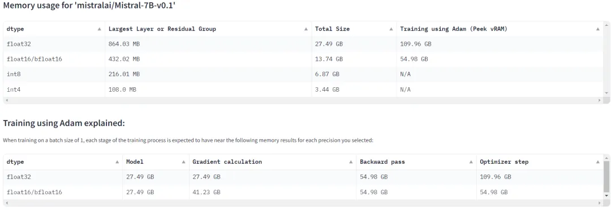
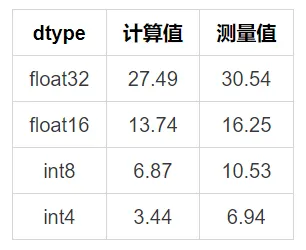

# 1. 资源

HuggingFace的官方库Accelerate推出了一款创新工具——Model Memory Calculator，它是一个在线估算工具，能够直接为用户提供在HuggingFace平台上托管的模型的显存需求预估。

https://huggingface.co/spaces/hf-accelerate/model-memory-usage

个人实测：
- 该方法为估算，并非精确计算
- 误差和实际差距很大，特别是训练的估计，也许之后会有更好的方法和改进

# 2. 介绍

transformers的模型参数量为

其中l为模型的层数，h为隐藏层的维度，V为词表的大小。

当模型足够大时，模型参数量近似为 12 * l * h^2。

但是推理和微调需要用的显存，常更加难以计算。占用显存的大头主要分为四部分：模型参数、前向计算过程中产生的中间激活、后向传递计算得到的梯度、优化器状态。训练大模型时通常会采用AdamW优化器，并用混合精度训练来加速训练，基于这个前提分析显存占用。根据经验和粗略估计，一般参数量为1X的大模型，全参数训练/微调占用显存约为8X bytes，推理所需显存约为2X bytes。

与此同时，HuggingFace的官方库Accelerate推出了一款创新工具——Model Memory Calculator，它是一个在线估算工具，能够直接为用户提供在HuggingFace平台上托管的模型的显存需求预估。

https://huggingface.co/spaces/hf-accelerate/model-memory-usage

Memory Calculator是由HuggingFace的Accelerate团队开发的在线工具，用户只需输入HuggingFace平台上的模型链接，工具便能够迅速计算出该模型在运行过程中所需的显存大小，包括进行推理操作以及采用Adam算法进行训练时的显存需求。除了支持huggingface库的模型，也还支持timm中的视觉模型。

然而，这种估算方法并非简单地基于最大层级参数进行计算。根据官方说明，Model Memory Calculator提供的结果与实际显存需求之间的误差通常在50MB以内（例如，对于bert-base-cased模型，实际运行需要的显存为413.68MB，而工具估算的结果为413.18MB）。这表明，该工具在实际应用中能够提供相当精确的显存需求预估，为用户在部署和训练大型模型时提供了极大的便利。

Mistrial模型的预估结果：

实测Mistrial-7B推理所需显存：

Mistrial-MOE模型的结果：

# 3. 总结

7B左右的模型，在最常见的fp16推理需要约16-20GB显存，在AdamW使用fp16/bf16训练时需要约55-60GB显存。

模型参数规模X B时，一般推理需要2-3X GB的显存，而训练则需要8-10X GB的推理显存。

# 参考

[1] 如何估计大模型需要的显存，https://mp.weixin.qq.com/s?__biz=Mzg3MDcwNjY2Mw==&mid=2247485040&idx=1&sn=1a5a6566fd1a69af375e369cc8f2fe8a&chksm=cf0e238e7bad3501077a7896ca67be78baf04574ae6c866a54dee897782f2c8e274b1e4905de&scene=132&exptype=timeline_recommend_article_extendread_samebiz&show_related_article=1&subscene=21&scene=132#wechat_redirect
