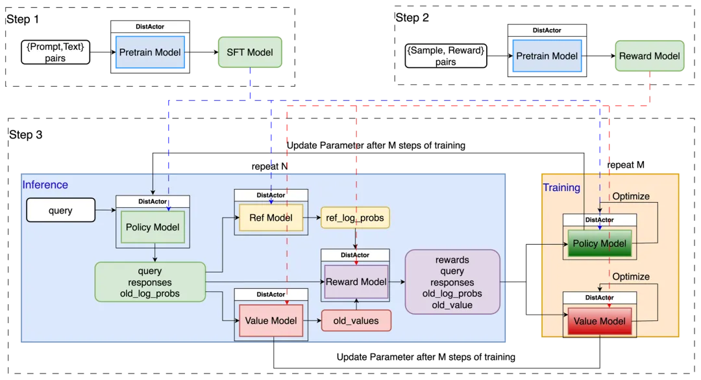
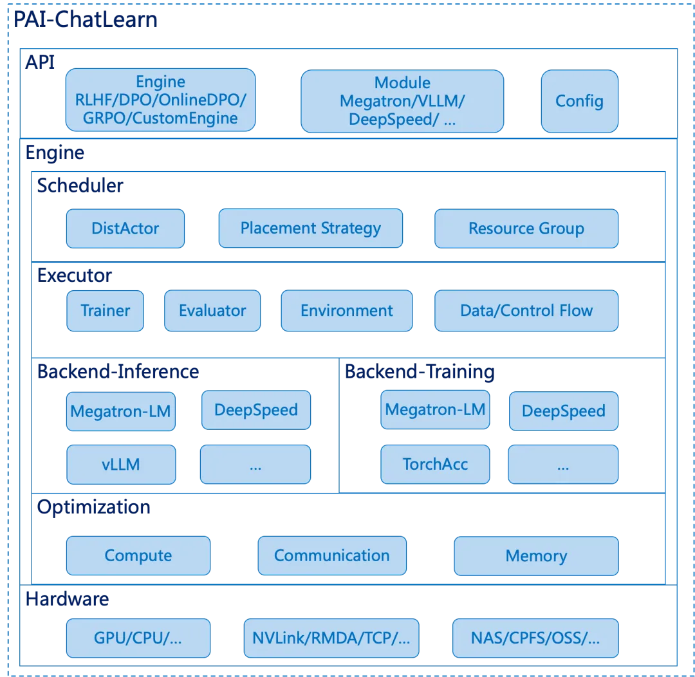
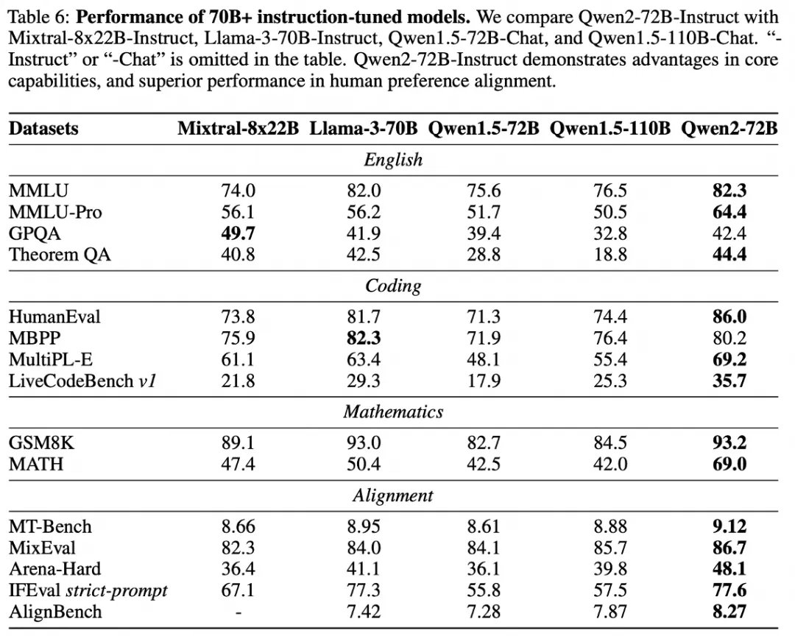
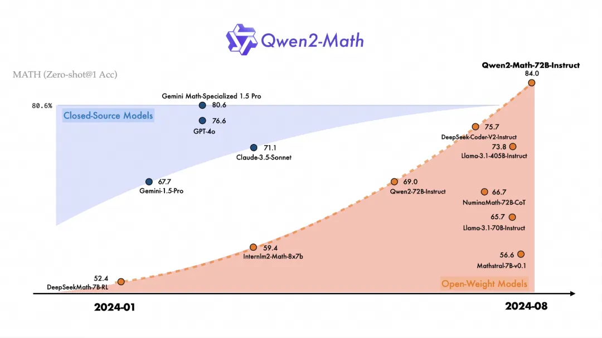

# 1. 简介

ChatLearn提供了RLHF、DPO、OnlineDPO、GRPO等 Alignment 训练，同时也支持用户自定义 model 的执行 flow，来实现自定义的训练流程。相比于当前的 SOTA 系统，ChatLearn 在 7B+7B (Policy+Reward) 规模性能提升115%，70B+70B 规模性能提升208%，并且能支持更大规模的Alignment训练，例如300B+300B规模。同时ChatLearn也一直在支持Qwen大模型的Alignment训练，在Qwen-Chat、Qwen2-Chat、Qwen2-Math上都取得不错的效果。

开源地址：https://github.com/alibaba/ChatLearn

使用文档：
- 中文：https://chatlearn.readthedocs.io/zh-cn/latest/
- 英文：https://chatlearn.readthedocs.io/en/latest/

交流钉群号：98090003312

# 2. 方法

不同于传统的深度学习训练，只涉及到单个模型的迭代和优化，以 RLHF 为代表的训练范式涉及到多个大模型的计算和数据交互，这对于构建构建一个易用、高效的训练系统提出了诸多的挑战。
- 编程接口：如何设计一个通用且灵活的编程接口，让用户能专注于单个模型的建模，同时，又可以灵活地控制模型间的交互。
- 分布式加速引擎：随着模型规模的增大，用户会选择一些分布式计算和加速的 backend，比如 训练有Megatron-LM、DeepSpeed 等，推理有vLLM等，如何结合这些加速 backend 来实现高效的多模型计算框架。
- 并行策略：多个模型可能各有各的计算特点，比如仅推理的模型和训练的模型在显存和计算上的特性都不同，每个模型最佳的并行策略也可能不同。因此，框架应该允许不同的模型配置不同的并行策略以发挥整体的最佳性能。
- 资源分配：如何灵活地给多个模型分配资源来实现高效的并发调度和执行。
- 扩展训练方式：当前Alignment训练，除了RLHF还有很多变种，例如：DPO/IPO、KTO、ORPO、Online DPO、RLAIF等，如何能便捷、快速地扩展训练流程以适用不同的Alignment训练。

为了解决上述问题，阿里云PAI团队提出了一个新的 Alignment 模型训练框架 ChatLearn。ChatLearn 通过对模型计算逻辑的抽象，解耦了模型和计算 backend、分布式策略的绑定，提供灵活的资源调度机制，可以支持灵活的资源分配和并行调度策略。

ChatLearn的优点总结如下:
- 易用的编程接口: ChatLearn提供通用的编程抽象，用户只需要封装几个函数即可完成模型构造。用户只需要专注于单模型的编程，系统负责资源调度、数据流传输、控制流传输、分布式执行等。
- 高可扩展的训练方式: ChatLearn 提供 RLHF、DPO、OnlineDPO、GRPO 等 Alignment 训练，同时也支持用户自定义 model 的执行 flow，使定制化训练流程变得非常便捷。
- 多种分布式加速引擎: 用户可以使用不同的计算 backend 进行模型建模，如 Megatron-LM、DeepSpeed、vLLM 等。用户也可以组合使用不同的 backend，如用 Megatron-LM 来进行加速训练，用 vLLM 来加速推理。
- 灵活的并行策略和资源分配: ChatLearn 支持不同模型配置不同的并行策略，可以结合各模型计算、显存、通信的特点来制定不同的并行策略。同时 ChatLearn 支持灵活的资源调度机制，支持各模型的资源独占或复用，通过系统调度策略支持高效的串行/并行执行和高效的显存共享。
- 高性能: 相较于当前的 SOTA 系统，ChatLearn 在 7B+7B (Policy+Reward) 规模性能提升115%，70B+70B 规模性能提升 208%。同时，ChatLearn 支持更大规模的 Alignment 训练，例如：300B+300B。

AI-ChatLearn技术架构如上图：
- API：ChatLearn提供了RLHF、DPO、OnlineDPO、GRPO 等 Alignment 训练，同时也支持用户自定义 model 的执行 flow，来实现自定义的训练流程。同时ChatLearn提供Module的抽象，用户通过继承MegatronModule、DeepSpeedModule、VLLMModule 完成对不同计算backend的封装。ChatLearn 通过 yaml 文件的形式为 Alignment 训练，以及不同的模型配置不同的超参数、并行策略等，来实现灵活的模型和并行策略配置。
- Scheduler：ChatLearn 提出了 DistActor 的抽象来支持模型的分布式训练或推理。DistActor 继承了 Ray actor 的状态管理和 worker 间的隔离性，同时突破了 Ray actor 不能跨机的限制。通过 DistActor，ChatLearn 可以支持任意规模的模型推理和训练。同时，ChatLearn Scheduler 通过划分集群 Resource Group 和调度策略，实现硬件感知的亲和性调度。ChatLearn 也支持灵活的资源分配，支持模型间的资源复用、独占或部分复用等策略，在给定资源数的情况下，实现训练效率的最大化。
- Executor：ChatLearn Executor 将 Alignment 训练流程划分为三个主要的模块，Environment、 Trainer和 Evaluator。Environment 负责推理模块模型和数据的并发执行和管理，Trainer 负责相应的训练模块，Evaluator 负责模型效果评估。Executor 还负责数据传输、参数同步。
- Backend：得益于 ChatLearn 良好的编程接口抽象，用户通过简单的封装即可接入各种不同 backend 进行计算优化和算法优化。
- Optimization：ChatLearn 也支持各种计算、显存、通信优化，通过各种并行策略组合来加速训练，通过 paged attention 和 continuous batching 等来加速推理，通过 EMS(Efficient Memory Sharing) 技术来高效复用显存，减少总资源需求，通过分组广播技术来支持 Training 和 Inference 模型间高效参数同步，等等。

# 3. 性能和效果

我们比较了不同参数量规模模型的 RLHF 训练吞吐量，采取 N+N 的模型配置，即 Policy 模型和 Reward 模型采用相同大小的参数量。我们和 DeepSpeed-Chat、OpenRLHF 对比了 7B 和 70B 的模型配置，在 8 GPUs 7B+7B 规模，有 115% 的加速，在 32 GPUs 70B+70B 规模，有 208% 的加速。规模越大，加速效果越明显。同时ChatLearn还能支持更大规模的 Alignment 训练，例如：300B+300B 规模。

ChatLearn支持了Qwen 大模型的Alignment训练，Qwen2-72B Online DPO训练效果在开源模型中取得领先：

Qwen2-Math-Instruct GRPO训练效果领先业界模型：

# 参考

[1] 阿里PAI-ChatLearn：大规模 Alignment高效训练框架正式开源，https://mp.weixin.qq.com/s/NSkGM39y4Lk5Wc9J41TOgw
[2] https://arxiv.org/pdf/2407.10671
[3] https://qwenlm.github.io/blog/qwen2-math/
[4] Megatron-LM: https://github.com/NVIDIA/Megatron-LM
[5] DeepSpeed-Chat: https://github.com/microsoft/DeepSpeedExamples/tree/master/applications/DeepSpeed-Chat
[6] OpenRLHF: https://github.com/OpenRLHF/OpenRLHF
