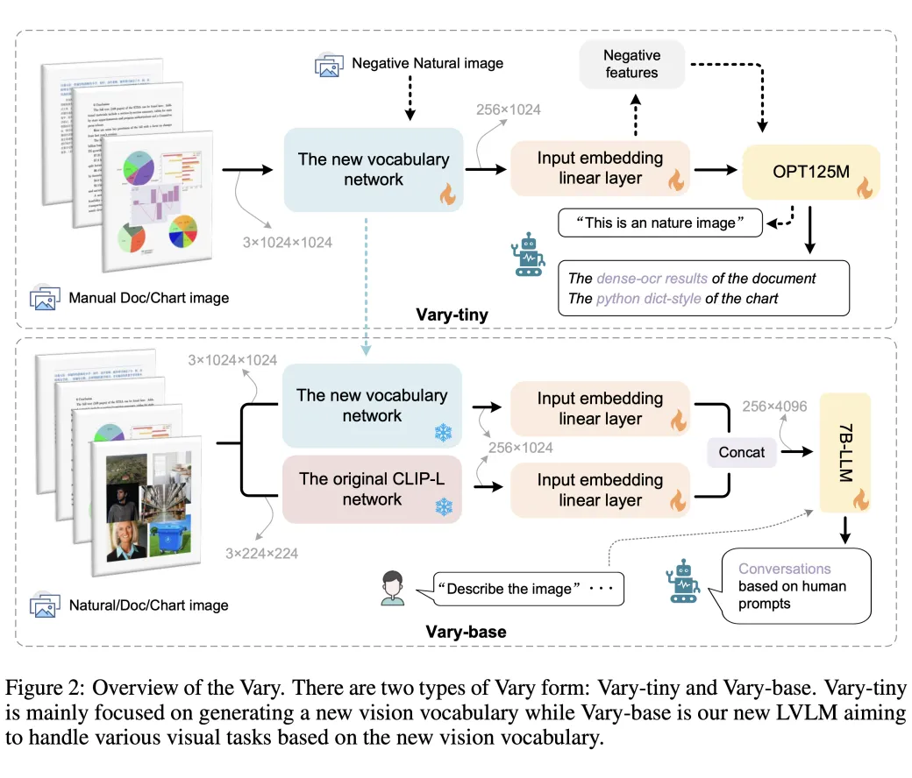

# 1. 简介

- https://varybase.github.io/
- https://zhuanlan.zhihu.com/p/671420712

Vary 表现出了很大的潜力和极高的上限，OCR 可以不再需要冗长的 pipline，直接端到端输出，且可以按用户的 prompt 输出不同的格式如 Latex、Word、Markdown。通过 LLM 极强的语言先验，这种架构还可以避免 OCR 中的易错字，比如“杠杆”和“杜杆”等， 对于模糊文档，也有望在语言先验的帮助下实现更强的 OCR 效果。

# 2. 背景

目前的多模态大模型几乎都是用 CLIP 作为 Vision Encoder 或者说视觉词表。确实，在 400M 图像文本对训练的 CLIP 有很强的视觉文本对齐能力，可以覆盖多数日常任务下的图像编码。但是对于密集和细粒度感知任务，比如文档级别的 OCR、Chart 理解，特别是在非英文场景，CLIP 表现出了明显的编码低效和 out-of-vocabulary 问题。

受语言的 LLMs 启发，纯 NLP 大模型（如 LLaMA）从英文到中文（外语）时因为原始词表编码中文效率低，必须要扩大 text 词表。那么对于现在基于 CLIP 视觉词表的多模大模型也是一样的，遇到 “foreign language image”，如一页论文密密麻麻的文字，很难高效地将图片 token 化，Vary 提出就是解决这一问题，在不 overwrite 原有词表前提下，高效扩充视觉词表。

不同于现有方法直接用现成的 CLIP 词表，Vary 分两个阶段：第一阶段先用一个很小的 Decoder-only 网络用自回归方式帮助产生一个强大的新视觉词表；然后在第二阶段融合新词表和 CLIP 词表，从而高效的训练多模大模型拥有新 feature。Vary 的训练方法和模型结构如下图：

通过在公开数据集以及渲染生成的文档图表等数据上训练，Vary 极大增强了细粒度的视觉感知能力。在保持 Vanilla 多模态能力的同时，激发出了端到端的中英文图片、公式截图和图表理解能力。

另外，原本可能需要几千 tokens 的页面内容，通过文档图片输入，信息被Vary压缩在了 256 个图像 tokens 中。这也为进一步的页面分析和总结提供了更多的想象空间。

# 参考

[1] OCR终结了？旷视提出可以文档级OCR的多模态大模型框架Vary，支持中英文，已开源！, https://mp.weixin.qq.com/s?__biz=MzIwMTc4ODE0Mw==&mid=2247645897&idx=2&sn=2d2c370c1947a4c6deee9b6eb843f354&chksm=96e46549a193ec5f325d69b5adaee81597623a625c3896847e331dd5b96c3f07f9bfe94fa8ed&cur_album_id=3244182239215730689&scene=21#wechat_redirect