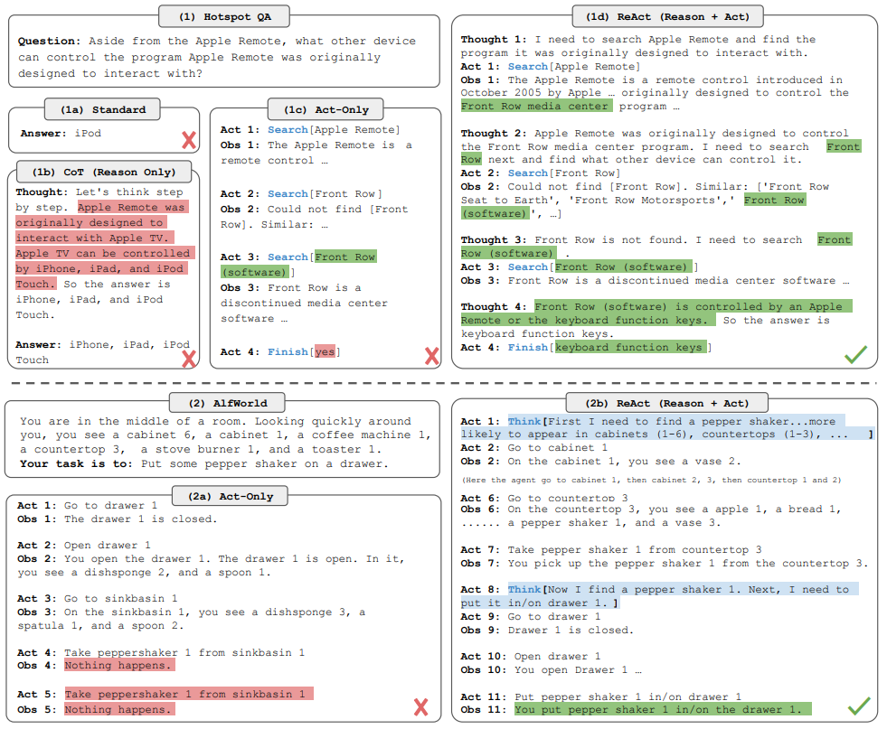
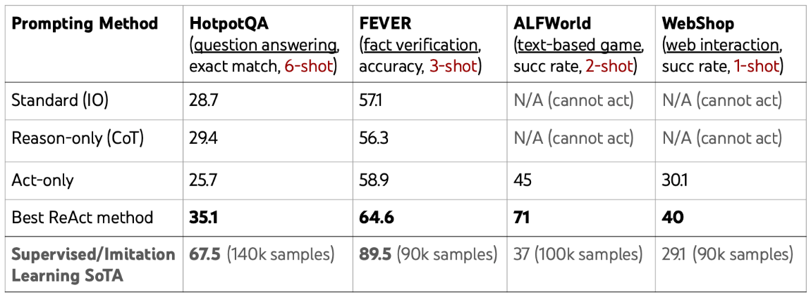
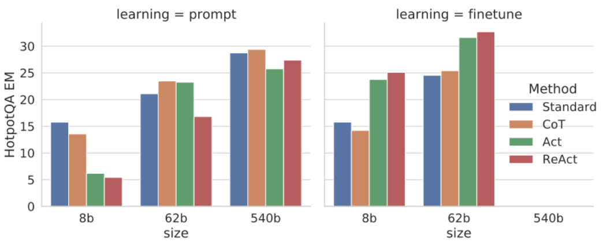

# 1. ReAct介绍

## 1.1 原理

- ReAct: Synergizing Reasoning and Acting in Language Models
- https://arxiv.org/abs/2210.03629

任务分类：
- HotPotQA (Yang et al., 2018), a multi-hop question answering benchmark that requires reasoning
  over two or more Wikipedia passages
- FEVER (Thorne et al., 2018), a fact verification benchmark where each claim is annotated SUPPORTS, 
  REFUTES, or NOT ENOUGH INFO, based on if there exists a Wikipedia passage to verify the claim




上图为ReAct与Prompt的区别，ReAct在Prompt的基础上增加了一个Action的部分，用于指导模型的生成。

```
ReAct方法，即推理+动作。得到结果：

想法1：我需要搜索Apple遥控器，并找到Apple遥控器最早可以控制的软件。
动作1：搜索【Apple 遥控器】
结果1：Apple遥控器是一种遥控器……最早可以控制“Front Row”……

想法2：Apple遥控器最早可以控制Front Row。我需要搜索Front Row下一步，找出还有什么其他设备可以控制他
动作2：搜索【Front Row】
结果2：无结果，可以试试“Front Row Seat to Earth”和“Front Row软件”

想法3：Front Row没有找到，我可以搜索“Front Row软件”
动作3：搜索【Front Row软件】
结果3：FrontRow是一种过时软件……可以被Apple遥控器和键盘功能键控制。

想法4：现在我知道答案了。
动作4：完成【键盘功能键】
```

动作空间
- search[entity]
- lookup[string]
- lookup[string]

## 1.2 实验结果





# 参考

[1]  ReAct: Synergizing Reasoning and Acting in Language Models, https://react-lm.github.io/