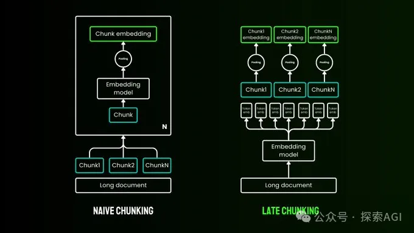

# 1. 资源

开源的实验代码：https://colab.research.google.com/drive/15vNZb6AsU7byjYoaEtXuNu567JWNzXOz?usp=sharing&ref=jina-ai-gmbh.ghost.io

# 2. 原理

正常在处理大规模数据建索引的时候，一般我们需要先对文档进行分块，建立向量索引。 而这个分块大小，设置的都是比较短的，比如512。 一方面是早期bert的处理长度的限制，另一个方面是如果文本太长，包含的信息就越多，那么可能比较难用一个向量来表征出来。

对于前者，如果持续关注向量模型的同学可以发现，无论是开源的BGE系列，还是闭源的API，都在往一个较长的上下文靠齐（比如说8192）。那这就有一些矛盾了，如果工业界只需要512的上下文的向量模型，为什么还要往更长的8192模型发展呢？

对于传统的分块，类似于固定长度的分块。带来的一个比较大的问题是，上下文缺失。就像下图一样，一个句子的主语在段落开头，后面的段落/句子中，有一些代词比如 It's， The city等等来表示主语。这种情况下确实主语的句子基本上就变得比较断章取义了~

与先分块后向量化不同，JinaAI最新提出的“Late Chunking”方法是一个相反的步骤，首先将整个文本或尽可能多的文本输入到嵌入模型中。在输出层会为每个token生成一个向量表示，其中包含整个文本的文本信息。然后我们可以按照需要的块大小对对向量进行聚合得到每个chunk的embedding。这样的优势是，充分利用长上下文模型的优势，同时又不会让每个块的信息过多，干扰向量表征。

在测试中，在所有情况下，与常规的分块相比，Late Chunking提高了召回ndcg@10。在某些情况下，它的性能也优于将整个文档编码为单个嵌入。并且，文档越长，Late Chunking策略就越有效。

# 参考

[1] 告别传统的文档切块！JinaAI提出Late Chunking技巧， https://mp.weixin.qq.com/s/BxJNcsfbwZpbG4boU6vjiw