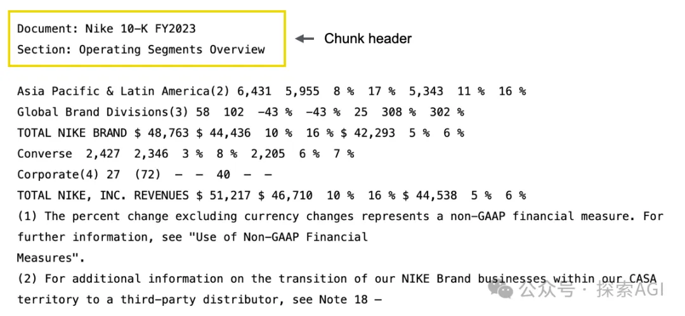
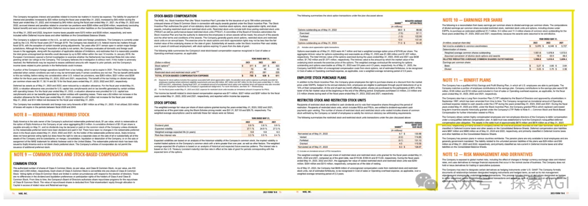

# 1. 简介

项目代码：https://github.com/D-Star-AI/dsRAG/tree/main

一个不好的分块，会带来很多的问题，比如说以下几点：

代称，他/她等表示响应的主题，刚好被切分在单独的块中，影响召回
单个块可能不包含完整的答案块，答案可能包含在连续的几个块中
块可能仅在某种特定上下文中才有意义
等等。。。

解决方案有2种：

- 在每个块添加上下文头，将更高级别的信息补充在文档块开头（例如将文档标题，摘要放在每个块的开头）
  从块到段  chunk -> segments
- 前者添加上下文头的目的是给文档块添加更多的上下文信息，这些上下文头会随着块一级被向量模型编码。下图是个例子：

测试添加块头能明显的提高相关的文档块与query的相关性。

同样，针对这个query，如果我们计算与这个文档所有块的相似度。可以绘制出下面的点图，围绕在chunkid_400附近存在一些高相似度的文档块。

当一个块附近的文档块都与query相近时，我们可以把这些块合并成一个段（segments）。如果把这些段合并作为整体送入LLM，可能可以获得更好的效果。那如何识别这些段的存在呢？因为已经计算了query与块的相关性，所以直接减去一个常数超参，让相关的块的score仍为正数，不相关的为负数。这个超参越大，段越小，反之，得到的段越大。

通过这种方法可以得到一个大段。

这个策略的一个优点是，当部分被排序模型认为不相关的块，但夹在高度相关的块之间，通常与query也是相关的。

因此，除了为LLM提供更完整的上下文之外，这种动态构建相关文本片段的方法还使我们的检索系统对排序模型所犯的错误不太敏感。

# 参考

[1] DsRAG：新开源的高级RAG分块技巧！，https://mp.weixin.qq.com/s/QUM_PTGFtbJkyl9pqjmLdA