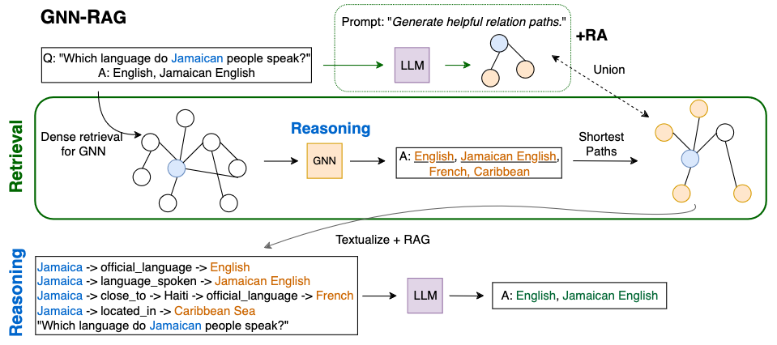

# 1. 资源

- Github (151 stars): https://github.com/cmavro/GNN-RAG

论文
- https://arxiv.org/html/2405.20139v1
- Gnn-Rag: Graph Neural Retrieval for Large Language Model Reasoning

# 2. 介绍

GNN-RAG利用图神经网络在密集子图上进行推理，寻找候选答案及对应的推理路径（从问题实体到答案的最短路径），这些经过整理的信息随后被送入LLM，进一步增强回答的质量。

# 3. 原理

GNN-RAG分为两大核心模块：

- GNN 端：位于gnn文件夹下，封装了多种图神经网络算法实现，专门针对知识图谱问答场景优化。用户既可以选择训练自己的GNN模型，也可以直接利用预计算的GNN输出（位于llm/results/gnn）。
- LLM 端：整合于llm文件夹，致力于实现基于RAG（Retrieval-Augmented Generation）的知识图谱问答。这一部分详细指导如何将GNN的结果融入到大型语言模型中，以实现更深层次的语义理解和回答生成。

技术亮点

- 集成推理与检索：通过GNN的深度学习方法在知识图谱中检索相关信息，结合LLM的上下文理解力，实现了信息检索和逻辑推理的无缝对接。
- 灵活性：提供了自定义GNN模型的可能性，同时也支持直接应用预处理数据，满足不同开发阶段的需求。

# 参考

[1] 探索知识图谱的力量：GNN-RAG，大型语言模型的推理新纪元，https://blog.csdn.net/gitblog_00010/article/details/139849954
