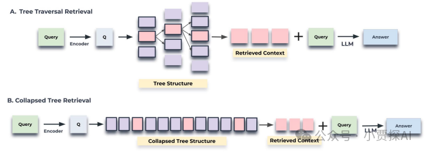

篇章分析获取的文本块具有层次依存关系，检索时可以按照上至下的顺序进行，并配合剪枝策略。对于BERT段落相似判断，由于没有依存关系，
需要使用LLM进行总结和摘要。2024年斯坦福大学提出的RAPTOR方法，是对固定长度分割后的文本块进行语义聚类，然后使用LLM总结摘要，
生成摘要embedding作为树的节点。

在这三种层次结构中，由于语义切分后的文本块可能很长，所以采用固定长度分割可以避免引入冗余文本。如果检索成本不是问题（例如并行检索），
那么可以将层次结构压平后进行检索。

关键词抽取：利用NLP技术（句法分析、NER、依存分析、语义角色标注、关键词提取等）抽取关键信息，将其加入到层次检索的顶部。先检索关键信息，再检索相应内容。缺点是如果用户提问的信息未被提前抽取，就无法检索到。

RAG-Fusion：使用LLM优化用户查询，改写输入查询，并丰富召回结果。将召回内容通过倒排融合（Reciprocal rank fusion, RRF）得到统一得分，然后重排取 TOP k 检索结果。RAG-Fusion的缺点是耗时，因为需要多次提问。

混合搜索：这是一种值得尝试的低成本高收益方案，将字面相似的传统搜索算法（Best Matching 25, BM25）与向量相似性检索相结合，实现混合搜索。可以采用加权融合分数、取各自top k检索后并集 或 RRF+Rerank等方法。

# 参考

[1] RAG|攻克切片难题，https://mp.weixin.qq.com/s/oX8-Fowj5LLyx5X8s4bdZw