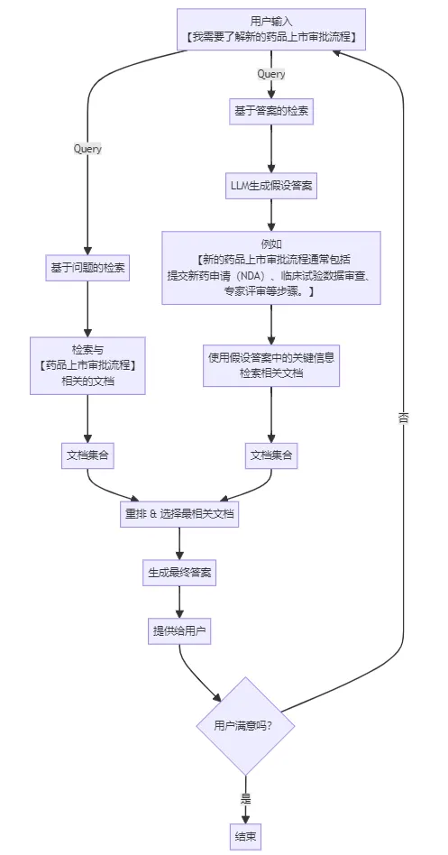
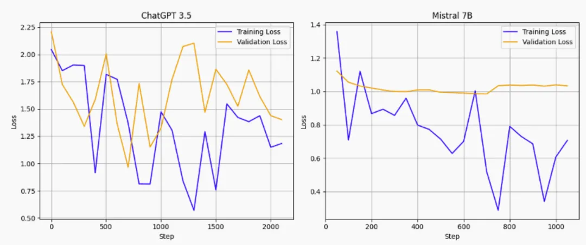

# 1. 资源

- 简介：QA-RAG为了提高制药行业监管合规流程中的准确性和效率而设计的，注重于类似如制药行业的监管指南这样的特定领域知识，以确保提供高度可靠和准确的回答。
- 论文：https://arxiv.org/pdf/2402.01717v1.pdf
- 代码 （5 stars）：https://github.com/jwoongkim11/QA-RAG
- 微调数据集：https://huggingface.co/datasets/Jaymax/FDA_Pharmaceuticals_FAQ

# 2. 方案介绍

QA-RAG系统利用微调后的LLM生成结果作为Query的额外辅助信息。也就是除了有一半的信息来自知识库的直接检索，还有一半的信息来自微调后的LLM生成。这种方式的好处是：扩大搜索范围，捕获更广泛的潜在相关信息。整合好Query相关的文档内容，在经过重排序，最终丢给大模型生成。


## 2.1 文档预处理
使用OCR技术进行文档处理时，尤其提到用 Nougat ，这是一种学术文档PDF解析器，可以理解LaTeX数学和表格。文档分块的大小设置为 10000 ，分块之间的overlap设置为 2000 个字符。块大小是指每个文本块可以包含的最大字符数，块重叠是指连续块之间重叠的字符数。文中提到，选择较大的分块和重叠，原因是为了获得总体指南的整体视图，并将信息损失最小化。

## 2.2 向量化与相似性搜索
由于稀疏检索算法为BM25无法捕捉深层次的语义关系，也是采用向量化（稠密）方式。具体的文档embedding模型为 LLM-Embedder，该模型擅长捕捉文本中的复杂语义关系；向量数据库和相似性搜索工具用的是FAISS，它在处理大规模数据集时具备高效和可扩展。

## 2.3 双轨检索（Dual-track Retrieval）
传统方式只做单步检索增强，特别是在涉及到语言的细微差别和复杂多变时，由于过度依赖用户Query中出现的特定关键字或短语，导致容易错过相关文档。什么意思呢，不是说做了embedding就能召回用户想要的信息。举几个例子就清楚了。

- 情形1：用户意图表述不清，query没有覆盖真实问题需求。假设用户只是输入“环保房屋”，其实用户想了解“如何使用环保材料来建造节能房屋”（RAG心里一万个cnm！）。一来系统可以让用户补全Query（任务型、意图分层分级），二来就像本文提到的，利用经过领域特定数据训练的微调LLM生成的假设答案来补充检索的损失。
- 情形2：语言表述复杂性，导致语言理解的局限，无法解析更深层次的意图需求。假设用户想要了解“如何在家工作时保持专注”。理想情况，检索出来的文档不仅只是字面上的指南，还应该包括远程办公或家庭办公环境如何提高生产力的技巧和策略的文档。因为专注的目的就是为了提高效率、提高生产力。也就是这些概念都是相关的，如果检索系统没有足够智能地识别和评估这些语义上的相关性，它们就可能被错过。

针对上述问题，已经提出了各种解决方案，包括使用多Query检索和HyDE。

- Multiquery retrieval，它可以从原始问题以不同的角度让LLM自动生成多个Query，一定程度上扩大了语义检索空间。但它仍然局限于用户问题的狭窄范围，无法获得更广泛的信息知识
  - 
- HyDE，则不是生成类似的Query，而是直接用LLM生成和Query相关的文档。举个例子，
  - ```text
    假设我问，“如何在家制作植物肥料？”，HyDE方法会用一个经过训练的语言模型来生成一个相关的假设文档，比如：“家庭制作植物肥料可以通过混合咖啡渣、鸡蛋壳和香蕉皮来实现。”
    ```
该方法的本质是利用LLM的内涵知识来扩大整个语义搜索空间。弊端是：（1）高度依赖LLM的能力，且容易引入噪声或误导性信息，尤其是专业程度很高的领域，通用LLM通常会产生非常不完整的假设答案，需要采用更专门的方法；（2）扩大搜索空间，也就意味着提高了检索复杂度，资源不足情况就有点难适应了。

- 双轨策略，则是利用经过专业领域微调后LLM生成的假设答案和原始Query一起来检索文档。

假设用户提出的Query是：“我需要了解新的药品上市审批流程”，会有两个检索路径：

- （路径1）基于问题的检索：系统会使用这个查询直接去检索与“药品上市审批流程”相关的文档。系统会使用这个查询直接去检索与“药品上市审批流程”相关的文档。
- （路径2）基于答案的检索：微调后的LLM可能会生成一个假设答案，比如：“新的药品上市审批流程通常包括提交新药申请（NDA）、临床试验数据审查、专家评审等步骤。” 然后，系统会使用这个假设答案中的关键信息去检索相关的文档。



# 3. 实验过程与结果

- 微调数据集：https://huggingface.co/datasets/Jaymax/FDA_Pharmaceuticals_FAQ
- 数据集划分：85%用于训练，10%用于验证，剩余5%用于测试
- 待微调LLMs：ChatGPT 3.5 和 Mistral-7B
- 微调方式：LoRA
- 在GPT-3.5-Turbo上进行了3个epoch和2101步的微调
- 在Mistral-7B进行了3个epoch和1074步的微调
  - 
- 评价指标与流程：使用BertScore进行评价，这是一个评估文本生成质量的指标，关注精确度（precision）、召回率（recall）和F1分数（f1）
  - 

# 4. 落地思考

QA-RAG模型在制药行业的监管合规领域的应用：

- 流程简化：通过自动化问答流程，减少导航复杂法规所需的时间和资源。
- 减少对人类专家的依赖：自动化合规流程的部分环节，让专家能够专注于更战略性的任务。

个人认为，针对B端的企业级RAG落地，结合业务的意图深挖与充分理解是至关重要的，检索和生成在我看来都相对次要。检索的目的是召回和query意图最相关（注意，不仅是语义最相关）的信息进行后续的融合生成，那如果意图都没做好，检索就有更多问题，后面生成就容易出现幻觉。

# 参考

[1] QA-RAG：双轨策略提高RAG效果，https://mp.weixin.qq.com/s/Vq2Kbml2VBcKi8s4H1KXUw
