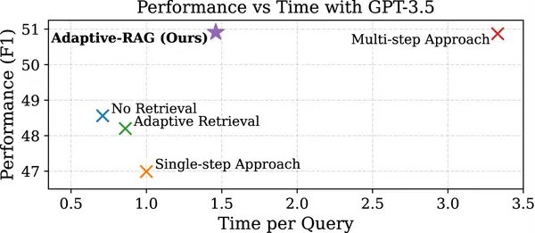

# 1. 资源

Github （代码已被删除，不确定原因）: https://github.com/starsuzi/Adaptive-RAG
论文：
  - Adaptive-RAG: Learning to Adapt Retrieval-Augmented Large Language Models through Question Complexity
  - https://arxiv.org/pdf/2403.14403v1.pdf
  - 时间：2024.03.21
  - 作者：Korea Advanced Institute of Science and Technology1

# 2. 方法

自适应RAG通过判断问题的复杂性来自动选择使用哪种RAG策略。作者将问题划分为三类（如上图的C部分）：

• 开放领域问答：这类任务通常涉及两个模块：一个检索器和一个阅读器。随着具有千亿参数的超强推理能力的LLMs的出现，LLMs和检索器之间的协同作用已经取得了显著进展。然而，尽管在单跳检索增强LLMs方面取得了进展，但某些查询的复杂性需要更复杂的策略。

• 多跳问答：多跳问答（Multi-hop QA）是传统开放领域问答（Open-domain QA）的扩展，需要系统全面收集和上下文化多个文档的信息回答更复杂的查询。首先将多跳查询分解为更简单的单跳查询，反复访问LLMs和检索器来解决这些子查询，并合并它们的解决方案以形成完整答案。 这种查询的缺点是：每个查询进行迭代访问LLMs和检索器可能效率极低，因为有些查询可能足够简单，可以通过单一检索步骤甚至仅通过LLM本身来解决。

• 自适应检索：为了处理不同复杂性的查询，自适应检索策略根据每个查询的复杂性动态决定是否检索文档。根据实体的频率来确定查询的复杂性级别，并建议仅当频率低于一定阈值时才使用检索模块。然而，这种方法仅关注于检索与否的二元决策，可能不足以解决需要多个推理步骤的更复杂的查询。

分别使用三种策略来运用RAG进行回答：

Adaptive Retrieval-Augmented Generation (Adaptive-RAG) 是一种新型的问答框架，它能够根据问题的复杂性动态选择最适合的策略来处理检索增强的大型语言模型（LLMs）。这三种策略包括：

1. 非检索方法（No Retrieval）：这是最简单的策略，直接使用大型语言模型（LLM）本身的知识库来生成答案。这种方法适用于那些模型已经知道答案的简单问题，不需要额外的外部信息。
2. 单步检索方法（Single-step Approach）：当问题需要额外的信息时，这种方法会先从外部知识源检索相关信息，然后将检索到的文档作为上下文信息输入到LLM中，帮助模型生成更准确的答案。这种方法适用于需要一次额外信息检索的中等复杂度问题。
3. 多步检索方法（Multi-step Approach）：对于最复杂的问题，需要从多个文档中综合信息并进行多步推理。这种方法通过迭代地访问检索器和LLM，逐步构建起解决问题所需的信息链。这种方法适用于需要多步逻辑推理的复杂问题。

4. Adaptive-RAG的核心在于它能够通过一个分类器来评估问题的复杂性，然后根据这个评估结果选择最合适的处理策略。分类器是一个较小的语言模型，它被训练来预测传入问题（query）的复杂性级别，并自动收集标签，这些标签来自于模型预测的实际结果和数据集中固有的归纳偏差。

通过这种方式，Adaptive-RAG能够灵活地在不同的检索增强LLM策略之间进行切换，从而在处理各种复杂性的问题时，实现更高的效率和准确性。这种方法在实验中显示出，与现有的自适应检索方法相比，Adaptive-RAG在多个开放域问答数据集上都取得了更好的整体效率和准确性。

在Adaptive-RAG模型中，训练分类器以准确评估问题的复杂性是一个关键步骤。这个过程涉及以下几个关键步骤：

1. 定义复杂性标签：首先，需要定义问题的复杂性等级。在Adaptive-RAG中，通常有三个类别：简单（A）、中等（B）和复杂（C）。简单问题可以直接由LLM回答，中等复杂度问题需要单步检索，而复杂问题则需要多步检索和推理。
2. 自动收集训练数据：由于没有现成的带有复杂性标签的查询数据集，Adaptive-RAG通过两种策略自动构建训练数据集：
   
   • 从不同检索增强LLM策略的预测结果中标注查询的复杂性。如果非检索方法能够正确生成答案，则对应问题的标签为简单（A）；如果单步检索方法和多步检索方法都能正确回答，而非检索方法失败，则对应问题的标签为中等（B）；如果只有多步检索方法能够正确回答，则对应问题的标签为复杂（C）。
   
   • 利用基准数据集中的固有偏差来标注未标记的查询。例如，如果一个查询在单步数据集中未被标记，则自动分配标签为中等（B）；如果在多步数据集中未被标记，则自动分配标签为复杂（C）。
3. 训练分类器：使用自动收集的查询-复杂性对数据集，训练一个较小的语言模型作为分类器。这个分类器的目标是根据输入的问题（query）预测其复杂性级别。训练过程中，使用交叉熵损失函数，并选择在验证集上表现最佳的迭代次数。
4. 评估和优化分类器：在训练完成后，评估分类器的性能，包括准确率和其他相关指标。如果分类器的性能不足，可能需要进一步优化，例如通过调整模型结构、增加训练数据或改进数据标注策略。
5. 集成到Adaptive-RAG框架：将训练好的分类器集成到Adaptive-RAG框架中。在推理阶段，分类器用于预测新问题的复杂性，然后根据这个预测结果选择最合适的问答策略。

通过这种方法，Adaptive-RAG能够动态地调整其查询处理策略，以适应不同复杂性的问题，从而提高问答系统的整体效率和准确性。
 
# 3. 实验

上图展示了不同检索增强生成方法在问答任务中的性能和效率对比。这些方法包括不使用检索的单步方法、自适应检索方法、多步方法，以及本文提出的Adaptive-RAG方法。图中的横轴表示每个查询的处理时间，纵轴表示问答任务的性能，通常使用F1分数（F1 Score）来衡量。

从图中可以看出，Adaptive-RAG方法在处理各种复杂性的查询时，能够在保持较高F1分数的同时，减少每个查询的处理时间。这意味着Adaptive-RAG方法在提高问答系统整体效率的同时，也增强了系统的准确性。

具体来说，不使用检索的单步方法（No Retrieval）在处理简单查询时效率较高，但在处理复杂查询时性能下降。自适应检索方法（Adaptive Retrieval）和多步方法（Multi-step Approach）虽然能够处理更复杂的查询，但它们在效率上有所牺牲，尤其是多步方法，其处理时间显著增加。

相比之下，Adaptive-RAG方法通过动态选择最合适的检索策略，实现了在简单和复杂查询之间的有效平衡。这表明Adaptive-RAG方法能够根据查询的实际需求，灵活地调整其处理策略，从而在不同的问答场景中都能取得良好的性能。

# 参考

[1] Adaptive-RAG：性能提升50%以上的高效RAG策略，https://www.zhihu.com/tardis/zm/art/688547968?source_id=1005