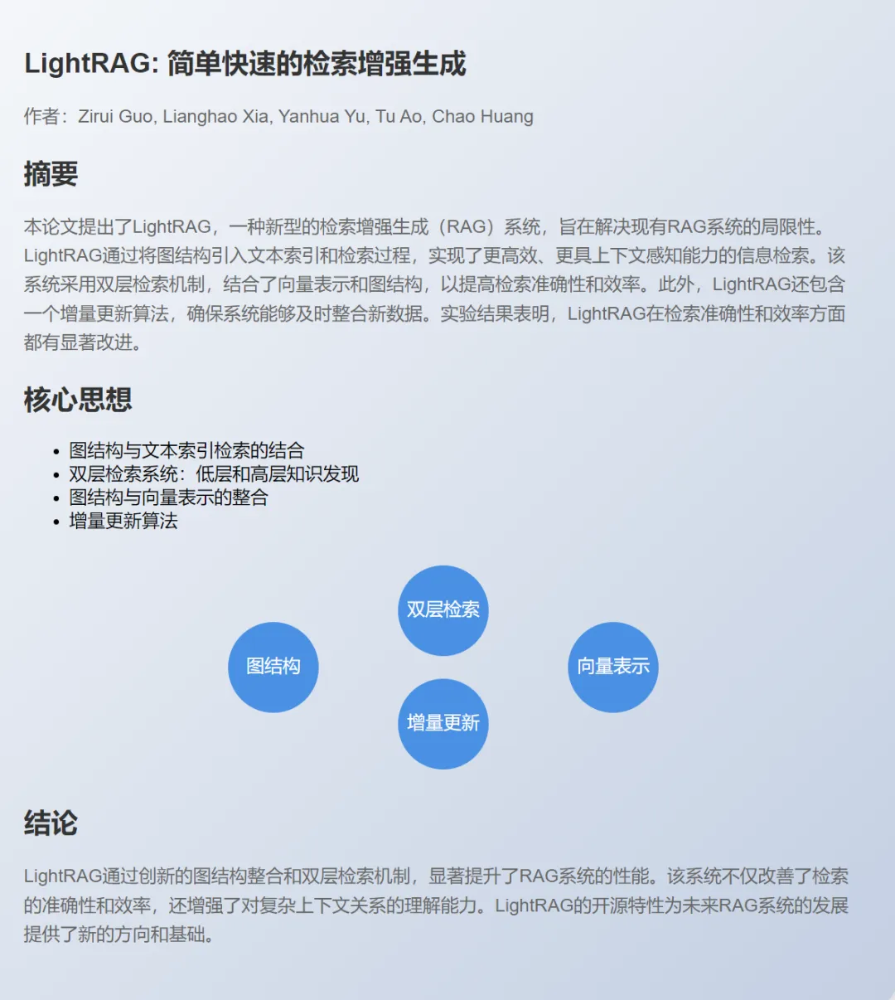
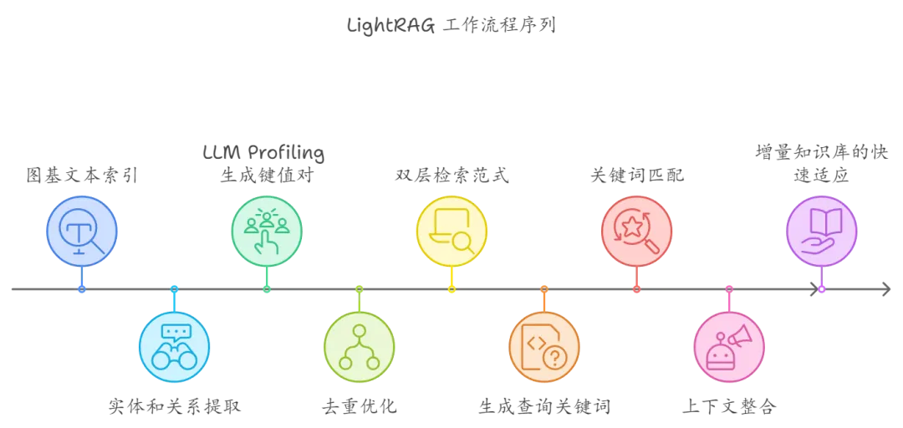
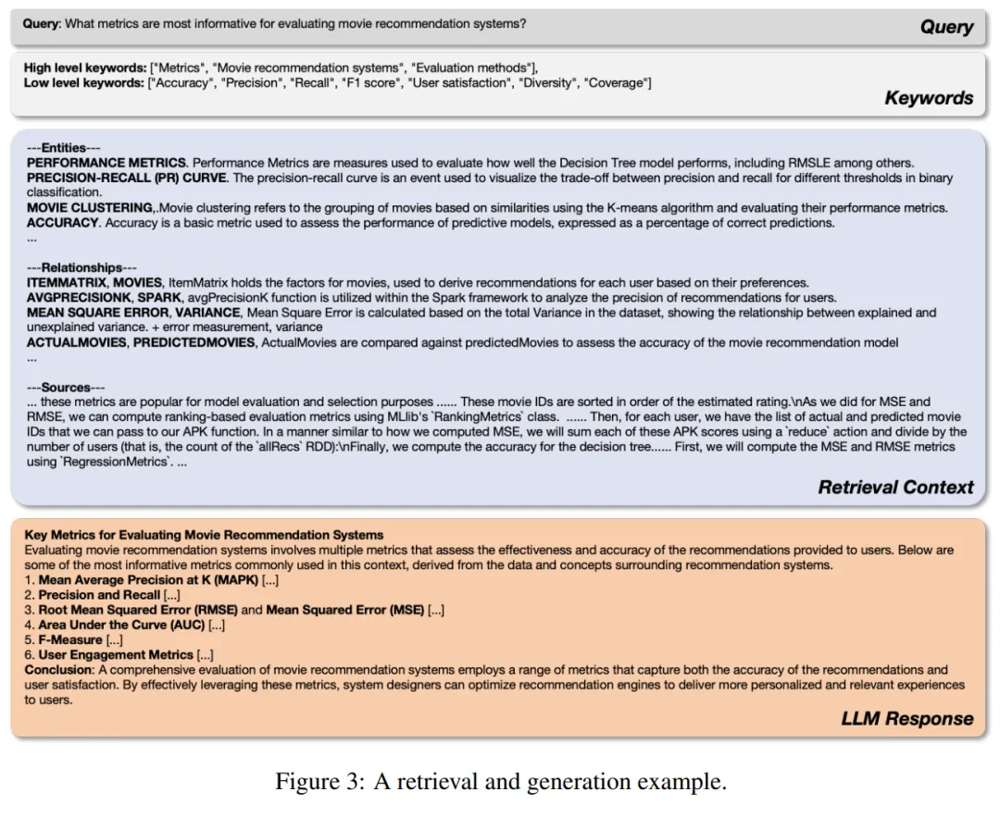
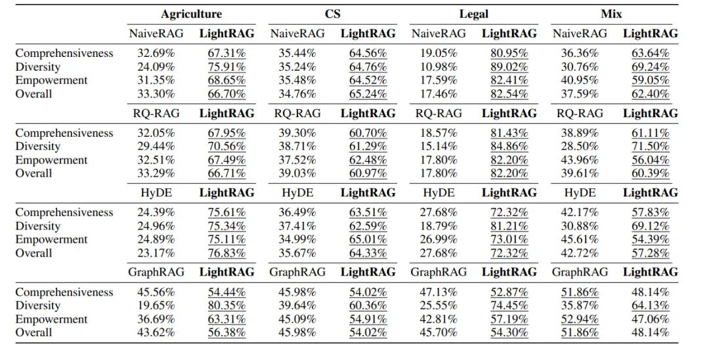

# 0. 资源

- LightRAG 论文：https://arxiv.org/abs/2410.05779
- github：https://github.com/HKUDS/LightRAG

基于Claude生成的论文摘要卡片

# 1. 简介

现有的RAG系统老是搞不清复杂关系，答案经常被切碎，缺乏上下文，难以真正理解问题。而LightRAG就是来解决这些问题的，它把图结构引入文本索引和检索，采用双层检索系统，从低到高全面覆盖信息。更酷的是，它还能快速更新数据，保持实时高效的响应，而且它已经开源了哦！

并且你现在可以通过简单的API调用来实现多种检索模式，包括本地、全局和混合检索。

# 2. 原理

LightRAG 的工作流程分为三个核心部分：

1. 图基文本索引（Graph-Based Text Indexing）

2. 双层检索范式（Dual-Level Retrieval Paradigm）

3. 增量知识库的快速适应

## 一、图基文本索引

### 步骤 1：实体和关系提取
- 使用大型语言模型（LLM）分析文档，自动识别出文本中的实体（如人名、地点、组织等）及其关系（如“属于”或“位于”）。
- 文本被分割成多个较小的块（chunks）来提升处理效率。

### 步骤 2：LLM Profiling 生成键值对
- 对每个识别出的实体和关系，LLM 生成键值对（Key-Value Pair）。其中，“键”（Key）是一个或多个关键词，而“值”（Value）是与这些实体或关系相关的文本段落。

### 步骤 3：去重优化
- 合并不同文档中的重复实体和关系，减少不必要的计算，提升处理速度。

## 二、双层检索范式

### 步骤 4：生成查询关键词
- 针对用户查询，系统自动提取局部关键词（low-level）和全局关键词（high-level）用于匹配检索。

### 步骤 5：关键词匹配
- 使用向量数据库，局部关键词会匹配相关的实体，全局关键词会匹配到相应的实体关系。

### 步骤 6：整合高阶相关性
- 为增强检索的准确性，LightRAG 会收集检索到的图元素的邻接节点，涉及检索到的实体及其关系的上下文。

## 三、检索增强的答案生成

### 步骤 7：使用检索到的信息
- 检索完成后，系统将提取到的实体和关系输入LLM，并基于这些信息生成答案。

### 步骤 8：上下文整合与答案生成
- 系统将用户查询与多源检索结果进行合并，生成符合查询语境的答案。

## 四、增量知识库的快速适应

### 步骤 9：增量更新知识库
- 新文档加入时，系统会按照之前的图基索引步骤处理新文档，将新生成的知识图谱与现有图谱数据合并，实现无缝更新。

### 步骤 10：减少计算开销
- 为了提升效率，LightRAG 避免重建整个知识图谱，仅更新新数据部分，从而减少计算开销，提升系统响应速度。

通过这些步骤，**LightRAG** 实现了更精准、更高效、更具上下文关联的知识检索和答案生成，特别是在解决复杂问题和处理大规模数据时具有显著优势。

# 3. LightRAG 架构实例解释

**LightRAG** 主要通过以下几个步骤来让信息检索更准确、更智能：

## 1. 从文本中提取信息
系统会读取文档，识别出重要的“实体”（比如人、地点、事物）及其之间的“关系”（如某人属于某组织、某事物位于某地）。

- 例如，系统可能会识别出“Beekeeper（养蜂人）”这个实体，并且提取出它与“Bee（蜜蜂）”的关系。

## 2. 去掉重复信息
系统会去除文档中相同的实体和关系，避免不必要的重复信息。这能减轻系统的负担，提高检索效率。

- 例如，系统发现同一个文档中多次提到了“Beekeeper”，但意思相同，就只保留一次。

## 3. 把信息放入图表
这些提取出的实体和关系会被放入一个“图”中。在这个图里，实体作为“节点”，关系作为“边”，所有节点和边相连，形成了一个可以高效查询的信息网络。

- 例如，图中可以显示“Beekeeper”节点和“Bee”节点通过一条“管理（Manage）”的边相连。

## 4. 双层检索
当用户提出问题时，系统会分两步进行检索。首先，它会寻找与问题直接相关的“局部关键词”（如“Beekeeper”），然后再寻找与这些关键词关联的“全局关键词”（如“Bee”、“Hive（蜂巢）”等）。

- 例如，用户问：“养蜂人如何管理蜂群？”系统会找到与“Beekeeper”相关的信息，同时也找到与“Bee”和“Hive”相关的内容，提供更完整的答案。

## 5. 生成答案
系统结合检索到的信息，利用大语言模型（LLM）生成详细的答案，并确保答案逻辑连贯、信息准确。

## 6. 知识更新
当有新的信息加入时，系统会把新信息无缝整合到已有的图中，确保系统总是基于最新的知识进行检索，而不会每次都重建整个系统。

这张图表可以理解为整个过程的可视化，它展示了从识别实体到检索再到生成答案的完整流程。

面对问题“哪些指标最适合评估电影推荐系统？”时，LLM首先提取低层次和高层次的关键词，用这些关键词在生成的知识图谱上检索相关的实体和关系。检索到的信息被组织成三个部分：实体、关系和相应的文本片段。然后，这些结构化的数据被送入LLM，帮助它生成一个全面的答案。

LightRAG在四个数据集/评估维度上都显示出了显著的改进，效果优于GraphRAG、NaiveRAG、RQ-RAG 、HyDE。

在四个数据集和四个评估维度下，基线与LightRAG的胜率（%）对比

LightRAG 的代码结构基于nano-graphrag，一个更小、更快的GraphRAG。

# 参考

[1] LightRAG开源了！轻巧、强大，GraphRAG的进化版，https://mp.weixin.qq.com/s/_zPm8NSuBqXKfuoMTdyWAQ
[2] PaperAgent：https://mp.weixin.qq.com/s/1QKdgZMN55zD6X6xWSiTJw