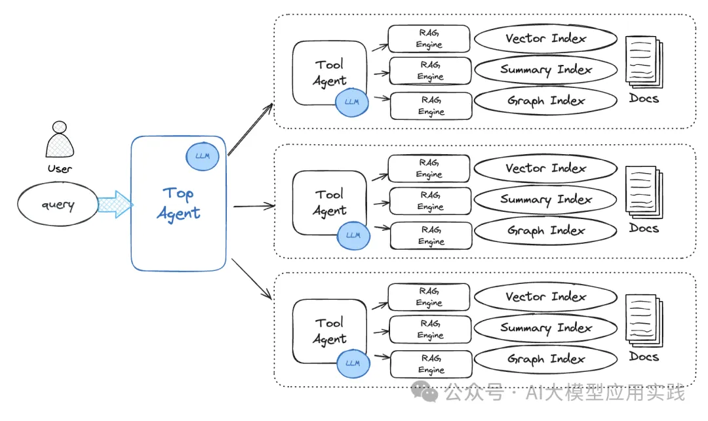

# 1. 问题

需求包括：

- 基于全局的理解文档后回答问题。比如：对某知识内容进行总结摘要？
- 跨文档与知识库的回答问题。比如：比较不同文档内容的区别？
- 结合非知识工具的复合场景。比如：从文档提取产品介绍发送给xx客户？

这种复杂需求的场景如果使用经典RAG架构，通过chunks+向量+top_K检索来获得并插入上下文，直接让LLM来给出答案，显然是不现实的。经典RAG在回答文档相关的事实性问题时可以工作的不错，但是实际的知识应用并不总是这种类型！当然你也可以借助一些改进的RAG范式来提高应用场景的适应性，比如RAPTOR（基于文档树的多级检索机制，有利于回答从细节到高层理解的多级问题），但在一些跨文档或者需要结合工具的场景仍然无法胜任。

# 2. 解决方案



在这里的Agentic RAG架构中：

RAG应用（RAG引擎，即借助索引实现检索并合成响应）退化成一个Agent使用的知识工具。你可以针对一个文档/知识库构建多种不同的RAG引擎，比如使用向量索引来回答事实性问题；使用摘要索引来回答总结性问题；使用知识图谱索引来回答需要更多关联性的问题等

在单个文档/知识库的多个RAG引擎之上设置一个ToolAgent，把RAG引擎作为该Agent的tools，并利用LLM的能力由ToolAgent在自己“负责”的文档内使用这些tools来回答问题

设置一个总的顶级代理TopAgent来管理所有的低阶ToolAgent，将ToolAgent看作自己的tools，仍然利用LLM来规划、协调、执行用户问题的回答方案

# 3. Llama-index实现

## 3.1 准备测试文档

首先这里准备三个RAG相关的测试PDF文档，其名称与路径分别保存。当然，在实际应用中，这里文档数量可以扩展到非常大（后面会看到针对大量文档的一个优化方法）：

```python
names = ['c-rag','self-rag','kg-rag']
files = ['../../data/c-rag.pdf','../../data/self-rag.pdf','../../data/kg-rag.pdf']
```

## 3.2 准备创建Tool Agent的函数

创建一个针对单个文档生成Tool Agent的函数，在这个函数中，将对一个文档创建两个索引与对应的RAG引擎：

- 针对普通事实性问题的向量索引与RAG引擎
- 针对更高层语义理解的总结类问题的摘要索引与RAG引擎

最后，我们把这两个引擎作为一个Agent可使用的两个tool，构建一个Tool Agent返回。

```python
......省略import部分与准备llm部分......

#采用chroma向量数据库
chroma = chromadb.HttpClient(host="localhost", port=8000)
collection = chroma.get_or_create_collection(name="agentic_rag")
vector_store = ChromaVectorStore(chroma_collection=collection)

#创建针对某个文档的tool_agent
def create_tool_agent(file,name):

    #文档拆分
    print(f'Starting to create tool agent for 【{name}】...\n')
    docs =SimpleDirectoryReader(input_files = [file]).load_data()
    splitter = SentenceSplitter(chunk_size=500,chunk_overlap=50)
    nodes = splitter.get_nodes_from_documents(docs)
    
    #创建向量索引，并做持久保存
    if not os.path.exists(f"./storage/{name}"):
        print('Creating vector index...\n')
        storage_context = StorageContext.from_defaults(vector_store=vector_store)
        vector_index = VectorStoreIndex(nodes,storage_context=storage_context)
        vector_index.storage_context.persist(persist_dir=f"./storage/{name}")
    else:
        print('Loading vector index...\n')
        storage_context = StorageContext.from_defaults(persist_dir=f"./storage/{name}",vector_store=vector_store)
        vector_index = load_index_from_storage(storage_context=storage_context)

    #创建基于向量的查询引擎
    query_engine = vector_index.as_query_engine(similarity_top_k=5)

    #创建摘要索引与对应的查询引擎
    summary_index = SummaryIndex(nodes)
    summary_engine = summary_index.as_query_engine(response_mode="tree_summarize")

    #将RAG引擎转化为两个tool
    query_tool = QueryEngineTool.from_defaults(query_engine=query_engine,name=f'query_tool',description=f'Use if you want to query details about {name}')
    summary_tool = QueryEngineTool.from_defaults(query_engine=summary_engine,name=f'summary_tool',description=f'Use ONLY IF you want to get a holistic summary of the documents. DO NOT USE if you want to query some details about {name}.')

    #创建一个tool agent
    tool_agent = ReActAgent.from_tools([query_tool,summary_tool],verbose=True,
                                  system_prompt=f"""
                                                          You are a specialized agent designed to answer queries about {name}.You must ALWAYS use at least one of the tools provided when answering a question; DO NOT rely on prior knowledge. DO NOT fabricate answer.
                                                            """)
    return tool_agent
```

这部分代码主要目的就是把两个查询的RAG引擎包装成工具（一个是query_tool，用于回答事实性问题；一个是summary_tool用于回答总结性问题，当然你还可以构建更多类型的引擎），最后构建一个ReAct思考范式的AI Agent，并把构建的RAG tools插入。

```text
如果你了解LlamaIndex，可能会使用路由RouteQueryEngine来代替这里的Agent，实现接近的功能。但是要注意，Router与Agent是有区别的，路由仅仅是起到一个“选择”工具与“转发”的作用，并不会做多次迭代；而Agent则会观察工具返回的结果，且有可能会使用多个工具通过迭代来完成任务。
```

## 3.3 批量创建Tool Agent

有了上面的函数后，就可以批量创建好这些文档的Tool Agent。这里把每一个文档名字和对应的Agent保存在一个dict中：

```python
#创建不同文档的agent
print('===============================================\n')
print('Creating tool agents for different documents...\n')
tool_agents_dict = {}
for name, file in zip(names, files):
    tool_agent = create_tool_agent(file, name)
    tool_agents_dict[name] = tool_agent
```

## 3.4 创建Top Agent

最后，我们需要创建一个顶层的Top Agent，这个Agent的作用是接收客户的请求问题，然后规划这个问题的查询计划，并使用工具来完成，而这里的工具就是上面创建好的多个Tool Agent：

```python
#首先将Tool Agent进行“工具化”
print('===============================================\n')
print('Creating tools from tool agents...\n')
all_tools = []

for name in names:
    agent_tool = QueryEngineTool.from_defaults(
            #注意，Agent本身也是一种Query Engine，所以直接转为tool
           query_engine=tool_agents_dict[name],

            #这个工具的名字
            name=f"tool_{name.replace("-", "")}",

            #描述这个工具的作用和使用方法
            description=f"Use this tool if you want to answer any questions about {name}."
    )

    all_tools.append(agent_tool)

#创建Top Agent
print('Creating top agent...\n')
top_agent = OpenAIAgent.from_tools(tools=all_tools,verbose=True,system_prompt="""You are an agent designed to answer queries over a set of given papers.Please always use the tools provided to answer a question.Do not rely on prior knowledge.DO NOT fabricate answer""" )
```

注意这里我们创建的Top Agent使用了OpenAIAgent，而不是ReActAgent，这也展示了这种架构的灵活性：不同Agent可以按需使用不同的推理范式。

## 3.5 测试

现在来简单测试这个Top Agent，并观察其执行的过程：

```python
top_agent.chat_repl()
```

输入一个问题：Please introduce Retrieval Evaluator in C-RAG pattern?


注意观察这里红线与绿色部分内容，可以看出Agent的“思考”过程：

1.在TopAgent这一层，由于我们使用了OpenAIAgent，其是通过OpenAI的function calling来实现，因此这里显示LLM要求进行函数调用，需要调用tool_crag，输入参数为"Retrieval Evaluator in C-RAG pattern"。而这里的函数名tool_crag，也就是后端Tool Agent的名称。

2.然后来到Tool Agent层，Tool Agent收到请求后，通过ReAct范式的思考过程，决定需要调用query_tool工具，也就是通过向量索引进行响应的RAG引擎。在调用这个引擎后，获得了返回内容（observation的内容）。收到返回后Tool Agent通过观察与推理，认为可以回答这个问题，因此Tool Agent运行结束，并返回结果给Top Agent

3.Top Agent收到函数调用的结果后，认为无需再次进行其他函数调用，因此直接输出了结果，整个迭代过程结束。

当然，你也可以自行测试更复杂的文档任务，比如：要求对比两个文档中某个知识点的区别等。

# 4. 进一步优化Agentic RAG

面我们只用了三个文档，构建了针对他们的Tool Agent。那么如果这里的文档数量是几十或者几百，过多的Tool Agent作为Tools塞给Top Agent进行推理选择时会带来一些问题：

- LLM产生困惑并推理错误的概率会提高

- 过多的Tools信息导致上下文过大，成本与延迟增加

一种可行的方法是：利用RAG的思想对Tools进行检索，即只把本次输入问题语义相关的Tools（即这里的多个ToolAgent）交给Top Agent使用。这里借助LlamaIndex中的Object Index来实现：Object Index可以对任意Python对象构建向量化的索引，并通过输入问题来检索出相关的Objects。

现在可以对上面的代码做简单的改造，给Top Agent在推理时增加tools检索功能，从而能够缩小tools选择的范围。只需要在创建Top Agent之前针对tools创建一个Object Index的检索器用来根据输入问题检索相关的tools：

```python
#创建工具检索器
print('===============================================\n')
print('Creating tool retrieve index...\n')
obj_index = ObjectIndex.from_objects(all_tools,index_cls=VectorStoreIndex,)
tool_retriever = obj_index.as_retriever(similarity_top_k=5,verbose=True)
```

然后将创建Top Agent的代码做简单的修改,不再传入all_tools，而是传入tools检索器：

```python
......
top_agent = OpenAIAgent.from_tools(tool_retriever=tool_retriever,
                                   verbose=True,
                                   system_prompt="""You are an agent designed to answer queries over a set of given papers.Please always use the tools provided to answer a question.Do not rely on prior knowledge.""")
.......
```

现在如果你继续测试这个Agent，会发现仍然可以达到相同的效果。当然，如果你需要验证这里检索出来的tools正确性，可以直接对tool_retriever调用检索方法来观察（输入相同的自然语言问题）输出的tools信息：

```python
tools_needed = tool_retriever.retrieve("What is the Adaptive retrieval in the c-RAG?")
print('Tools needed to answer the question:')
for tool in tools_needed:
    print(tool.metadata.name)
```

# 5. Agentic RAG总结

相对于更适用于对几个文档进行简单查询的经典RAG应用，Agentic RAG的方法通过更具有自主能力的AI Agent来对其进行增强，具备了极大的灵活性与扩展性，几乎可以完成任意基于知识的复杂任务：

基于RAG之上的Tool Agent将不再局限于简单的回答事实性的问题，通过扩展更多的后端RAG引擎，可以完成更多的知识型任务。比如：整理、摘要生成、数据分析、甚至借助API访问外部系统等

Top Agent管理与协调下的多个Tool Agent可以通过协作完成联合型的任务。比如对两个不同文档中的知识做对比与汇总，这也是经典问答型的RAG无法完成的任务类型。

# 参考

[1] 手把手教你构建Agentic RAG：一种基于多文档RAG应用的AI Agent智能体，https://mp.weixin.qq.com/s?__biz=Mzk0MjUwMzY1MA==&mid=2247509889&idx=1&sn=e2f477ed055eddd7362c202619e5db86&chksm=c2c0c40cf5b74d1a95d6b7764a042cd678320cb0df64fa76a98e059ac9b57e8556de50310e54&scene=21#wechat_redirect
[2] 2024 年人工智能用户大会：Jerry Liu 主题演讲：https://www.youtube.com/watch?v=MRavjoPpmgM&t=9450s&ab_channel=AIUserGroup