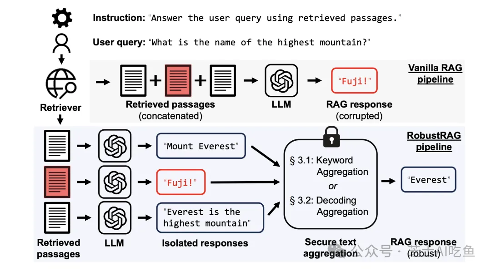
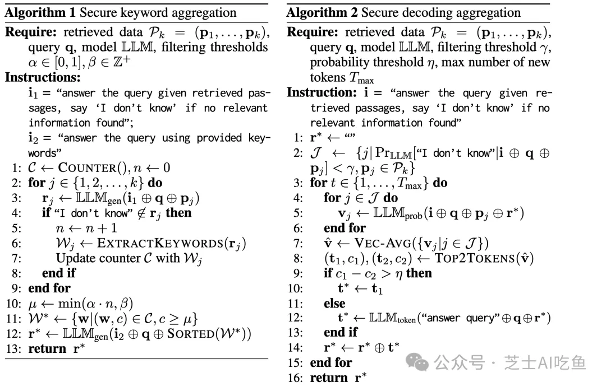
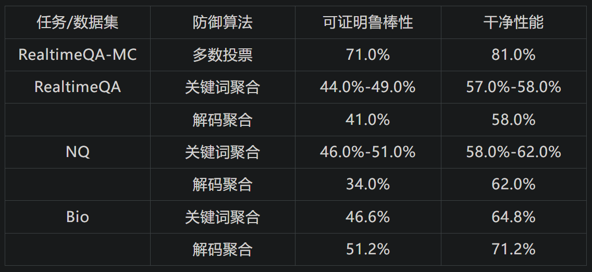

# 1. 资源

# 2. 问题

RAG模型的优势也带来了新的安全隐患。由于依赖外部知识库的检索结果，RAG模型容易受到恶意的检索污染攻击(Retrieval Corruption Attacks)。攻击者可以通过在检索结果中注入虚假或误导性的文本，操纵模型的输出，产生错误甚至有害的内容。这种攻击不仅会严重影响RAG模型的可靠性和实用性，还可能带来难以预料的负面社会影响。

# 3. 方法



RobustRAG框架的核心思想是"隔离然后聚合"(Isolate-then-Aggregate)策略。具体而言，该框架包含以下两个关键步骤：

隔离响应：对于检索到的每一段文本，RobustRAG会独立地获取LLM的响应，而不是将所有文本拼接在一起作为输入。这样做的目的是限制恶意文本对其他响应的影响。

安全聚合：RobustRAG设计了基于关键词和解码的算法，以安全的方式聚合这些独立的响应，生成最终的输出。这一步骤确保了即使存在少量恶意响应，RobustRAG也能从正常响应中提取关键信息，得出可靠的结果。

下图使用Mermaid流程图直观地展示了RobustRAG的工作流程：


接下来，我们将详细介绍RobustRAG的两种聚合算法：关键词聚合和解码聚合。



## 3.1 关键词聚合算法

关键词聚合算法的主要步骤如下：

提取关键词：对每个独立的LLM响应进行关键词提取。RobustRAG使用启发式规则，例如保留名词、形容词、数字等信息量大的词，形成关键词集合。

聚合关键词：统计不同响应中关键词的出现频率。出现频率高的关键词更有可能携带正确和相关的信息。RobustRAG会过滤掉出现频率低于阈值的关键词。

生成最终响应：使用筛选后的高频关键词，再次提示LLM生成最终的响应。关键词集合以一定的顺序(如字母序)排列，作为额外的上下文信息输入到LLM中。

关键词聚合算法的伪代码如下：

```python
def keyword_aggregation(passages， query， LLM， α， β)：
    # 初始化
    keyword_counter = Counter()
    num_non_abstain = 0
    
    for passage in passages：
        # 独立获取LLM响应
        response = LLM.generate(query， passage)
        
        if "I don't know" not in response：
            num_non_abstain += 1
            # 提取关键词并更新计数器
            keywords = extract_keywords(response)
            keyword_counter.update(keywords)
    
    # 计算过滤阈值
    threshold = min(α * num_non_abstain， β)
    
    # 获取高频关键词
    filtered_keywords = {w for w， c in keyword_counter.items() if c >= threshold}
    
    # 生成最终响应
    final_response = LLM.generate(query， sorted(filtered_keywords))
    
    return final_response
```

## 3.2 解码聚合算法

如果我们能够访问LLM在生成过程中的更多内部信息，如解码阶段每一步的概率分布，就可以设计更精细的聚合算法。RobustRAG提出的解码聚合算法就利用了这一点。其主要步骤如下：

独立解码：对每个检索到的文本，RobustRAG独立地进行解码操作。在每个解码步骤，我们都可以得到LLM预测下一个词的概率分布向量。

聚合概率向量：将不同文本解码得到的概率向量进行聚合。RobustRAG使用元素级平均的方法，得到一个鲁棒的概率分布。由于每个概率值都在[0，1]范围内，恶意文本对聚合结果的影响是有限的。

生成响应：根据聚合的概率分布，RobustRAG可以可靠地预测下一个词。重复这一过程，直到生成完整的响应文本。在预测置信度较低时，RobustRAG也会适当参考无检索结果时LLM的预测，以保证响应的流畅性。


解码聚合算法的简化伪代码如下：


# 4. 实验

研究者在多个数据集上评估了RobustRAG的性能：开放域问答数据集RealtimeQA和NQ，以及长文本生成数据集Bio。实验表明，RobustRAG在不同任务、数据集和LLM模型(如Mistral、Llama、GPT)上均取得了显著的效果。

下表总结了RobustRAG在不同数据集上的可证明鲁棒性(Certified Robustness)和干净性能(Clean Performance)：



可以看到，RobustRAG在保持高鲁棒性的同时，对无攻击时的生成质量影响很小。这表明RobustRAG在确保可靠性的同时，最大限度地保留了RAG模型的生成性能。

此外，研究还分析了RobustRAG的不同参数设置对性能的影响。例如，随着检索文本数量的增加，可证明鲁棒性和干净准确率会提高，但超过10篇后提升幅度变小。

# 5. 结论

RobustRAG框架通过巧妙的"隔离-聚合"策略，为抵御RAG模型的检索污染攻击提供了行之有效的解决方案。其可证明的鲁棒性保障，使得RAG模型即使在恶意环境下也能保持稳健的生成性能。

展望未来，RobustRAG的研究方向还有很大的拓展空间：

1. 提高检索阶段的安全性。目前RobustRAG主要针对生成阶段的防御，若能在检索阶段就减少恶意文本的混入，将进一步强化整个RAG管道的鲁棒性。

2. 优化复杂问题的处理。对于需要多跳推理的复杂问题，如何优雅地分解子任务并应用RobustRAG框架，仍有待进一步探索。

3. 持续改进性能均衡。在某些情况下，RobustRAG为鲁棒性付出了一定的准确率代价。研究更高效的聚合算法，最小化对生成质量的影响，将助力RobustRAG的实际部署。 

# 参考

[1] RobustRAG：抵御检索污染攻击,确保生成模型输出的可靠性，https://mp.weixin.qq.com/s/oTpqyZdPPc9RaJZAU91Mdg
