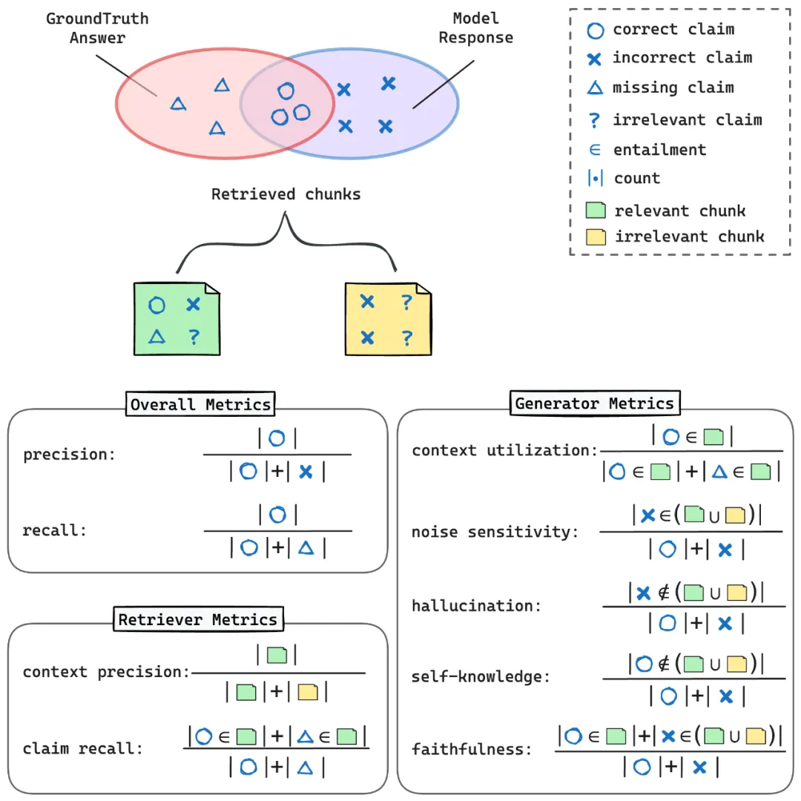

# 1. 资源

- 论文：https://arxiv.org/pdf/2408.08067
- 项目地址：https://github.com/amazon-science/RAGChecker

# 2. 方法
## 2.1 主要特点

RAGChecker 的主要特点包括：

- 细粒度评估：RAGChecker 采用基于声明（claim）级别的蕴含关系检查，而非简单的回复级别评估。这种方法能够对系统性能进行更加详细和微妙的分析，提供深入的洞察。
- 全面的指标体系：该框架提供了一套涵盖 RAG 系统各个方面性能的指标，包括忠实度（faithfulness）、上下文利用率（context utilization）、噪声敏感度（noise sensitivity）和幻觉（hallucination）等。
- 经过验证的有效性：可靠性测试表明，RAGChecker 的评估结果与人类判断有很强的相关性，其表现超过了其他现有的评估指标。这保证了评估结果的可信度和实用性。
- 可操作的洞察：RAGChecker 提供的诊断指标为改进 RAG 系统提供了明确的方向指导。这些洞察能够帮助研究人员和实践者开发出更加有效和可靠的 AI 应用。

## 2.2 RAGChecker 的核心指标

RAGChecker 的指标体系可以用下图直观的理解：

这些指标被分为三大类：

1. 整体指标: 

    - Precision（精确率）：模型回答中正确陈述的比例
    - Recall（召回率）：模型回答中包含的标准答案中陈述的比例
    - F1 score（F1 分数）：精确率和召回率的调和平均数，提供平衡的性能度量

2. 检索模块指标: 

    - Context Precision（上下文精确率）：在所有检索块中，包含至少一个标准答案陈述的块的比例
    - Claim Recall（陈述召回率）：被检索块覆盖的标准答案陈述的比例

3. 生成模块指标: 

    - Context Utilization（上下文利用率）：评估生成模块如何有效利用从检索块中获取的相关信息来产生正确的陈述。这个指标反映了系统对检索到的信息的利用效率。
    - Noise Sensitivity（噪音敏感度）：衡量生成模块在回答中包含来自检索块的错误信息的倾向。这个指标帮助识别系统对不相关或错误信息的敏感程度。
    - Hallucination（幻觉）：测量模型生成既不存在于检索块也不在标准答案中的信息的频率。这就像是捕捉模型 “凭空捏造” 信息的情况，是评估模型可靠性的重要指标。
    - Self-knowledge（模型内部知识）：评估模型在未从检索块获得信息的情况下，正确回答问题的频率。这反映了模型在需要时利用自身内置知识的能力。
    - Faithfulness（忠实度）：衡量生成模块的响应与检索块提供的信息的一致程度。这个指标反映了系统对给定信息的依从性。

这些指标就像是 RAG 系统的 “体检报告”，帮助开发者全面了解系统的健康状况，并找出需要改进的地方。

# 参考

[1] 给RAG系统做一次全面「体检」，亚马逊开源RAGChecker诊断工具，https://mp.weixin.qq.com/s/x4o7BinnwvTsOa2_hegcrQ